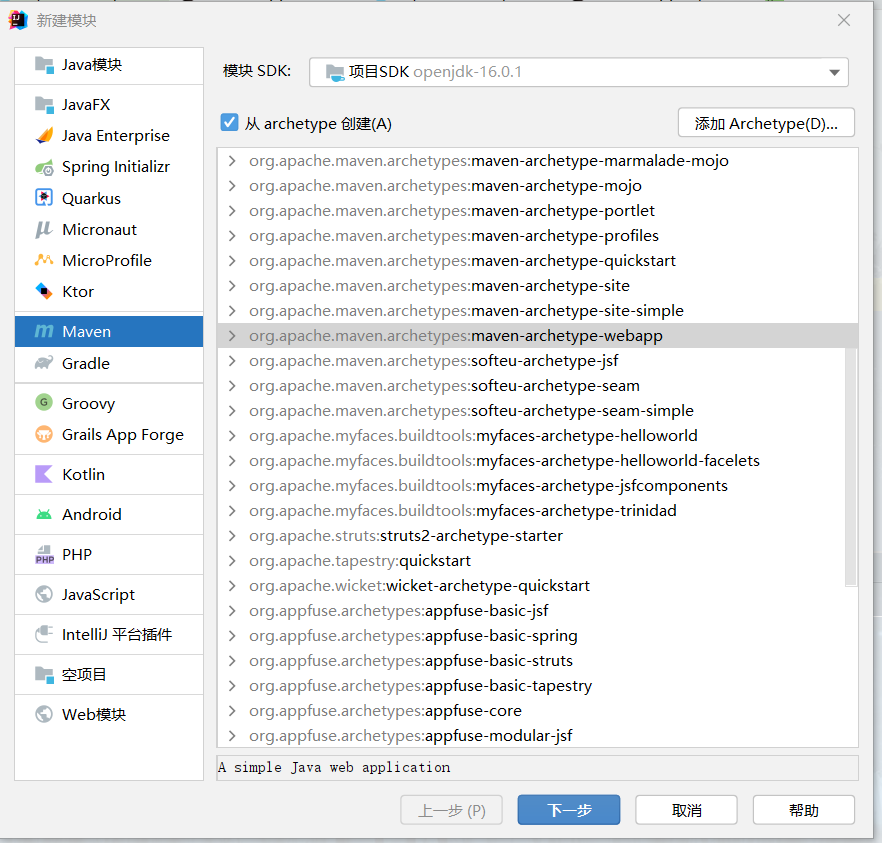
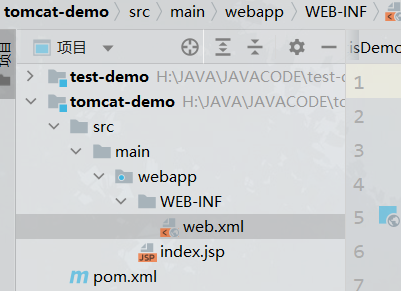
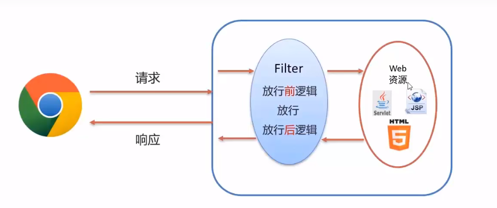
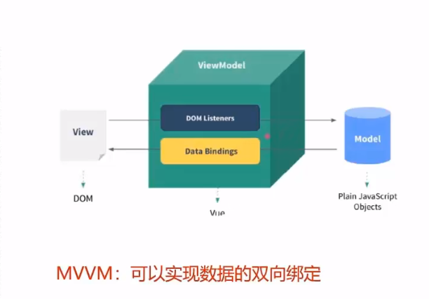

# 1. web核心简介

- B/S架构:Browser/Server,浏览器/服务器架构模式,它的特点是:`客户端只需要浏览器,应用程序的逻辑和数据集都存储在服务器，浏览器只需要请求服务器，获取WEB资源，服务器把WEB资源发送给浏览器即可`
- 静态资源:HTML、CSS、JavaScript、图片等。负责页面展现
- 动态资源:Servlet、JSP等，负责逻辑处理
- 数据库:负责存储数据(持久化)
- HTTP:定义通信规则
- WEB服务器:负责解析HTTP协议,解析请求数据，并发送响应数据,如Tomcat

# 2. HTTP(Hyper Text Transfer Protocol)

## 2.1 HTTP简介

- 概念：超文本传输协议，规定了浏览器和服务器之间数据传输的规则
- 基于`TCP协议(三次握手)`:面向连接,安全
- 基于`请求-响应模型`的:一次请求对应一次响应
- HTTP协议是`无状态的协议`,对于事务处理没有记忆能力，每次请求-响应都是独立的
  - 缺点:多次请求间不能共享数据,JAVA中使用会话技术(Cookie、Session)来解决这个问题
  - 优点:速度快

## 2.1 请求数据的格式

- `请求行`:请求数据的第一行,其中`GET`表示请求方式,`/`表示请求资源的路径,`HTTP/1.1`表示协议版本
- `请求头`:第二行开始,格式为key:val形式
- `请求体`:POST请求的最后一部分,存放请求参数
- 常见的`HTTP`请求头:
  - Host:表示请求的主机名
  - User-Agent:浏览器版本
  - Accept:表示浏览器能接收的资源类型
  - Accept-Language:表示浏览器偏好的语言,服务器可以根据此返回不同语言的网页
  - Accept-Encoding:表示浏览器可以支持的压缩类型 
- GET请求和POST请求的区别:
  - GET请求参数在请求行中，没有请求体,POST请求参数在请求体中
  - GET请求参数参数大小有限制,而POST请求没有

## 2.2 响应数据的格式

- `响应行`:响应数据的第一行。其中HTTP/1.1表示协议版本，200表示响应状态码，OK表示状态码描述
- `响应头`:第二行开始,格式为key:val
- `响应体`:最后一部分,存放响应数据

- 常见的`HTTP`响应头:
  - Content-Type:表示该响应内容的类型,录入text/html,image/jpeg
  - Content-Length:表示该响应内容的长度(字节数)
  - Content-Encoding:表示该响应压缩算法,例如gzip
  - Cache-Contro:指示客户端应该如何缓存,例如max-age=300表示最多可以缓存300秒

## 2.3 响应状态码粗分类

​	

| 状态码分类 | 说明                                                         |
| ---------- | ------------------------------------------------------------ |
| 1xx        | `响应中`--临时状态码,表示请求已经接受，告诉客户端应该继续请求或者如果它已经完成则忽略它 |
| 2xx        | `成功`--表示请求已经被对方所接受，处理已经完成               |
| 3xx        | `重定向`--重定向到其他地方，它让客户端再发起一个请求以完成整个处理过程 |
| 4xx        | `客户端错误`--处理发生的错误,责任在于客户端,如:客户端的请求一个不存在的资源,客户端未被授权,禁止访问等 |
| 5xx        | `服务端错误`--处理发生的错误,责任在于服务端,如:服务端抛出了异常,路由出错,HTTP版本不支持等等 |


## 2.4 常见响应状态码

| 状态码 | 英文描述                        | 解释                                                         |
| ------ | ------------------------------- | ------------------------------------------------------------ |
| 200    | OK                              | 客户端请求成功,即处理成功                                    |
| 302    | Found                           | 指示所请求的资源已移动到由Location响应头所给定的URL，浏览器会自动重新访问到这个页面 |
| 304    | Not Modified                    | 告诉客户端,你请求的资源自上次取得后，服务端并未更改，直接使用本地缓存即可。隐式重定向 |
| 400    | Bad Request                     | 客户端有语法错误,不能被服务器所理解                          |
| 403    | Forbidden                       | 服务器收到请求，但是拒绝提供服务，比如:没有权限访问相关资源  |
| 428    | Precondition Required           | 服务器要求有条件的请求,告诉客户端想要访问某资源,必须携带特定的请求头 |
| 429    | Too Many Requests               | 太多请求,可以限制客户端请求某个资源的数量，配合Retry-After(多长时间可以请求)响应头一起使用 |
| 431    | Request Header Fields Too Large | 请求头太大,服务器不愿意处理该请求,因为头部字段太大,请求可以减少请求头域大小偶重新提交该请求 |
| 405    | Method Not Allowed              | 请求方式有误,比如用GET请求方式才能请求到的资源,用了POST      |
| 500    | Internal Server Error           | 服务器发生了不可预期的错误,服务器产生了异常                  |
| 503    | Service Unavailable             | 服务器尚未准备好处理请求,服务器刚刚启动,还未初始化好         |
| 511    | Network Authentication Required | 客户端需要进行身份验证才能获得网络访问权限                   |

# 3. web服务器-Tomcat

## 3.1 简介

- web服务器是一个应用程序，对HTTP协议的操作进行封装，使得程序员不必直接对协议进行操作，让web开发更加便捷，主要功能是提供网上信息浏览服务
- Tomcat也称为Web容器,Servlet容器,Servel需要依赖Tomcat才能运行

 ## 3.2 Tomcat的配置以及项目部署

- 修改启动端口号:`conf/server.xml`
- 项目部署:将项目放到webapps下,即部署完成
- 一般JavaWeb项目会被打包成war包,然后将war包放到webapps目录下,Tomcat将会自动解压缩war文件

## 3.3 Maven Web项目结构

- Web项目结构
  - Maven Web项目结构:开发中的项目
  - webapps(web项目特有的目录)
    - WEB-INF(web项目核心目录)
      - web.xml(web项目配置文件)
  - 部署的JavaWeb项目结构:开发完成,可以进行部署的项目
    - WEB-INF(WEB项目核心目录)
      - classes(JAVA字节码文件)
      - lib(项目所需jar包)
      - web.xml(web项目配置文件)

- 创建方式
  - 使用骨架(项目模板)
  - 

然后检查maven变量是否正确即可



- maven的打包方式
  - jar打包(默认)
  - war打包

```xml
<packaging>war</packaging>
<packaging>jar</packaging>
```

# 4. Servlet

- Java提供的动态Web资源开发技术

## 4.1 Servel快速入门

- 引入依赖

```xml
    <!-- servlet依赖 -->
    <dependency>
      <groupId>javax.servlet</groupId>
      <artifactId>javax.servlet-api</artifactId>
      <version>4.0.1</version>
      <scope>provided</scope>
      <!--这里要配置为provided(在编译环境和测试环境下是有效的而在运行环境下是无效的)-->
      <!--这是因为 tomcat中已经内置了servlet的jar包了,如果再在运行环境下再去依赖这个jar包就会冲突报错-->
    </dependency>
```

- 创建:定义一个类,实现servelt接口,并重写接口中的所有方法,编写service方法

```java
 package com.demo.web;

import javax.servlet.*;
import java.io.IOException;

public class ServletDemo implements Servlet {

    public void init(ServletConfig servletConfig) throws ServletException {

    }

    public ServletConfig getServletConfig() {
        return null;
    }

    public void service(ServletRequest servletRequest, ServletResponse servletResponse) throws ServletException, IOException {
        System.out.println("servlet hello world!");
    }

    public String getServletInfo() {
        return null;
    }

    public void destroy() {

    }
}

```

- 配置:在类上使用@WebServlet注解,配置该Servlet的访问路径

```java
@WebServlet("/hello")
```

- 访问:启动tomcat,输入url访问该servlet

## 4.2 Servlet执行流程与生命周期

- 执行流程:简单来说就是服务器拿到了我们自己写的Servlet类,然后根据这个类的属性与方法去创建Servlet对象,,里面提供service()方法,当有人来访问我们的服务的时候,tomcat拿着这个对象,执行service()方法，就是这样一回事。
- Servlet对象的生命周期
  - 加载和实例化:默认情况下,当Servlet第一次被访问的时候，由容器来创建Servlet对象
  - 初始化:在Servlet实例化之后，容器将调用Servlet的`init()`方法来对对象进行初始化,完成一些例如加载配置文件，创建连接等初始化的工作,该方法是只调用一次的
  - 请求处理:每次请求Servlet时，Servlet容器都会调用`service()`方法对请求进行处理
  - 服务终止:当需要释放内存或者容器关闭时，容器就会调用Servlet实例的`destory()`方法来完成资源的释放，在`destory()`方法调用之后，容器就会释放该实例，该随后被JVM的GC所回收

```java
//当loadOnStartup是负整数的时候,第一次访问时创建Servlet
//当是0或者正整数的时候,服务器启动时就创建Servlet对象,数字越小优先级越高
@WebServlet(value = "/hello",loadOnStartup = -1)
```

## 4.3 Servlet体系结构

- htppsServlet

```java
package com.demo.web;

import javax.servlet.*;
import javax.servlet.annotation.WebServlet;
import javax.servlet.http.HttpServlet;
import javax.servlet.http.HttpServletRequest;
import javax.servlet.http.HttpServletResponse;
import java.io.IOException;
@WebServlet(urlPatterns = "/demo3",loadOnStartup = 1)
public class ServletDemo3 extends HttpServlet {
    @Override
    protected void doGet(HttpServletRequest req, HttpServletResponse resp) throws ServletException, IOException {
        System.out.println("get..");
    }

    @Override
    protected void doPost(HttpServletRequest req, HttpServletResponse resp) throws ServletException, IOException {
        System.out.println("post..");
    }
}
//从浏览器值直接输入url访问的方式是get的方式

```

```java
        //根据请求方式不同,分发post请求和get请求
        HttpServletRequest req = (HttpServletRequest) servletRequest;
        String method = req.getMethod();
        if("GET".equals(method)){

        }else if("POST".equals(method)){

        }
//实际上就是做请求的分发而已
```

## 4.4 urlPettern配置

- 一个servlet可以配置多个urlPattern

```java
@WebServlet(urlPatterns = {"/demo1","/demo2"})
```

- url配置规则
  - 精确匹配:`@WebServlet(urlPatterns = {"/demo1","/demo2"})`
  - 目录匹配:`@WebServlet(urlPatterns = {"/demo1/*"})`,该目录下所有的都访问该servlet
  - 扩展名匹配:`@WebServlet(urlPatterns = {"*.do",})`
  - 任意匹配:`@WebServlet(urlPatterns = {"/"})`,`@WebServlet(urlPatterns = {"/*"})`

# 5. Request

## 5.1 Request继承体系

- ServeltRequest->JAVA提供的请求对象根接口
- HttpServeltRequest->JAVA提供的对HTTP协议封装的请求对象接口
- RequestFacade->Tomcat定义的实现类
- Tomcat需要解析请求数据，封装为request对象,并且创建request对象传递到service方法中

## 5.2 Request获取请求数据

- 请求行
  - GET /RESOURCE_DIR/ HTTP/1.1

```java
String getMethod();//获取请求方式:GET
String getContextPath();//获取虚拟目录(项目访问路径):/request-demo,动态获取
StringBuffer getRequestURL();//获取URL(统一资源定位符)
String getRequestURI();//获取URI
String getQueryString();//获取请求参数(GET方式) 
```

- 请求头

```java
String getHeader(String name);//根据请求头名称,获取值
```

- 请求体:只有`POST`才有请求体

```java
ServletInputStream getInputStream();//获取字节输入流
BufferReader getReader();//获取字符输入流
```

- 通用方式获取请求参数

```java
String method = this.getMethod();
if("GET".equals(method)){
    params = this.getQueryString();
}else if("POST".equals(methid)){
    BufferedReader reader = this.getReader();
    params = reader.readLine();
}
```

- API

```java
Map<String,String[]> getParamterMap();//获取所有参数Map的集合
String[] getParamterValues(String name);//根据名称获取参数值(数组)
String getParamter(String name);//根据名称获取单个数值
```

```java
        Map<String, String[]> parameterMap = req.getParameterMap();
        for(String key:parameterMap.keySet()){
            System.out.print(key+":");
            for(String string: parameterMap.get(key)){
                System.out.print(string+" ");
            }
            System.out.println();
        }
        //2.根据key获取参数值
        System.out.println(req.getParameterValues("hobby"));
        //3.根据key获取单个参数值
        String userName = req.getParameter("username");
        System.out.println(userName);
```

- POST解决中文乱码问题

```java
//POST的底层处理是通过字符输入流来写的,因此如果字符编码不一致的话就会产生乱码
req.setCharacterEncoding("UTF-8");
```

- GET解决中文乱码问题

```java
    public String modifiedEncoding(String string){
        byte[] bytes = string.getBytes(StandardCharsets.ISO_8859_1);
        //然后再将bytes数组转换为UTF-8
        return new String(bytes,StandardCharsets.UTF_8);
        //可以写作为 一行
        return new String(string.getBytes(StandardCharsets.ISO_8859_1),StandardCharsets.UTF_8);
    }
```

## 5.3请求转发

- `请求转发(forward)`:一种在服务器内部的资源跳转方式,简单来说就是当一个请求,单个资源所不能完全处理的时候，这个请求就会被转发到其他资源，让其他资源来完成这个请求的响应。

```java
req.getRequestDispatcher("资源B路径").forward(req,resp);
```

- 请求转发资源间共享数据:使用Request对象
  - `void setAttribute(String name,Object o)`:存储数据到request域中
  - `Object getAttribute(String name)`:根据key值获取值
  - `void removeAttribute(String name)`:根据key,删除该键值对
- 请求转发的特点
  - 浏览器地址栏路径不发生变化
  - 只能转发到当前服务器内部的资源
  - 一次请求，可以在转发的资源间使用request共享数据

# 6. Response

- 使用`Response`对象来设置响应数据
- ServletResponse(JAVA提供的请求对象接口)
- HttpServletResponse(JAVA提供的对Http协议封装的请求对象)
- ResponseFacade(Tomcat定义的实现类)

## 6.1 Response设置响应数据功能介绍

- `void setStatus(int sc)`:设置响应状态码
- `void setHeader(String name,String value)`:设置响应头键值对
- `PrintWriter getWriter()`:获取字符输出流
- `ServletOutputStream getOutputStream()`:获取字节输出流

## 6.2 Response重定向(Redirect)

- `重定向`:一种资源重定向方式，可以重定向到外部服务器资源
  - 浏览器地址栏会发生变化
  - 可以重定向到任意位置的资源(服务器内部、外部均可)
  - 内部的话写虚拟目录即可,外部则需要完整的HTTPURL
  - 两次请求，不能在多个资源使用request共享数据

- 示例代码

```java
    @Override
    protected void doGet(HttpServletRequest request, HttpServletResponse response) throws ServletException, IOException {
        System.out.println("resp1....");
        //重定向
        //1.设置响应状态码
        response.setStatus(302);
        //2.设置头
        response.setHeader("Location","/tomcat-demo/resp2");//要写虚拟目录
        //简化重定向的写法
        response.sendRedirect("/tomcat-demo/resp2");//只需要填入重定向的资源地址即可，
    }
    @Override
    protected void doGet(HttpServletRequest request, HttpServletResponse response) throws ServletException, IOException {
        System.out.println("resp2....");
    }
```

- 关于路径使用的问题
  - 首先明确路径是谁使用的，如果是浏览器使用的，那么就需要加虚拟目录，如果是服务端使用的，则不需要加虚拟目录

## 6.3 Response响应字符数据

- 通过`PrintWriter getWriter()`来获取字符输出流,直接写入字符即可,tomcat将直接将该数据传入响应体的位置

- ```java
          System.out.println("resp3....");
          response.setContentType("text/html;charset=utf-8");
          PrintWriter writer = response.getWriter();
          response.setHeader("content-type","text/html");
          writer.write("<h1>你好<h1>");//流的默认编码字符是ISO-8859-1
  ```

## 6.4 Response响应字节数据

```java
        System.out.println("resp4....");
        ServletOutputStream outputStream = response.getOutputStream();
        outputStream.write("<h1>你好<h1>".getBytes(StandardCharsets.UTF_8));
        response.setHeader("content-type","text/html");
```

# 7. 登录注册案例练习

- 准备数据库

```mysql
/*1.创建数据库*/
create database db1;
/*2.进入数据库,创建user表*/
use db1;
create table user(
    id int primary key auto_increment,
    username varchar(15),
    password varchar(15)
);
/*3.手动添加数据*/
insert into user(username,password) values ("张三","123456"),("李四","123456");
/*4.校验数据*/
select * from user;
/*这里不小心忘记了设置了唯一索引*/
alter table user add unique (username);

desc user;
```

- 准备mybatis文件

```xml
<?xml version="1.0" encoding="UTF-8" ?>
<!DOCTYPE configuration
        PUBLIC "-//mybatis.org//DTD Config 3.0//EN"
        "http://mybatis.org/dtd/mybatis-3-config.dtd">
<configuration>
    <typeAliases>
        <package name="com.demo.web.pojo"/>
    </typeAliases>
    <environments default="development">
        <environment id="development">
            <transactionManager type="JDBC"/>
            <dataSource type="POOLED">
                <property name="driver" value="com.mysql.cj.jdbc.Driver"/>
                <property name="url" value="jdbc:mysql://127.0.0.1:3306/db1?serverTimezone=GMT&amp;useSSL=false&amp;allowPublicKeyRetrieval=true"/>
                <property name="username" value="root"/>
                <property name="password" value="123456"/>
            </dataSource>
        </environment>
    </environments>

    <mappers>
        <package name="com.demo.web.Mapper"/>
    </mappers>

</configuration>
```

- 创建映射文件
- UserMapper

```xml
<?xml version="1.0" encoding="UTF-8" ?>
<!DOCTYPE mapper
        PUBLIC "-//mybatis.org//DTD Mapper 3.0//EN"
        "http://mybatis.org/dtd/mybatis-3-mapper.dtd">
<mapper namespace="com.demo.web.mapper.UserMapper">

</mapper>
```

```java
package com.demo.web.mapper;

public interface UserMapper {
    @Select("select * from user where username = #{username} and password =#{password}")
    User selectByNameAndPassword(@Param("username") String username, @Param("password") String password);
}

```

- 编写servelt代码

```java
    @Override
    protected void doGet(HttpServletRequest request, HttpServletResponse response) throws ServletException, IOException {
        //1.接收用户名和密码
        String username = new String(request.getParameter("username").getBytes(StandardCharsets.ISO_8859_1),StandardCharsets.UTF_8.toString());
        String password = new String(request.getParameter("password").getBytes(StandardCharsets.ISO_8859_1),StandardCharsets.UTF_8.toString());
        System.out.println("username:"+username+",password:"+password);
        //2.调用数据库
        String resource  = "mybatis-config.xml";
        InputStream resourceAsStream = Resources.getResourceAsStream(resource);
        SqlSessionFactory sqlSessionFactory = new SqlSessionFactoryBuilder().build(resourceAsStream);
        SqlSession sqlSession = sqlSessionFactory.openSession();
        UserMapper mapper = sqlSession.getMapper(UserMapper.class);
        User user = mapper.selectByNameAndPassword(username,password);
        sqlSession.close();

        response.setContentType("text/html;charset=utf-8");
        PrintWriter writer = response.getWriter();
        if(user != null){
            writer.write("登录成功");
        }else{
            writer.write("登录失败");
        }
    }
```

- 编写注册的代码

```java
    @Override
    protected void doGet(HttpServletRequest request, HttpServletResponse response) throws ServletException, IOException {
        //1.接收用户名和密码
        String username = new String(request.getParameter("username").getBytes(StandardCharsets.ISO_8859_1),StandardCharsets.UTF_8.toString());
        String password = new String(request.getParameter("password").getBytes(StandardCharsets.ISO_8859_1),StandardCharsets.UTF_8.toString());
        System.out.println("username:"+username+",password:"+password);
        //2.调用数据库
        String resource  = "mybatis-config.xml";
        InputStream resourceAsStream = Resources.getResourceAsStream(resource);
        SqlSessionFactory sqlSessionFactory = new SqlSessionFactoryBuilder().build(resourceAsStream);
        SqlSession sqlSession = sqlSessionFactory.openSession();
        UserMapper mapper = sqlSession.getMapper(UserMapper.class);
        User user = mapper.selectByName(username);

        response.setContentType("text/html;charset=utf-8");
        PrintWriter writer = response.getWriter();
        if(user != null){
            writer.write("当前用户已经存在了,不让注册");
        }else{//用户不存在
            User newUser = new User();
            newUser.setUsername(username);
            newUser.setPassword(password);
            mapper.addUser(newUser);
            sqlSession.commit();
            writer.write("注册成功");
        }
        sqlSession.close();
    }
```

- 工具类抽取

```java
package com.demo.web.util;

import org.apache.ibatis.io.Resources;
import org.apache.ibatis.session.SqlSession;
import org.apache.ibatis.session.SqlSessionFactory;
import org.apache.ibatis.session.SqlSessionFactoryBuilder;

import java.io.IOException;
import java.io.InputStream;

public class SqlSessionFactoryUtils {
    private static SqlSessionFactory sqlSessionFactory;
    static {
        try {
            String resource  = "mybatis-config.xml";
            InputStream resourceAsStream = Resources.getResourceAsStream(resource);
            sqlSessionFactory = new SqlSessionFactoryBuilder().build(resourceAsStream);
        } catch (IOException e) {
            e.printStackTrace();
        }
    }

    public static SqlSessionFactory getSqlSessionFactory(){
        return sqlSessionFactory;
    }

}

```

# 8. JSP(Java Server Pages)JAVA服务端页面

## 8.1 快速入门

```java
<html>
<body>
 <h1>hello jsp</h1>
<%
    System.out.println("hello jsp");
%>
</body>
</html>

```

## 8.2 JSP原理

- JSP本质上就是一个servlet
- .jsp->servlet->(编译)class->响应请求

- jsp在被访问时，由JSP容器(Tomcat)将其转化为JAVA文件(Servlet)，在由JSP容器(Tomcat)将其编译时，最终对外提供服务的就是这个字节码文件

## 8.3 JSP缺点

总之就是很多缺点,做下了解就好了,不用深入学

- 替代方案:HTML+AJAX

# 9.MVC模式和三层架构

- MVC是一种分层开发的模式,其中:
  - M:Model,业务模型，处理业务,在JAVA中不单指pojo，而是指java-bean
  - V:View,视图,页面显示
  - C:Controller,控制器，处理请求,调用模型和视图
- 三层架构
  - 表现层:接收请求，封装数据，调用业务层逻辑，响应数据(controller)
  - 业务逻辑层:对业务逻辑进行封装，组合数据访问层中基本功能，形成复杂的业务逻辑功能(service)
  - 数据访问层:对数据库进行CRUD的操作(mapper(mybatis)/dao)

# 10. 会话跟踪技术

## 10.1 会话技术简介

- `会话`:用户打开浏览器，访问web服务器的资源，会话建立，直到有一方断开连接，会话结束，在一次会话中可以包含`多次`请求和响应
- `会话跟踪`:一种维护浏览器状态的方法,服务器需要识别多次请求是否来自于同一服务器，以便在同一次会话的多次请求间`共享数据`
- HTTP协议是`无状态的`，每次浏览器向服务器请求时，服务器都会将该请求视为新的请求，因此我们需要会话跟踪技术来实现会话内数据共享

- 实现方法
  - 客户端会话跟踪技术:Cookie
  - 服务端会话跟踪技术:Session

## 10.2 Cookie

### 10.2.1 Cookie基本使用

- `cookie`:客户端会话技术,将数据保存到客户端,以后每次请求都携带Cookie数据进行访问

- Cokkie的基本使用

  - 发送Cookie

  ```java
  //1.创建cookie对象，设置数据
  Cookie cookie = new Cookie("key","value");
  //2.发送cookie到客户端,使用response对象 
  response.addCookie(cookie);
  ```

  - 获取Cookie	

    ```java
            //1.获取cookie
            Cookie[] cookies = request.getCookies();
            for(Cookie cookie:cookies){
                System.out.println(cookie.getName()+" :"+cookie.getValue());
            }
    ```


### 10.2.2 Cookie原理

- Cookie是基于HTTP协议的
  - 响应头:set-cookie，当服务端需要为客户端建立cookie时，写入cookie,通过HTTP协议发送给服务端
  - 请求头:cookie，当客户端给服务端发送请求时，自动携带该请求头，携带cookie供其使用
- cookie存活时间
  - 默认情况下,Cookie存储在浏览器内存中，当浏览器关闭时，内存释放，则Cookie就被销毁
  - 为了解决默认情况下的问题,要做`持久化`
  - `setMaxAge(int seconds)`:设置cookie的存活时间
    - 正数:将cookie写入浏览器所在电脑的硬盘中，持久化存储，到时间则自动销毁
    - 负数:默认值,cookie在当前浏览器内存中，当浏览器关闭，则Cookie被销毁
    - 零:删除对应的cookie
- cookie存储中文
  - Cookie不能直接存储中文
  - 如需要存储,则使用URL编码`URLEncoder`

## 10.3 Session

### 10.3.1 Session基本使用

- `Session`:服务端会话跟踪技术，将数据保存到服务端
- JAVAEE提供了`HttpSession`接口,来实现一次会话多次请求间数据共享功能
- 其主要功能就是保存上一次请求的数据到`服务端`,在服务端可以直接调用服务器的session,注意:其调用的session是一次会话中的

### 10.3.2 Session原理

- Session的实现是基于cookie的
- 实现细节
  - 服务端内部有一个session池,每一个session有一个唯一标识的sessionId
  - 每次客户端请求的时候,会发送`set-cookie:JESSIONID`给服务端
  - 服务端根据SessionId来识别会话是否是同一次的，若是同一次会话，则返回指定的Session对象供其使用
  - 以此保证一次会话，对应唯一的一个session

- session钝化:在服务器正常关闭后，Tomcat会自动将Session数据写入硬盘
- session活化:再次启动服务器后，从文件中加载数据到Session
- session销毁
  - 默认情况下，无操作，则在30min内销毁
  - 调用`invalidate()`

# 11. Filter

## 11.1 简介

- 概念：`Filter`表示过滤器,是java-web三大组件(Servlet、Filter、Listener)之一
- 过滤器可以把对资源的请求拦截下来，从而实现一些特殊的功能
- 过滤器一般完成一些通用的操作:`权限控制`、`统一编码处理`、`敏感字符处理`

 ## 11.2 快速入门

 ```java
 package com.demo.web.filter;
 
 
 import javax.servlet.*;
 import javax.servlet.annotation.WebFilter;
 import java.io.IOException;
 @WebFilter("/*")//拦截所有资源
 public class FilterDemo implements Filter {
 
     @Override
     public void init(FilterConfig filterConfig) throws ServletException {
 
     }
 
     @Override
     public void doFilter(ServletRequest servletRequest, ServletResponse servletResponse, FilterChain filterChain) throws IOException, ServletException {
         //1.编写放行前逻辑
         System.out.println("正在拦截资源");
         //2.执行放行
         filterChain.doFilter(servletRequest,servletResponse);
         //3.编写放行后逻辑
     }
 
     @Override
     public void destroy() {
 
     }
 }
 
 ```




## 11.3 Filter拦截路径配置

- 拦截具体的资源:`/index.jsp`:只有访问index.jsp时才会被拦截
- 目录拦截:`/user/*`:访问/user下的所有资源,都会被拦截
- 后缀名拦截:`*.jsp`,访问后缀名为jsp的资源,都会被拦截
- 拦截所有:`/*`:访问所有资源,都会被拦截
- 一个web应用，可以配置多个过滤器，这多个过滤器称为过滤器链
- 注解配置的Filter，优先级按照过滤器类名(字符串)的自然排序

# 12. Listener

- 概念:Listener表示监听器，是JAVAWeb三大组件之一
- 监听器可以监听在application、session、request三个对象创建、销毁或者往其中添加修改删除属性时自动执行代码的功能组件
- Listener分类

| 监听器分类         | 监听器名称                      | 作用                                             |
| ------------------ | ------------------------------- | ------------------------------------------------ |
| ServletContext监听 | ServletContextListener          | 用于对SerlvetContext对象进行监听(创建、销毁)     |
|                    | ServletContextAttributeListener | 对ServletContext对象中的属性进行监听(增删改属性) |
| Session监听        | HttpSessionListener             | 用于对Session对象的整体状态进行监听(创建、销毁)  |
|                    | HttpSessionAttributeListener    | 对Session对象中的属性进行监听(增删改属性)        |
|                    | HttpSessionBindingListener      | 监听对象于Session的绑定和解除                    |
|                    | HttpSessionActivationListener   | 对Session数据的钝化和活化的监听                  |
| Request监听        | ServletRequestListener          | 对Request对象进行监听(创建、销毁)                |
|                    | ServletRequestAttributeListener | 对Request对象中的属性进行监听(增删改属性)        |

- 快速入门代码

```java
package com.demo.web.listener;

import javax.servlet.ServletContextEvent;
import javax.servlet.ServletContextListener;
import javax.servlet.annotation.WebListener;

@WebListener //启动该监听器
public class ContextLoaderListener implements ServletContextListener {

    @Override
    public void contextInitialized(ServletContextEvent sce) {
        //加载资源
        System.out.println("contextInitialized");
    }

    @Override
    public void contextDestroyed(ServletContextEvent sce) {
        //释放资源

    }
}

```

# 13. AJAX

## 13.1 简介

- 概念:AJAX(Asynchronous JavaScript And XML):`异步`的JavaScript和XML
- 作用
  - 与服务器进行数据交换，通过AJAX可以给服务器发送请求，并获取服务器响应的数据
  - 使用AJAX和服务器进行通信，就可以使用HTML+AJAX来替换JSP页面了
  - 异步交互:可以在不加载整个页面的情况下，与服务器交换数据并更新部分网页的技术

## 13.2 快速入门

```java
    //1.创建核心对象
    var xhttp;
    if (window.XMLHttpRequest) {
        xhttp = new XMLHttpRequest();
    } else {
        // code for IE6, IE5
        xhttp = new ActiveXObject("Microsoft.XMLHTTP");
    }
    //2.发送请求
    xhttp.open("GET", "http://localhost:8890/ajax-demo/ajaxServlet", true);//异步交互路径写全路径
    xhttp.send();
    //3.获取响应
    xhttp.onreadystatechange = function (){//不断监听该属性,当属性发生变化时执行function()
        if(this.readyState == 4 && this.status == 200){
            alert(this.responseText);
        }
    }
```

## 13.3 axios异步框架

- 简单来说就是对ajax进行了封装

```java
<!--引入axios源码-->
<script src="js/axios-0.18.0.js"></script>
<script>
    //1.get请求编写实例
    //传入一个js对象
    //注意是url-get传参
    //.then()接收一个回调函数
    axios({
        method :"get",
        url:"http://localhost:8890/ajax-demo/axiosServlet?username=zhangsan"
    }).then(function (resp) {//原理也是不断监听响应的情况
        alert(resp.data)
    })
    //2.post请求编写实例
    axios({
        method: "post",
        url: "http://localhost:8890/ajax-demo/axiosServlet",
        data:zhangsan
    }).then(function (resp){
        alert(resp.data)
    })
    //3.更加简化的有
    axios.get("http://localhost:8890/ajax-demo/axiosServlet?username=zhangsan").then(function (resp) {
        alert(resp.data);
    })
    //4.更加简化的有
    axios.get("http://localhost:8890/ajax-demo/axiosServlet","username=zhangsan ").then(function (resp) {
        alert(resp.data);
    })


</script>
```

# 14.Json

## 14.1 简介

- JSON:JavaScript Obejct Notaion,JavaScript对象表示法

```javascript
var 变量名 = {
    "key1":value1,
    "key2":value2
    ...
}
//获取数据
变量名.key
json.name
```

## 14.2 API

- `JSON.toJSONString(user)`
- `JSON.parseObject(jsonStr,Object.class)`

# 15. Vue

## 15.1 Vue简介

- Vue是一套前端框架,免除原生JavaScript中的DOM操作，简化书写
- 基于`MVVM(Model-view-view-Model)`，实现数据的双向绑定，将编程的关注点放在数据上



- 使用这个框架的最大好处是，之前通过MVC框架可知，并没有直接的通道可以实现模型和视图层的双向绑定，而通过该模型就可以实现模型和视图层的双向绑定，视图变则模型变，模型变则视图变

## 15.2 Vue常用指令操作

- `v-bind`:为HTML标签绑定属性值，如设置href,css样式等
- `v-model`:为表单元素创建双向数据绑定
- `v-on`:为HTML标签绑定事件
- `v-for`:列表渲染，遍历容器的元素或者对象的属性

```vue
    <!-- vue核心控制id为app的组件，将代码写在这个区域里面就起作用-->
    <input name = "username" v-model="username">
    {{username}}
    <!--插值表达式-->
    <div v-if="count == 1">count = 1</div>
    <div v-else-if="count == 2">count = 2</div>
    <div v-else>count!=1&&count!=2</div>
    <div v-show="count == 3">count= 3</div>
    <hr>
    <div v-for="addr in addrs">
        {{addr}}<br>
    </div>
    <hr>
    <div v-for="(addr,i) in addrs">
        {{i+1}}--{{addr}}<br>
    </div>
```

## 15.3 Vue生命周期

- 生命周期的八个阶段:每触发一个生命周期事件，会自动执行一个生命周期方法(钩子)

| 状态          | 阶段周期                                            |
| ------------- | --------------------------------------------------- |
| beforeCreate  | 创建前                                              |
| created       | 创建后                                              |
| beforeMount   | 载入前                                              |
| mounted       | 挂载完成(挂载完成，Vue初始化成功，HTML页面渲染成功) |
| beforeUpdate  | 更新前                                              |
| updated       | 更新后                                              |
| beforeDestory | 销毁前                                              |
| destoryed     | 销毁后                                              |


# 16. Element

## 16.1 快速入门

- 基于Vue的网站组件库，用于快速构建网页
- 组件:组成网页的部件，例如超链接，按钮，图片，表格等

 ```vue
 <script src="js/vue.js"></script>
 <script src="element-ui/lib/index.js"></script><!--引入index.js-->
 <link rel = "stylesheet" href="element-ui/lib/theme-chalk/index.css">
 
 <script>
     new Vue({
        el:"#app"
     });
 </script>
 
 ```

## 16.2 Element布局

- Layout布局:通过基础的24分栏,迅速简便地创建布局
- Container:用于布局的容器组件，方便快速搭建页面的基本结构

## 16.3 页面搭建案例

```vue
<!DOCTYPE html>
<html lang="en">
<head>
    <meta charset="UTF-8">
    <title>品牌管理后台</title>

    <style>
        .el-table .warning-row {
            background: oldlace;
        }

        .el-table .success-row {
            background: #f0f9eb;
        }
    </style>


</head>
<body>

<div id="app">
    <!--搜索框-->
    <el-form :inline="true" :model="brand" class="demo-form-inline">
        <el-form-item label="当前状态">
            <el-select v-model="brand.status" placeholder="当前状态">
                <el-option label="启用" value="1"></el-option>
                <el-option label="禁用" value="0"></el-option>
            </el-select>
        </el-form-item>
        <el-form-item label="企业名称">
            <el-input v-model="brand.companyName" placeholder="企业名称"></el-input>
        </el-form-item>
        </el-form-item>
        <el-form-item label="品牌名称">
            <el-input v-model="brand.brandName" placeholder="品牌名称"></el-input>
        </el-form-item>
        <el-form-item>
            <el-button type="primary" @click="onSubmit">查询</el-button>
        </el-form-item>
    </el-form>

    <!--新增与批量删除-->
    <el-row>
        <el-button type="danger" plain >批量删除</el-button>
        <el-button type="primary" plain @click="dialogVisible = true">新增</el-button>
    </el-row>

    <!--添加数据的对话框表单-->
    <el-dialog
            title="编辑品牌"
            :visible.sync="dialogVisible"
            width="40%">
        <el-form ref="form" :model="brand" label-width="80px">
            <el-form-item label="品牌名称">
                <el-input v-model="brand.brandNamename"></el-input>
            </el-form-item>
            <el-form-item label="企业名称">
                <el-input v-model="brand.companyName"></el-input>
            </el-form-item>
            <el-form-item label="排序">
                <el-input v-model="brand.ordered"></el-input>
            </el-form-item>
            <el-form-item label="备注">
                <el-input type="textarea" v-model="brand.description"></el-input>
            </el-form-item>
            <el-form-item label="状态">
                <el-switch v-model="brand.status"active-value="1" inactive-value="0" ></el-switch>
            </el-form-item>
            <el-form-item>
                <el-button type="primary" @click="addBrand()">立即创建</el-button>
                <el-button @click="dialogVisible = false">取消</el-button>
            </el-form-item>
        </el-form>
    </el-dialog>


    <!--表格-->
    <template>
        <el-table
                :data="tableData"
                style="width: 100%"
                :row-class-name="tableRowClassName"
                @selection-change="handleSelectionChange">
            <el-table-column
                    type="selection"
                    width="55">
            </el-table-column>
            <el-table-column
                    label="序号"
                    type="index"
                    width="50">
            </el-table-column>
            <el-table-column
                    prop="brandName"
                    label="品牌名称"
                    align="center">
            </el-table-column>
            <el-table-column
                    prop="companyName"
                    label="企业名称"
                    align="center">
            </el-table-column>
            <el-table-column
                    prop="ordered"
                    align="center"
                    label="排序">
            </el-table-column>
            <el-table-column
                    prop="status"
                    align="center"
                    label="当前状态">
            </el-table-column>
            <el-table-column
                    align="center"
                    label="操作">
                <el-row>
                    <el-button type="primary" round>修改</el-button>
                    <el-button type="danger"  round>删除</el-button>
                </el-row>
            </el-table-column>
        </el-table>
    </template>

    <div class="block">
        <span class="demonstration"></span>
        <el-pagination
                @size-change="handleSizeChange"
                @current-change="handleCurrentChange"
                :current-page="currentPage"
                :page-sizes="[5, 10 ,15, 20, 100]"
                :page-size="100"
                layout="total, sizes, prev, pager, next, jumper"
                :total="400">
        </el-pagination>
    </div>


</div>


<script src="js/vue.js"></script>
<script src="element-ui/lib/index.js"></script><!--引入index.js-->
<link rel = "stylesheet" href="element-ui/lib/theme-chalk/index.css">

<script>
    new Vue({
       el:"#app",
        methods: {
            tableRowClassName({row, rowIndex}) {
                if (rowIndex === 1) {
                    return 'warning-row';
                } else if (rowIndex === 3) {
                    return 'success-row';
                }
                return '';
            },
            handleSelectionChange(val) {
                this.multipleSelection = val;
                console.log(this.multipleSelection)
            },
            onSubmit() {
                console.log(this.brand);
            },
            //添加数据
            addBrand() {
                console.log(this.brand);
            },
            handleSizeChange(val) {
                console.log(`每页 ${val} 条`);
            },
            handleCurrentChange(val) {
                console.log(`当前页: ${val}`);
            }
        },
        data() {
            return {
                tableData: [{
                    brandName: '花为',
                    companyName: '化为优先公司',
                    ordered: '100',
                    status:"1",
                }, {
                    brandName: '花为',
                    companyName: '化为优先公司',
                    ordered: '100',
                    status:"1",
                }, {
                    brandName: '花为',
                    companyName: '化为优先公司',
                    ordered: '100',
                    status:"1",
                }, {
                    brandName: '花为',
                    companyName: '化为优先公司',
                    ordered: '100',
                    status:"1",
                }],
                multipleSelection: [],
                brand: {
                    brandName: '',
                    companyName: '',
                    status:'',
                    id:'',
                    ordered:'',
                    description:''
                },
                dialogVisible : false,
                currentPage: 4
            }
        }
    });
</script>

</body>
</html>
```


