# 1. 概述

## 1.1 开发使用场景

- 备份
- 代码还原
- 协同开发
- 追溯代码的编写人和先写时间 

## 1.2 版本控制器的方式

- 集中式版本控制工具(SVN,CSV)
  - 集中式版本控制工具，版本存放在中央服务器中，team里每个人工作时从中央服务器下载代码，必须联网才能工作，局域网或者互联网，个人修改后提交到中央版本库
- 分布式版本控制工具(GIT)
  - 分布式版本控制系统没有“中央服务器”，每个人的电脑上都是一个完整的版本库，这样工作的时候，就不需要联网了，因为版本库就在自己的电脑上，多人协作只需要各自的修改推送给对方，就能看到彼此的修改了

## 1.3  GIT的工作流程图

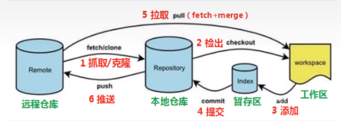

- clone(克隆):从远程仓库中克隆代码到本地仓库
- checkout(检出):从本地仓库中检出一个仓库分支进行修订
- add(添加):在提交前先将代码提交到暂存区
- commit(提交):提交到本地仓库，本地仓库中保存修改的各个历史版本
- fetch(抓取):从远程库，抓取到本地仓库，不进行任何的合并动作，一般操作比较少
- pull(拉取):从远程仓库拉取到本地，自动进行合并，然后放到工作区，相当于fetch+merge
- push(推送):修改完成后，需要和团队成员共享代码时，将代码推送到远程仓库

# 2. GIT基本使用

## 2.1 GIT-GUI&GIT-Bash

- GIT GUI:GIT提供的图形界面工具
- Git Bash:Git提供的命令行工具
- 当安装了GIT之后首先要做的就是要设置用户名称和email地址。

## 2.2 设置个人信息

- 设置用户名称:`git config --global user.name 你的名字`
- 设置用户邮箱:`git config --global user.email 你的邮箱`

## 2.3 可以为常用指令设置别名

```shell
	# 用于输出git提交日志
    alias git-log='git log --pretty=oneline --all --graph --abbrev-commit'
    # 用于输出当前目录所有文件及基本信息
    alias ll='ls -al'
```

## 2.4 基础指令操作

- 执行`git init`，输入`ll`，观察到目录下创建.git文件后,即证明创建git目录成功
- Git工作目录下对于文件的`修改(增加、删除、更新)`会存在几个状态，这些修改的状态会随着我们执行GIT的命令而发生变化

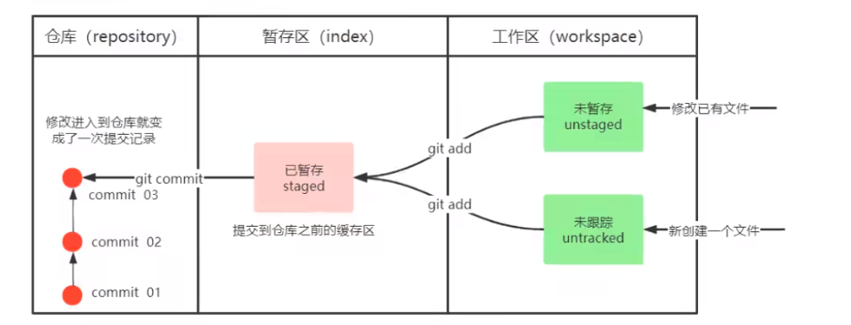

- 如何控制这些状态?
  - `git add`:工作区->暂存区
  - `git commit`:暂存区->本地仓库
  - 通过输入`git status`来查看当前仓库文件的管理状态
  - 通过输入`git commit "提交名称-版本号"`来确认提交,将暂存区内的缓存区提交到仓库
- 查看提交日志
  - `git log [option]`
  - opition
    - --all 显示所有分支
    - --pretty=online 将提交信息显示为一行
    - --abbrev-commit 使得输出的commitId更简短
    - --graph 以图的形式显示
- 版本回退
  - `git reset --hard commitID`
- 查看已经删除的记录:这个指令可以看到已经提交删除的提交记录,或者查看之前在GIT里边的操作
  - `git reflog`

- 忽略某个文件
  - 新建管理文件`touch .gitignore`
  - 在`.gitignore`中输入文件名来让GIT识别你不想提交的文件

# 3. GIT分支

- 几乎所有的版本控制系统都以某种形式支持分支，使用分支意味着你可以把你的工作从开发主线上分离开来进行重大BUG修改、开发新的功能，以免影响主线
- 查看本地分支
  - `git branch`
  - 我们在工作区只能为一个分区服务
- 新建分支
  - `git branch dev01`
  - 使用`git-long`可以查看各分支内部的提交信息
  - 新建时分支处于哪个分支就是基于哪个分支创建的
  - 比如说我现在`master`带了个*，那么我就是基于`master`进行分支创建的
- 切换分支
  - `git checkout 分支名`
  - 还支持直接切换到一个不存在的分支(GIT会帮我们创建并且切换):`git check -b 分支名`
- 合并分支
  - 一个分支上的提交可以合并到另一个分支
  - `git merge 分支名称`

- 删除分支
  - `git branch -d b`:删除分支时，需要做各种检查
  - `git branch -D b`:删除分支时，强制删除

# 4. *如何解决冲突

- 当两个分支上对文件的修改可能会存在冲突，例如同时修改了同一个文件同一行，这时候就需要手动解决冲突，解决冲突的步骤如下
  - 处理文件中冲突的地方
  - 将解决完冲突的文件加入暂存区(add)
  - 提交到仓库

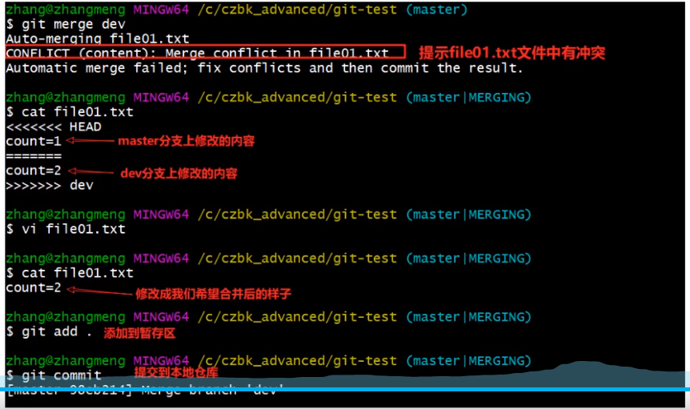

# 5.*开发中分支使用原则与流程

- 在开发中，一般有如下分支使用原则和流程
  - `master`(生产)分支:`线上分支`，`主分支`，中小规模项目作为线上运行的应用对应的分支
  - `develop`(开发)分支:是由`master`创建而来的分支，一般作为开发部门的主要开发分支，如果没有其他并行开发不同期上线要求，都可以在此版本进行开发，阶段开发完成后，需要合并到`master`分支，准备上线
  - `feature/xxx`分支:由`develop`创建的分支，一般是同期并行开发，但不同期上线创建的分支，分支上研发任务完成后合并到`develop`分支
  - `hotfix/xxx`分支:从`master`派生出来的分支，一般作为线上bug修复使用，修复完成后需要合并到master、test、develop分支
  - 还有一些其他分支,例如test(用于代码测试的分支)、pre分支(预上线分支)

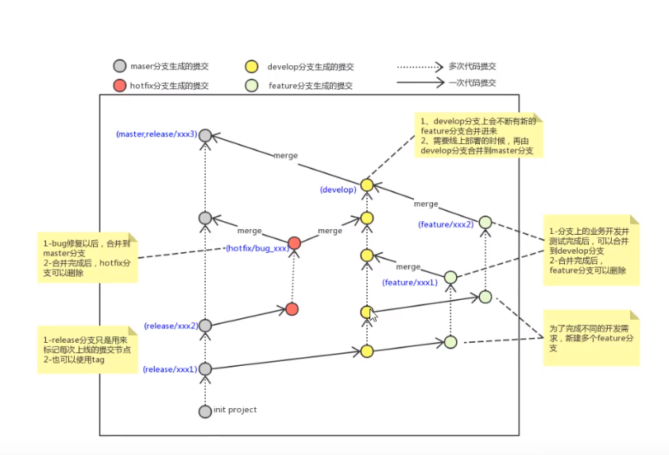

# 6. GIT远程仓库使用

## 6.1 新建仓库

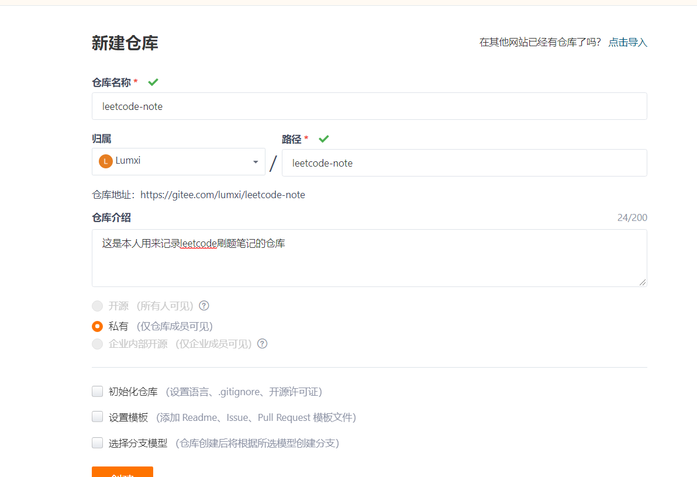

- 注意下面三个勾选的地方先不要勾选,否则会出问题，因为我们本地已经有项目了，做到一半推上去，因此如果初始化仓库的话会产生冲突问题的

## 6.2 配置SSH公钥

- 首先本地生成一个ssh公钥:`ssh-keygen -t rsa`，输入之后一路回车
- 然后获取刚才生成的公钥`cat ~/.ssh/id_rsa.pub`,然后会得到一串以ssh-rsa开头的东西，我们直接全部复制下来
- 由于SSH隐私问题这里就不放图了，个人设置->SSH公钥->然后把你的标题名和刚才得到的公钥名称给复制过去，确定即可

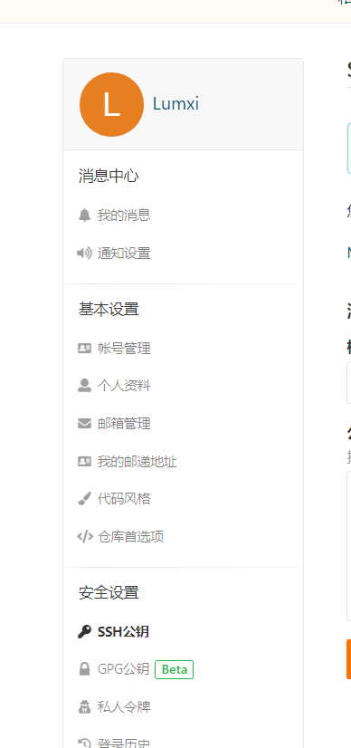

- 完成之后输入` ssh -T git@gitee.com`进行校验,如果出现`Hi 你的用户名! You've successfully authenticated, but GITEE.COM does not provide shell access.`就证明配置SSH公钥完成了

## 6.3 远程仓库添加、推送

- 接着我们将本地仓库推到远程仓库

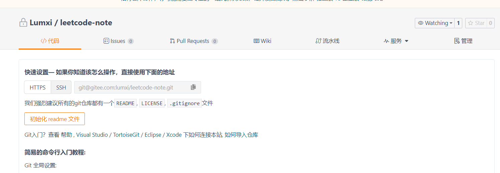

- 选择SSH，我们点击复制一份过来
- 接着在GIT-BASH中操作

```shell
git remote add origin git@gitee.com:lumxi/leetcode-note.git
#将本地仓库关联到远程仓库 其中origin是远程仓库名 后面接远程仓库地址 origin是git示范的最佳实践,我们照着写就行
git remote
#校验当前是否关联到远程仓库
git push origin matser
#origin代表你要推送的远程仓库 master代表你要推送的本地分支名
#注:第一次会报warning
```

- 关于推送指令`git push [-f] [--set-upstream] [远端名称[本地分支名][:远端分支名]]`
  - 如果远程分支名和本地分支名一致，则可以只写本地分支
    - `git push origin master`
  - `--set-upstream`推送到远端的同时并且建立起和远端分支的关联关系
    - `git push --set-upstream origin master`
  - 如果**当前分支已经和远端分支关联,则可以省略分支名和远端名**
    - `git push`:将master分支推送到已关联的远端分支
  - `-f`则表示强制覆盖

## 6.4 从远程仓库中克隆

- 如果已经有一个远端仓库，我们可以直接`clone`到本地
  - `git clone <仓库名称> [本地目录]`
  - 本地目录是可以省略的，会自动生成一个目录

## 6.5 从远程仓库中抓取和拉取

- 远程分支和本地的分支一样，我们可以进行merge操作，只是需要先把远程仓库的更新都下载到本地，然后再进行操作
- 抓取,指令:`git fetch [remote name] [branch name]`
  - 抓取指令就是将仓库的更新都抓取到本地，而不会进行合并
  - 如果不指定远端名称和分支名，则抓取所有分支
- 拉取,指令:`git pull [remote name] [branch name]`
  - 拉取指令就是将远端仓库的修改拉到本地并自动进行合并，等同与`fetch/merge`
  - 如果不指定远端名称和分支名，则抓取所有并更新当前分支

## 6.6 *解决合并冲突

- 在一段时间内，A、B用户修改了同一个文件，而且修改了同一行位置的代码，此时会发生合并冲突
- A用户在本地修改代码后优先推送到远程仓库，此时B用户在本地修订代码，提交到本地仓库后，也需要推送到远程仓库，此时B用户晚于A用户，所以就`需要先拉取远程仓库的提交，经过合并后才能推送到远端分支`

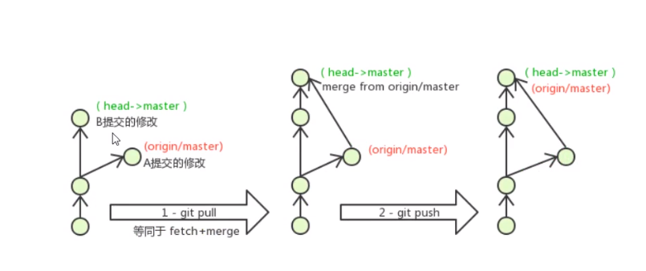

- 在B用户拉取代码时，因为A、B用户同一段时间内修改了同一文件的相同位置的代码，故会发生合并冲突
- 远程分支也是分支，所以合并时冲突的解决方式也和解决本地分支冲突时相同。

# 7.在IDEA中操作GIT

## 7.1 配置GIT路径

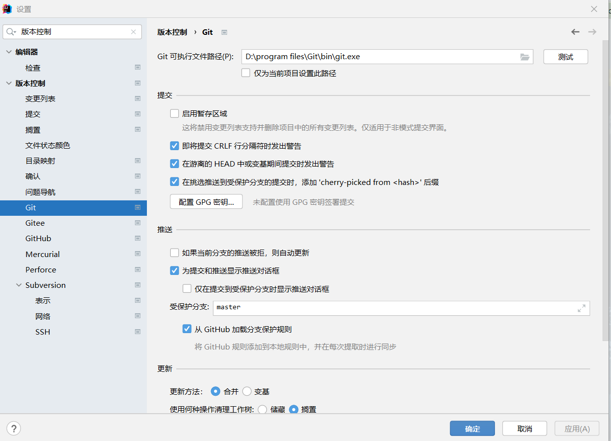

- 修改GIT可执行文件路径即可

## 7.2 配置.gitignore

```java
# Compiled class file
*.class

# Log file
*.log

# BlueJ files
*.ctxt

# Mobile Tools for Java (J2ME)
.mtj.tmp/

# Package Files #
*.jar
*.war
*.nar
*.ear
*.zip
*.tar.gz
*.rar


# virtual machine crash logs, see http://www.java.com/en/download/help/error_hotspot.xml
hs_err_pid*

```

## 7.3 新建GIT仓库

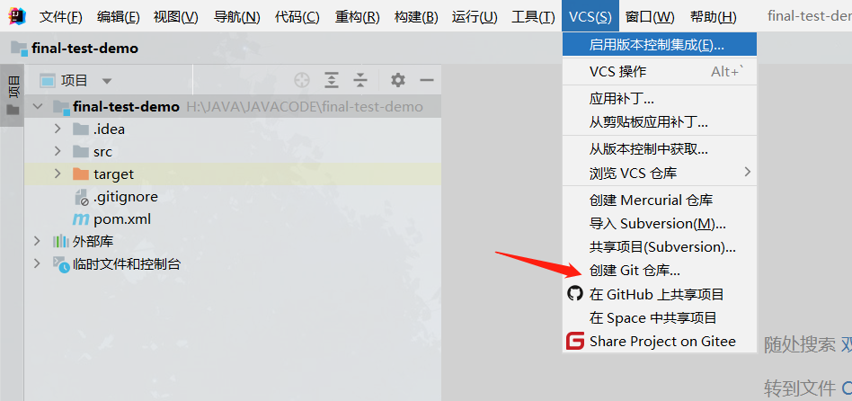

- 然后选择项目所在目录即可

## 7.4 提交到本地仓库

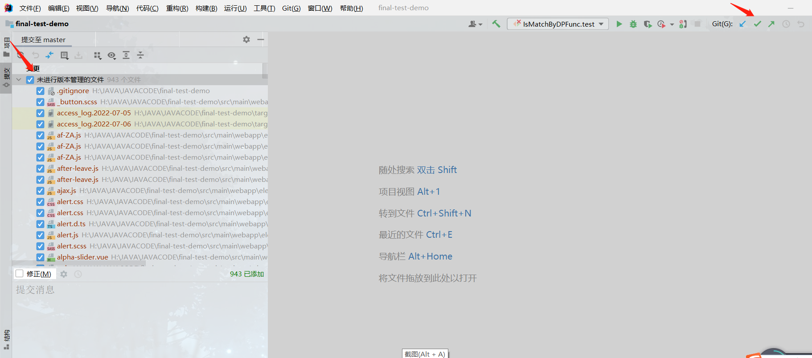

- 点击绿色的箭头,然后全选我们要管理的文件,由于已经有了.gitingnore文件,git会自动帮我们过滤掉我们不想管理的文件,因此放心提交就好了,然后填入提交消息,点击提交即可

## 7.5 推送到远程仓库

- 如下图,填入URL即可

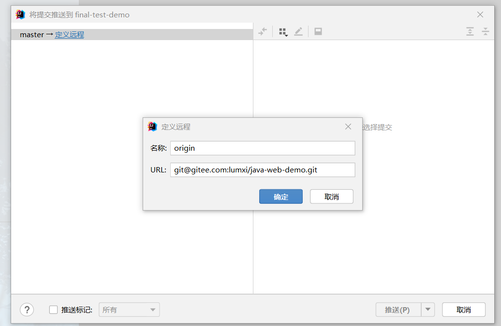

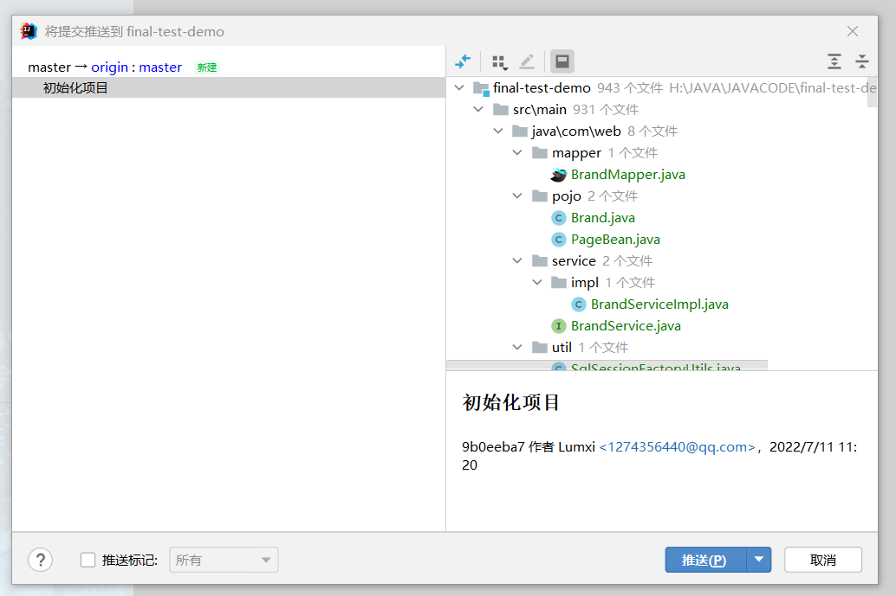


这样就是推送成功了

## 7.6 常用操作入口

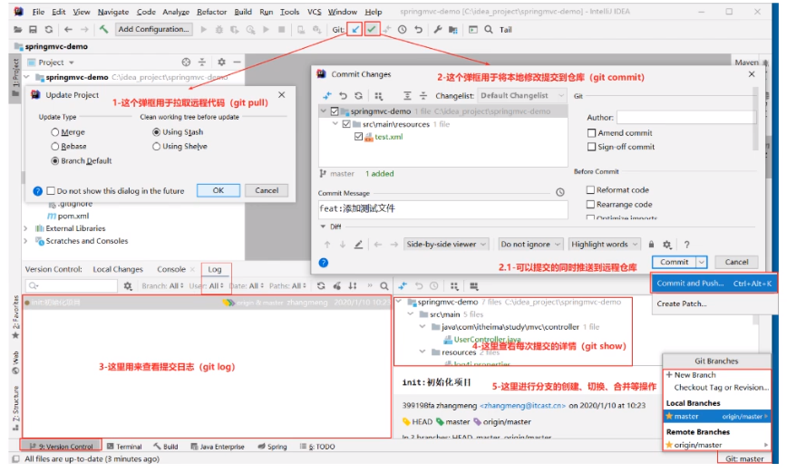

## 7.7 解决同时开发的冲突

- 首先先点pull，更新项目，将冲突的代码解决后，再推送

## 7.8 使用规范

- 切换分支前先提交本地的修改
- 代码及时提交，提交过了就不会丢
- 遇到任何问题都不要删除文件目录
