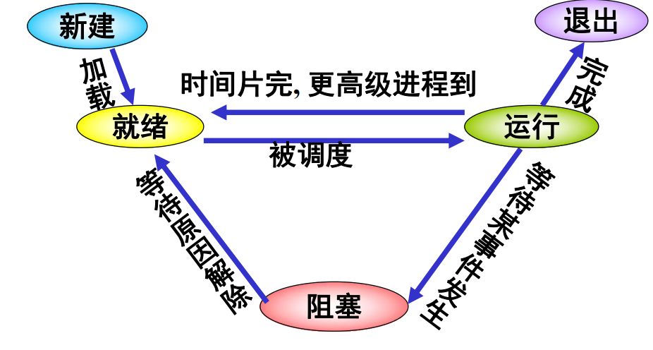
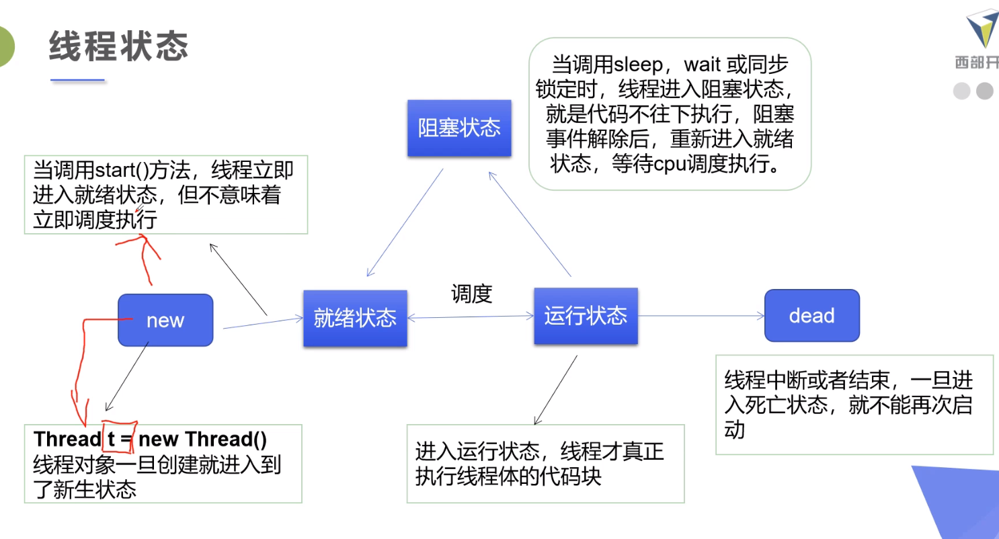
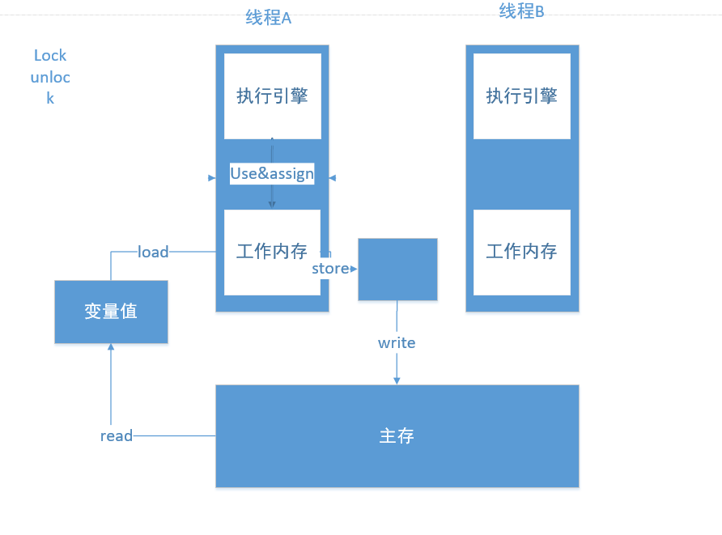

# 1. 线程、进程简介

- `进程`是执行程序的一次过程，它是一个动态的概念，是系统资源分配的单位
- `线程`是被调度运行的单位，不拥有资源，可频繁切换调度，轻装运行，也被称为轻装LWP

> 进程和线程的区别:
>
> 进程是资源分配和抢占CPU的单位，进程的资源以及地址空间供其所有的线程共享
>
> 线程不拥有系统资源，线程执行环境小，同一个进程的不同线程间切换和通信时开销比较小
>
> 线程是一个进程内部的基本流调单位，一个进程可以派生多个线程，线程间是并发执行的

# 2. JAVA中实现线程的三种方式

## 2.1 继承Thread类

```java
import org.junit.jupiter.api.Test;

public class demo01 extends Thread{//1.自定义线程继承Thread类
    //2.重写run()方法,编写线程执行体
    //线程入口点
    @Override
    public void run() {
        //线程体
        System.out.println("进入到了线程");
    }


    @Test
    public void test(){
        //3.创建线程对象,调用start()方法启动线程
        demo01 demo01 = new demo01();
        demo01.run();
        //如果使用run()方法,那么就顺序执行,相当于给了主线程一个中断,程序流跑到demo01的线程体去了,这个run()跑完才会去跑主线程剩下的
        demo01.start();
        //如果使用start()方法,那么主线程和创建出来的子线程是交替执行的,由CPU调度
    }
}

```

- 每个线程都具有优先权，具有较高优先权的线程优先于低优先级的线程执行，每个线程可能不会被标记为守护线程，当某个线程中运行的代码创建一个新的Thread对象时，新线程的优先级最初设置为等于创建线程的优先级，并且当且仅当创建线程被设置为守护线程时，才是守护线程
- 当JAVA虚拟机启动时，通常有一个非守护进程线程(通常调用某些指定类为main的方法)，JAVA虚拟机将继续执行线程，直到发生以下情况
  - 已经调用了RunTime类的exit()方法，并且安全管理器已经允许进行退出操作
  - 所有不是守护进程线程的线程都已经死亡，无论是从调用返回到run方法还是抛出run方法的run

## 2.2 实现Runnable接口

```java
package demo;

public class Demo02 implements Runnable{//1.实现Runnable接口
    //2.线程入口点
    @Override
    public void run() {
        //3.线程体
        for (int i = 0; i < 20; i++) {
            System.out.println("eating");
        }
    }

    public static void main(String[] args) {
        //1.创建实现类对象
        Demo02 demo02 = new Demo02();
        //2.创建代理类对象
        Thread thread = new Thread(demo02);
        //3.启动线程即可
        thread.start();
        for (int i = 0; i < 5000*5; i++) {
            System.out.println("looking");
        }
    }
}

```

- 实现接口Runnable具有多线程能力
- 启动线程:传入目标对象+Thread对象.start()
- 推荐使用该种方法，避免了单继承的局限性

## 2.3 实现Callable接口

- Callabe接口类似于Runnable，因为它们都是为其实例可能由另一个线程执行的类设计的。然而，Runnable不返回结果，也不会抛出异常
- 泛型的参数等于接口的返回值

```java
package demo;

import java.util.concurrent.*;

public class Demo03 implements Callable<Boolean>{//1.实现callable接口
    @Override
    public Boolean call() throws Exception {//2.实现方法需要返回值类型
        //3.创建目标对象
        return true;
    }

    public static void main(String[] args) {
        //4.创建执行服务,创建线程池,可以按照需求更改线程池中的线程数量
        ExecutorService executorService = Executors.newFixedThreadPool(1);
        //5.提交执行
        Future<Boolean> r1 = executorService.submit(new Demo03());
        //6.获取结果
        try{
            boolean res = r1.get();
            System.out.println(res);
            //7.关闭服务
            executorService.shutdown();
        }catch (ExecutionException e){
            e.printStackTrace();
        }catch (InterruptedException e){
            e.printStackTrace();
        }
    }
}
```

- 首先观察源代码发现Thread是无法直接实现Callable的，因此需要借助第三方代理来完成线程的启动

```java
//1.Runnable代理接口启动
new Thread(new Runnable()).start();
//2.FutureTask<V>代理模型启动
new Thread(new FutureTask<V>()).start();
//3.结合1和2,我们V替换为Callable的实现类,完成代理
//本质的设计模式是静态代理模式和适配器模式
FutureTask futureTask =  new FutureTask(myThread);
new Thread(futureTask).start();//myThread是Callable的实现类
new Thread(futureTask).start();//myThread是Callable的实现类
//由于JVM第二次再调用FutureTask对象所持有的线程，此时FutureTask的State已经不是NEW的状态了
//则此时直接结束对应的线程，就导致任务不再执行，只是在第一次调用时将返回结果保存了。
//FutureTask对象只会被线程执行一次
Object o = futureTask.get();//此操作可能会导致阻塞
```

# 3. 静态代理模式

- 真实对象(目标对象)都要实现同一接口
- 代理对象要代理真实角色
- 代理模式是一种更为高级的继承抽象
  - 它将某一类对象元素所需要执行的`统一的`方法封装到代理对象中
  - 而将所将要执行的`互异的`方法设置为抽象，交给真实对象来实现这个方法
  - 最终代理对象接收真实对象，执行互异的真实对象方法
  - 而这个过程中，由于要执行的统一的方法是一致的，因此只需要修改互异的方法即可

# 4. 线程状态与方法

## 4.1 五状态模型

回顾一下五状态模型,这是进程的五状态模型，对于线程而言，也是通用的




对于JAVA中的线程模型,有:



## 4.2 线程API

- `setPriority(int newPriority)`:更改线程的优先级
- `static void sleep(long mills)`:在指定的毫秒数内让当前正在执行的线程休眠
- `void join()`:等待该线程终止
- `static void yield()`:暂停当前正在执行的线程对象，并执行其他线程
- `void interrupt()`:给线程打上中断标记
- `boolean isAlive()`:测试线程是否处于活动状态

## 4.3 线程停止

- 建议线程正常停止(利用次数，不建议死循环)
- 建议使用标志位(设置一个标志位，通常情况下是存在外部因素使得线程停止了)

```java
package demo;

public class Demo05 implements Runnable{
    private boolean flag = true;
    @Override
    public void run() {
        int i = 0;
        while(flag){
            System.out.println("running"+(i));
            i++;
        }
    }

    //**设置一个公开的方法来停止线程,方式是转换标志为**
    public void stop(){
        this.flag = false;
    }
    public static void main(String[] args) {
        Demo05 demo05 = new Demo05();
        new Thread(demo05).start();
        for (int i = 0; i < 1000; i++) {
            if(i==900){
                demo05.stop();
                System.out.println("stop");
            }
        }
    }
}

```

## 4.4 线程礼让

- 礼让线程,让当前正在执行的线程暂停，但不阻塞
- 将线程从运行状态切换到就绪状态
- 让CPU重新调度，这也就意味着礼让不一定成功，最终决定权还是在CPU手上

## 4.5 join()方法

- `join()`合并线程，待此线程执行完成后，再执行其他线程，其他线程被阻塞

- 相当于是一个插队的方法

## 4.6 观测线程状态

- `Thread.STATE`

- `NEW`:尚未启动的线程处于这个状态
- `RUNNABLE`:在JAVA虚拟机中执行的线程处于此状态
- `BLOCKED`:被阻塞等待监视器锁定的线程处于此状态
- `WAITING`:正在等待另一个线程执行特定动作的线程处于此状态
- `TIMED_WAITING`:正在等待另一个线程执行动作到指定等待时间的线程处于此状态
- `TERMINATED`:已经退出的线程处于此状态

## 4.7 线程优先级

- JAVA提供一个线程调度器来监控程序中启动后进入就绪状态的所有线程，线程调度器按照优先级决定应该哪个线程来执行
  - 线程的优先级用数字来表示
    - Thread.MIN_PRIORITY = 1;//最小优先级
    - Thread.MAX_PRIORITY=10;//最高优先级
    - Thread.NORM_PRIORITY=5;//默认优先级
  - 使用`getPriority()、setPriority(int xxx)`来得到或者修改优先级

## 4.8 守护(daemon)线程

- 线程分为`用户线程`和`守护线程`
- 虚拟机必须确保用户线程执行完毕
- 虚拟机不用等待守护线程执行完毕
- 如,后台记录操作日志，监控内存，垃圾回收等待等

```java
package demo;

public class Demo06 {
    public static void main(String[] args) {
        God god = new God();
        Human human = new Human();
        Thread thread = new Thread(god);
        thread.setDaemon(true);//默认为false表示是用户线程,当为true的时候就设置为守护线程
        thread.start();
        new Thread(human).start();
        //结果是尽管我们的god线程为之设置了while(true)死循环,但是它还是会在human线程结束后被强制终止
    }

}

//来模拟一下
class God implements Runnable{
    @Override
    public void run() {
        while (true){
            System.out.println("Im god");
        }
    }
}

class Human implements Runnable{
    @Override
    public void run() {
        for (int i = 0; i < 36500; i++) {
            System.out.println("Im human");
        }
    }
}

```


# 5. 线程同步机制

## 5.1 线程同步简介

- 线程同步其实就是一种等待机制，多个需要同时访问此对象的线程进入这个对象的`等待池`，等待前面的线程使用完毕后，下一个线程再使用
- 由于同一进程的多个线程共享同一块内存空间，为了保证数据在方法中被访问时的正确性，在访问时加入了`锁机制(synchronized)`，当一个线程获得对象的排它锁，独占资源，其他资源必须等待。
  - 一个线程持有锁会导致其他所有需要此锁的线程挂起
  - 在多线程竞争下，加锁，释放锁会导致比较多的上下文切换和调度延时开销，引起性能问题
  - 如果一个优先级高的线程等待一个优先级低的线程释放锁会导致优先级倒置，引起性能问题，甚至可能引起更为严重的死锁问题
- 等待池:假设一个线程A调用了某个对象的wait()方法，线程A就会释放该对象的锁后，进入到了该对象的等待池，等待池中的线程不会去竞争该对象的锁。
- 锁池:只有获取了对象的锁，线程才能执行对象的 synchronized 代码，对象的锁每次只有一个线程可以获得，其他线程只能在锁池中等待

## 5.2 同步方法

- 由于我们可以通过private关键字来保证数据对象只能被方法所访问，所以我们只需要针对方法提出一套机制，这套机制就是`synchronized`关键字，包括两种用法
- `同步方法:public synchronized void method(int[] args){}`
- 用`synchronized`方法控制对对象的访问，每个对象对应一把锁，每个`synchronized`方法都必须获得调用该方法的对象的锁才能执行，否则线程会阻塞，方法一旦执行，就独占该锁，直到该方法返回才释放锁，后面被阻塞的线程才能获得这个锁，继续执行
- `若将一个大的方法声明为synchronized的将会影响效率` 

```java
package pojo;

public class Ticket {
    private int number = 50;
    public synchronized void sale(){
        if(number>0){
            System.out.println("卖出了第"+(number--)+"张票,还剩余"+number+"张票");
        }
    }

}
```

```java
package demo;

import org.junit.jupiter.api.Test;
import pojo.Ticket;

public class Demo07 {
    @Test
    public void test(){
        //new Thread(()->{},"A").start();标准写法
        Ticket ticket = new Ticket();

        new Thread(()->{
            for (int i = 0; i < 40; i++) {
                ticket.sale();
            }
        },"A").start();

        new Thread(()->{
            for (int i = 0; i < 50; i++) {
                ticket.sale();
            }
        },"B").start();

        new Thread(()->{
            ticket.sale();
        },"C").start();
    }
}
```

## 5.3 同步块

- 同步块:`synchronized(obj){}`
- `obj`称之为**同步监视器**
  - `obj`可以是任何对象,推荐使用共享资源作为同步监视器
  - 同步方法中无需指定同步监视器，因为同步方法的同步监视器就是this,就是这个对象本身，或者是class
- 同步监视器的执行过程
  - 第一个线程访问，锁定同步监视器，执行其中代码
  - 第二个线程访问，发现同步监视器被锁定，无法访问
  - 第一个线程访问完毕，解锁同步监视器
  - 第二个线程访问，发现同步监视器没有锁，然后锁定其并访问

## 5.4 锁(LOCK)

- 实际上使用public class Ticket {

      Lock lock = new ReentrantLock();
      
      private int number = 50;
      public void sale(){
          //执行业务代码块之前给代码加锁
          lock.lock();
          //业务代码块
          try{
              if(number>0){
                  System.out.println("卖出了第"+(number--)+"张票,还剩余"+number+"张票");
              }
          }catch (Exception e){
              e.printStackTrace();
          }finally {
              //执行完毕后解锁
              lock.unlock();
          }
      }

  }

- 是一种比较不灵活的方式，它规定了某段代码必须在锁的作用范围里面(这种劣势在出现大量的条件分支语句时将会大大凸显出来)，为了灵活使用锁，JAVA提供了锁机制，首先需要知道的是LOCK是接口(开发规范)，在此基础上有可重入锁的实现类

```java
ReentrantLock reentrantLock;//可重入锁
ReentrantReadWriteLock.ReadLock;//读锁
ReentrantReadWriteLock.WriteLock;//写锁
//从源码上看
public ReentrantLock() {//如果不带参的话,可重入锁被默认初始化为非公平锁
        sync = new NonfairSync();
}
public ReentrantLock(boolean fair) {//如果带个参的话,true的话就是生成一个公平锁，否则就是非公平锁
    sync = fair ? new FairSync() : new NonfairSync();
}
```

- 公平锁:十分公平,`先进先出，先来后到的方式来分配资源`
- 非公平锁:不公平，支持抢占，一旦出现抢占，就可能出现饥饿
- 而`synchronized`内部实现的是一个非公平锁

```java
public class Ticket {

    Lock lock = new ReentrantLock();

    private int number = 50;
    public void sale(){
        //执行业务代码块之前给代码加锁
        lock.lock();
        //业务代码块
        try{
            if(number>0){
                System.out.println("卖出了第"+(number--)+"张票,还剩余"+number+"张票");
            }
        }catch (Exception e){
            e.printStackTrace();
        }finally {
            //执行完毕后解锁
            lock.unlock();
        }
    }
}
```

## 5.5 synchronized和Lock锁的区别

- synchronized是内置的JAVA关键字,Lock是一个JAVA类
- synchronized无法判断锁的获取和释放的状态,Lock内部提供了方法来判断其锁的获得和释放情况
- synchronized能够自动释放锁，lock锁必须手动解锁，如果忘记释放锁，则可能导致**死锁**
- synchronized线程1(获得了锁，但是要去I/O，阻塞)，这时候线程2（需要锁，但是不允许获得锁，则进入等待状态），而采用Lock锁的话线程2可以不用等待，可以使用方法`lock.tryLock();`来避免等待，等不到就结束了
- synchronized是可重入锁，不可以被中断（指的是synchronized等待不可中断，也就是说当具有synchronized的代码块在等待资源的时候，它不能够从等待状态切换到其他状态去），非公平,这里解释一下，所谓非公平是指分配锁的顺序。
- Lock也是可重入锁，可以判断锁，是否公平锁可以由代码设定
- synchronized适合锁少量的代码同步问题，Lock适合锁大量的代码问题

## 5.6 使用synchronized实现消费者和生产者模型

```java
package demo;

import org.junit.jupiter.api.Test;
import pojo.Data;

/**
 * 线程交替执行
 * 线程之间的通信问题:生产者消费者问题
 */
public class Demo09 {
    @Test
    public void test() {
        Data data = new Data();
        new Thread(()->{
            for (int i = 0; i < 20; i++) {
                try {
                    data.produce();
                } catch (InterruptedException e) {
                    e.printStackTrace();
                }
            }
        },"A").start();//生产者
        
        new Thread(()->{
            for (int i = 0; i < 20; i++) {
                try {
                    data.consume();
                } catch (InterruptedException e) {
                    e.printStackTrace();
                }
            }
        },"B").start();//消费者
    }
}
```

> 这是在两个线程下测试的情况，当超过两个以上的线程就会产生问题

- 线程也可以唤醒，而不会被通知，中断或者超时，也就是此时产生了`虚假唤醒`，应用程序必须通过测试使得线程被唤醒的条件来防范，并且如果条件不满足则继续等待，换句话说,`等待应该总是出现在循环中的`
- 上面那句话听起来比较绕，是JDK帮助文档中的原话，我们来理解一下什么叫做虚假唤醒
  - 首先我们理解我们做线程通信的机制，我们对临界资源做了一次操作之后，我们就把等待池中的所有线程唤醒了，然后它就去了锁池，去竞争锁，竞争不过的就在锁池中等待。
  - 这时候我们假设有两个线程A和B,临界资源是0个，这两个线程都是生产者线程，首先A先执行，它先去判断了，发现它的数量是0，就不等待，准备执行生产资源（但是还没有生产的喔）
  - 这时候B的时间片到了，B被换下来，A上去，A上去也发现（诶，你这个临界资源数量是0，那我也要生产，然后程序流就转到了分支外面的那个程序流去了），A准备生产了，这时候时间片又到了
  - B被换上去了，然后B执行刚才没有执行完的代码，生产使得临界资源数量+1，运行完之后换A上去，A上去只记得刚才自己想要生产，那就生产呗，然后又使得临界资源数量+1，这样就产生了线程不安全的情况了。
  - 所以，所谓的虚假唤醒就是唤醒了一批原本不应该唤醒的线程。
- 解决方案
  - 将if替换为while即可，这是因为while()中的循环条件每次都会执行一次。
  - 疑点:while()循环中的条件中翻译成的底层汇编指令是否是可被中断的？还是说是是原子性的不可中断的?
  - 首先我们知道中断处理发生在`这一条指令执行完毕之后，下一条指令执行之前`
  - if()的汇编代码是**cmp**指令，因此是单指令的，当其执行完毕后就会产生新的程序流，因此如果在执行cmp结束后被打断，当它回来的时候就会执行新的程序流
  - 而while()的汇编代码是一连串的指令，如果这一连串的指令能被中断，是否意味着在某种情况下while()被打断后也会产生虚假唤醒?

```assembly
movl 8(%ebp), %edx			//将n  %edx寄存器中
movl $1, %eax				//初始result
cmpl $1, %edx				//执行do-while前的条件测试,注意,假如说我执行到这里,被中断了,那么是否意味着,我一会回来被重新
							//调度执行的时候,是否是接着上一次被打断的点继续执行?
jle .L3						//如果第一次执行前的条件测试没有通过将跳过循环（不进入）
.L2:
//循环体内部,这里我省略了
jg .L2						//决定是否退出循环
```

```java
//判断等待、业务、通知
public class Data {
    private int number = 0;
    public void consume() throws InterruptedException {
        while(number!=0){
            //需要空缓冲
            this.wait();
        }
        number++;
        System.out.println(Thread.currentThread().getName()+"=>"+number);
        //这时候通知其他线程
        this.notifyAll();
    }
   
    public void produce() throws InterruptedException {
        while(number == 0){
            //需要满缓冲
            this.wait();
        }
        number--;
        System.out.println(Thread.currentThread().getName()+"=>"+number);
        //这时候通知其他线程
        this.notifyAll();
    }
}
```

## 5.7 Condition

- Condition 是一个`多线程协调通信`的工具类，可以让某些线程一起等待某个条件（condition），只有满足条件时，线程才会被唤醒
  - await:把当前线程阻塞挂起
  - signal:唤醒阻塞的进程
- Lock替换了synchronized方法和语句调用
- Condition则是替换了对象监视器方法的使用(也还是针对synchronized的)
- 还具有精准通知进程的功能

## 5.8 使用JUC实现消费者和生产者模型

```java
package pojo;

import java.util.concurrent.locks.Condition;
import java.util.concurrent.locks.Lock;
import java.util.concurrent.locks.ReentrantLock;

//判断等待、业务、通知
public class Data {
    private int number = 100;
    Lock lock = new ReentrantLock();
    Condition condition = lock.newCondition();
    public void consume() throws InterruptedException {
        lock.lock();
        try{
            while(number == 0){
                //需要满缓冲
                condition.await();
            }
            number++;
            System.out.println(Thread.currentThread().getName()+"=>"+number);
            //这时候通知其他线程
            condition.signal();
        }catch (Exception e){
            e.printStackTrace();
        }finally {
            lock.unlock();
        }

    }
    public void produce() throws InterruptedException {
        lock.lock();
        try{
            while(number != 0){
                //需要空缓冲
                condition.await();
            }
            number--;
            System.out.println(Thread.currentThread().getName()+"=>"+number);
            //这时候通知其他线程
            condition.signal();
        }catch (Exception e){
            e.printStackTrace();
        }finally {
            lock.unlock();
        }

    }
}
```

## 5.9 使用Condition来实现多线程(三个以上之间的通信)

```java
package pojo;

import java.util.concurrent.locks.Condition;
import java.util.concurrent.locks.Lock;
import java.util.concurrent.locks.ReentrantLock;

public class Buffer {
    private int number =1;
    private Lock lock = new ReentrantLock();
    private Condition condition1 = lock.newCondition();
    private Condition condition2 = lock.newCondition();
    private Condition condition3 = lock.newCondition();
    public void printA(){
        lock.lock();
        //加锁
        try{
            while (number!=1){
                condition1.await();
            }
            System.out.println(Thread.currentThread().getName()+":I am A=>"+number);
            number = 2;
            condition2.signal();
        }catch (Exception e){
            e.printStackTrace();
        }finally {
            lock.unlock();
        }
    }

    public void printB(){
        lock.lock();
        //加锁
        try{
            while(number!=2){
                condition2.await();
            }
            System.out.println(Thread.currentThread().getName()+":I am B=>"+number);
            number = 3;
            condition3.signal();
        }catch (Exception e){
            e.printStackTrace();
        }finally {
            lock.unlock();
        }
    }

    public void printC(){
        lock.lock();
        //加锁
        try{
            while (number!=3){
                condition3.await();
            }
            System.out.println(Thread.currentThread().getName()+":I am C=>"+number);
            number = 1;
            condition1.signal();
        }catch (Exception e){
            e.printStackTrace();
        }finally {
            lock.unlock();
        }
    }
}

```

```java
package demo;

import org.junit.jupiter.api.Test;
import pojo.Buffer;

public class Demo11 {
    @Test
    public void test(){
        Buffer buffer = new Buffer();
        new Thread(()->{
            for (int i = 0; i < 100; i++) {
                buffer.printA();
            }
        },"A").start();

        new Thread(()->{
            for (int i = 0; i < 100; i++) {
                buffer.printB();
            }
        },"B").start();

        new Thread(()->{
            for (int i = 0; i < 100; i++) {
                buffer.printC();
            }
        },"C").start();
    }
}
```

# 6. 八锁问题

## 6.1 普通的synchronized修饰下,线程执行顺序问题

```java
package demo;

import java.util.concurrent.TimeUnit;

public class Demo13 {
    public static void main(String[] args) {
        //新建实例对象类
        Phone phone = new Phone();
        new Thread(()->{
            phone.send();
        },"A").start();

        //模拟网络延时情况,假设A线程先于B线程进入就绪状态,如果上了CPU,那就获得了锁
        try {
            TimeUnit.SECONDS.sleep(1);
        } catch (InterruptedException e) {
            e.printStackTrace();
        }

        new Thread(()->{
            phone.call();
        },"B").start();
    }
}
class Phone{
    //要注意:synchronized锁的是谁?锁的是调用它的实例对象类(当不是类方法的时候)
    public synchronized void send(){
        System.out.println("发短信");
    }
    public synchronized void call(){
        System.out.println("打电话");
    }
}
```

```shell
发短信
打电话
//这里的顺序是固定的,因为一旦调用了start()函数,就会将线程送入就绪队列,而且中间间隔了1000ms这么长的时间片
//CPU必然会将就绪队列中的线程送入CPU执行,那么谁先拿到锁,谁就先执行
```

- 首先资源类方法均是用`synchronized`加锁的，谁先得到这个对象的锁，谁就先执行
- 锁的对象是谁?`synchronized`锁的对象是方法的调用者
- 注意:start()方法是将处于新建态的线程送入就绪队列中，供CPU调度，与代码执行顺序有关

## 6.2 当synchronized方法中存在延迟,线程执行顺序问题

```java
package demo;

import java.util.concurrent.TimeUnit;

public class Demo13 {
    public static void main(String[] args) {
        //新建实例对象类
        Phone phone = new Phone();
        new Thread(()->{
            phone.send();
        },"A").start();

        //模拟网络延时情况,假设A线程先于B线程进入就绪状态,如果上了CPU,那就获得了锁
        try {
            TimeUnit.SECONDS.sleep(1);
        } catch (InterruptedException e) {
            e.printStackTrace();
        }

        new Thread(()->{
            phone.call();
        },"B").start();
    }
}
class Phone{
    //要注意:synchronized锁的是谁?锁的是调用它的实例对象类(当不是类方法的时候)
    public synchronized void send(){
        try {
            TimeUnit.SECONDS.sleep(4);
        } catch (InterruptedException e) {
            e.printStackTrace();
        }
        System.out.println("发短信");
    }
    public synchronized void call(){
        System.out.println("打电话");
    }
}
```

```shell
发短信
打电话
```

## 6.3 普通方法(未加同步限制)与同步方法之间的执行顺序问题

```java
package demo;

import java.util.concurrent.TimeUnit;

public class Demo14 {
    public static void main(String[] args) {
        //新建实例对象类
        Phone2 phone = new Phone2();
        new Thread(()->{
            phone.send();
        },"A").start();

        //模拟网络延时情况,假设A线程先于B线程进入就绪状态,如果上了CPU,那就获得了锁
        try {
            TimeUnit.SECONDS.sleep(1);
        } catch (InterruptedException e) {
            e.printStackTrace();
        }

        new Thread(()->{
            phone.hello();
        },"B").start();
    }
}

class Phone2{
    //要注意:synchronized锁的是谁?锁的是调用它的实例对象类(当不是类方法的时候)
    public synchronized void send(){
        try {
            TimeUnit.SECONDS.sleep(4);
        } catch (InterruptedException e) {
            e.printStackTrace();
        }
        System.out.println("发短信");
    }
    public synchronized void call(){
        System.out.println("打电话");
    }

    public void hello(){
        System.out.println("hello");
    }
}
```

```sh
hello
发短信
```

- 由于`hello()`方法不受锁的限制,它不需要等待`send()`执行完毕后才执行

## 6.4 两个对象，两个同步方法，执行顺序问题

```java
package demo;

import java.util.concurrent.TimeUnit;

public class Demo14 {
    public static void main(String[] args) {
        //新建实例对象类
        Phone2 phone1 = new Phone2();
        Phone2 phone2 = new Phone2();
        new Thread(()->{
            phone1.send();
        },"A").start();

        //模拟网络延时情况,假设A线程先于B线程进入就绪状态,如果上了CPU,那就获得了锁
        try {
            TimeUnit.SECONDS.sleep(1);
        } catch (InterruptedException e) {
            e.printStackTrace();
        }

        new Thread(()->{
            phone2.call();
        },"B").start();
    }
}

class Phone2{
    //要注意:synchronized锁的是谁?锁的是调用它的实例对象类(当不是类方法的时候)
    public synchronized void send(){
        try {
            TimeUnit.SECONDS.sleep(4);
        } catch (InterruptedException e) {
            e.printStackTrace();
        }
        System.out.println("发短信");
    }
    public synchronized void call(){
        System.out.println("打电话");
    }

    public void hello(){
        System.out.println("hello");
    }
}
```

```shell
打电话
发短信
```

- 这是因为synchronized锁的是同一个对象,那我现在都new了两个不同的对象了，那么线程各自都能获得锁，那么就按照时间顺序来执行咯

## 6.5 将同步方法用static修饰符修饰后的执行顺序问题

```java
package demo;

import java.util.concurrent.TimeUnit;

public class Demo14 {
    public static void main(String[] args) {
        //新建实例对象类
        Phone2 phone = new Phone2();
        new Thread(()->{
            phone.send();
        },"A").start();

        //模拟网络延时情况,假设A线程先于B线程进入就绪状态,如果上了CPU,那就获得了锁
        try {
            TimeUnit.SECONDS.sleep(1);
        } catch (InterruptedException e) {
            e.printStackTrace();
        }

        new Thread(()->{
            phone.call();
        },"B").start();
    }
}

class Phone2{
    //要注意:synchronized锁的是谁?锁的是调用它的实例对象类(当不是类方法的时候)
    public static synchronized void send(){
        try {
            TimeUnit.SECONDS.sleep(4);
        } catch (InterruptedException e) {
            e.printStackTrace();
        }
        System.out.println("发短信");
    }
    public static synchronized void call(){
        System.out.println("打电话");
    }

}
```

```shell
发短信
打电话
```

- `static`方法是类方法，在类一加载就有了，那么`synchronized`将作用的是`类模板`，也就是,锁这个`class`，这个`class`是唯一的

## 6.6 两个实例对象,但调用静态同步方法的执行顺序问题 

```java
package demo;

import java.util.concurrent.TimeUnit;

public class Demo14 {
    public static void main(String[] args) {
        //新建实例对象类
        Phone2 phone1 = new Phone2();
        Phone2 phone2 = new Phone2();
        new Thread(()->{
            phone1.send();
        },"A").start();

        //模拟网络延时情况,假设A线程先于B线程进入就绪状态,如果上了CPU,那就获得了锁
        try {
            TimeUnit.SECONDS.sleep(1);
        } catch (InterruptedException e) {
            e.printStackTrace();
        }

        new Thread(()->{
            phone2.call();
        },"B").start();
    }
}

class Phone2{
    //要注意:synchronized锁的是谁?锁的是调用它的实例对象类(当不是类方法的时候)
    public static synchronized void send(){
        try {
            TimeUnit.SECONDS.sleep(4);
        } catch (InterruptedException e) {
            e.printStackTrace();
        }
        System.out.println("发短信");
    }
    public static synchronized void call(){
        System.out.println("打电话");
    }

}
```

```shell
发短信
打电话
```

- 这是因为调用方法的实际上还是类方法，因此锁只有一个，谁先得到，那就谁先执行

## 6.7 普通同步方法与静态同步方法执行顺序问题

```java
package demo;

import java.util.concurrent.TimeUnit;

public class Demo14 {
    public static void main(String[] args) {
        //新建实例对象类
        Phone2 phone1 = new Phone2();
        new Thread(()->{
            phone1.send();
        },"A").start();

        //模拟网络延时情况,假设A线程先于B线程进入就绪状态,如果上了CPU,那就获得了锁
        try {
            TimeUnit.SECONDS.sleep(1);
        } catch (InterruptedException e) {
            e.printStackTrace();
        }

        new Thread(()->{
            phone1.call();
        },"B").start();
    }
}

class Phone2{
    //要注意:synchronized锁的是谁?锁的是调用它的实例对象类(当不是类方法的时候)
    public static synchronized void send(){
        try {
            TimeUnit.SECONDS.sleep(4);
        } catch (InterruptedException e) {
            e.printStackTrace();
        }
        System.out.println("发短信");
    }
    public synchronized void call(){
        System.out.println("打电话");
    }

}
```

```shell
打电话
发短信
```

- 这是因为锁的对象已经不一样了,没有用`static`修饰的方法锁的是实例对象，用了`static`修饰的方法锁的类模板，那么也就意味着有两把锁，这是因此互不干扰。

## 6.8 普通同步方法与静态同步方法共存，引入两个资源类对象的执行顺序问题

```java
package demo;

import java.util.concurrent.TimeUnit;

public class Demo14 {
    public static void main(String[] args) {
        //新建实例对象类
        Phone2 phone1 = new Phone2();
        Phone2 phone2 = new Phone2();
        new Thread(()->{
            phone1.send();
        },"A").start();

        //模拟网络延时情况,假设A线程先于B线程进入就绪状态,如果上了CPU,那就获得了锁
        try {
            TimeUnit.SECONDS.sleep(1);
        } catch (InterruptedException e) {
            e.printStackTrace();
        }

        new Thread(()->{
            phone2.call();
        },"B").start();
    }
}

class Phone2{
    //要注意:synchronized锁的是谁?锁的是调用它的实例对象类(当不是类方法的时候)
    public static synchronized void send(){
        try {
            TimeUnit.SECONDS.sleep(4);
        } catch (InterruptedException e) {
            e.printStackTrace();
        }
        System.out.println("发短信");
    }
    public synchronized void call(){
        System.out.println("打电话");
    }

}
```

```shell
打电话
发短信
```

- 同样的还是锁的对象的问题，调用`phone1.send()`的时候，锁的是类模板，调用`phone2.call()`，锁的是`phone2`这个对象，因此本质上还是两把锁。

## 6.9 八锁案例总结

- 锁是什么?
  - 锁机制提供了一种特殊的资源对临界资源进行保护，锁能够保证临界资源的互斥/同步访问
- `synchronized`锁的对象是谁?
  - 分两种情况讨论
  - 当`synchronized`修饰普通方法时，synchronized锁的是调用者实例对象
  - 当`synchronized`修饰静态方法时，synchronized锁的是类模板
- `start()`与`run()`的区别
  - `start()`将进程从新建态进程池送入`就绪队列`
  - `run()`将进程送入CPU，开始执行
- `synchronized`方法不可中断如何解释?
  - `synchronized`方法不可中断指的不是方法的原子化执行，而是等待的原子化执行，也就是说，被`synchronized`修饰的方法允许被中断，但在等待synchronized方法释放锁的线程是不可以被中断的。

# 7. 集合类不安全

## 7.1 List不安全

- 先来看一段unsafe的代码

```java
        ArrayList<String> lists = new ArrayList<>();
        for (int i = 0; i < 10; i++) {
            new Thread(()->{
                lists.add(UUID.randomUUID().toString().substring(0,5));
                System.out.println(lists);
            },String.valueOf(i)).start();
        }
```

- 在执行完毕之后,JVM报错`java.util.ConcurrentModificationException(并发修改异常)`，那么也就说明在并发环境下，ArrayList是线程不安全的 

- 解决方案

  - 换用线程安全类:如`Vector`、或者是给定的syncCollections

  - ```java
    List<String> lists = Collections.synchronizedList(new ArrayList<>());
    ```

  - 使用CopyOnWriteList

  - ```java
    List<String> lists = new CopyOnWriteArrayList<>();
    ```

## 7.2 CopyOnWriteArrayList

- `CopyOnWrite(COW)`:写入时复制
  - 多个线程调用时，读取的时候可以任意读取
  - 在写入的时候，避免覆盖，造成数据问题
  - 当我们向容器中添加一个元素的时候，不是直接添加，而是对当前容器进行copy，复制一个容器，在这个复制的容器中添加元素，添加完之后，再将引用指向这个新容器

```java
/*源代码*/   
	public E set(int index, E element) {
        final ReentrantLock lock = this.lock;
        lock.lock();
        try {
            Object[] elements = getArray();
            E oldValue = get(elements, index);

            if (oldValue != element) {
                int len = elements.length;
                Object[] newElements = Arrays.copyOf(elements, len);
                //Arrays的copyOf()方法传回的数组是新的数组对象，改变传回数组中的元素值，不会影响原来的数组。
                //这一句就是copyOnWrite的精髓所在
                newElements[index] = element;
                setArray(newElements);
            } else {
                // Not quite a no-op; ensures volatile write semantics
                setArray(elements);
            }
            return oldValue;
        } finally {
            lock.unlock();
        }
    }
```

- 优点
  - CopyOnWrite容器可以并发的进行读操作，而不需要加锁，因为当前容器不会添加任何元素，所以这也是一种读写分离的思想，读和写的操作分开了。
  - 相对于Vector而言，其`add()`方法没有使用`synchrionzed`，而是使用了`lock`,提高了性能
- 缺点
  - 内存利用问题，产生了两个容器，如果是仅仅修改了一个元素，浪费比较严重
  - 只能保持数据的最终一致性，无法保持 实时性，所以如果希望读到新数据，不要用copyOnWrite

## 7.3 CopyOnWriteArraySet

- 复习:Set是继承于Collection的接口，其实现类有`HashSet`和`TreeSet`，定义一组`不允许出现重复元素，并且无序的集合`

```java
    public static void main(String[] args) {
        Set<String> set = new CopyOnWriteArraySet<>();
        for (int i = 1; i <= 30; i++) {
            new Thread(()->{
                set.add(UUID.randomUUID().toString().substring(0,5));
                System.out.println(set);
            },String.valueOf(i)).start();
        }
    }
```

- HashSet的底层是什么?

  - HashSet的底层实际上就是HashMap

  - ```java
        public HashSet() {
            map = new HashMap<>();
        }
    ```

  - 其add的原理是

  - ```java
        public boolean add(E e) {
            return map.put(e, PRESENT)==null;
            //看了下也是挺离谱的,就是利用key唯一的特性来构造出不出现重复元素的现象
            //后边那个PRESENT就相当于一个占位符,是一个固定的值来的
        }
    ```

  ## 7.4 ConcurrentHashMap

  Map的使用方法

  - ```java
    Map<String,String> map = new HashMap<>();
    //加载因子:默认为0.75 
    //容量:	默认为16
    
    ```

# 8.常用的辅助类

## 8.1 CountDownLatch

- 允许一个或者多个线程等待直到其他线程中执行的一组操作完成的同步辅助
- 每次有线程调用countDown()时，其数量就会-1，假设计数器归零时，countDownLatch.await()所阻塞的线程就会被唤醒，继续向下执行

```java
    @Test
    public void countDownLatchTest(){
        //计数器
        //填入的值表示倒计时的阈值,当小于0的时候会抛出不合法参数异常
        CountDownLatch countDownLatch = new CountDownLatch(5);
        for (int i = 1; i <= 6; i++) {
            new Thread(()->{
                System.out.println(Thread.currentThread().getName()+"Go out");
                //会使得传入的倒计时阈值--,读者和写者问题可以用到,东车西车问题等
                countDownLatch.countDown();
            },String.valueOf(i)).start();
        }
        try {
            countDownLatch.await();//等待计数器归零，然后再向下执行
        } catch (InterruptedException e) {
            e.printStackTrace();
        }
        System.out.println("end");
    }
```

## 8.2 CyclicBarrier(加法计数器)

- 允许一组线程全部等待彼此达到共同屏障点的同步辅助，循环阻塞在涉及固定大小的线程方法的程序中很有用，这些线程必须偶尔等待彼此，屏障被称为循环，因为它可以在等待的线程被释放后重新使用

```java
    @Test
    public void cyclicBarrierTest(){
        CyclicBarrier cyclicBarrier = new CyclicBarrier(7,()->{
            System.out.println("get seven");
        });
        for (int i = 0; i < 7; i++) {
            new Thread(()->{
                try {
                    cyclicBarrier.await();
                } catch (InterruptedException e) {
                    e.printStackTrace();
                } catch (BrokenBarrierException e) {
                    e.printStackTrace();
                }
            }).start();
        }
    }
```

## 8.3 Semaphore

- 一组计数信号量，维持一组许可证，相当于操作系统学的实现。

 ```java
     @Test
     public void semaphoreTest(){
         //默认临界资源数量
         Semaphore semaphore = new Semaphore(5);
         for (int i = 0; i < 6; i++) {
             new Thread(()->{
                 try {
                     semaphore.acquire();
                     System.out.println(Thread.currentThread().getName()+"得到了");
                 } catch (InterruptedException e) {
                     e.printStackTrace();
                 }finally {
                     semaphore.release();
                 }
             },String.valueOf(i)).start();
         }
     }
 ```

# 9. 读写锁

## 9.1 ReadWriteLock

- ReadWriteLock是维护一对关联的locks，一个用于只读操作，一个用于写入操作，允许多个读者读入，但是只允许一个写者来写。
- 独占锁:写锁，一次只能被一个线程所占用
- 共享锁:读锁，一次可以被多个线程所占用

```java
package Util;

import org.junit.jupiter.api.Test;

import java.util.HashMap;
import java.util.Map;
import java.util.concurrent.locks.ReadWriteLock;
import java.util.concurrent.locks.ReentrantReadWriteLock;

public class Demo04 {
    @Test
    public void test1(){
        Cache cache = new Cache();
        for (int i = 0; i < 5; i++) {
            int finalI = i;
            new Thread(()->{
                cache.put(String.valueOf(finalI),String.valueOf(finalI));
            },String.valueOf(i)).start();
        }

        for (int i = 0; i < 5; i++) {
            int finalI = i;
            new Thread(()->{
                System.out.println(cache.get(String.valueOf(finalI)));
            },String.valueOf(i)).start();
        }
    }
}

class Cache{
    private volatile Map<String,Object> map = new HashMap<>();
    //读写锁:更加细粒度的控制
    private ReadWriteLock readWriteLock = new ReentrantReadWriteLock();

    public Object get(String key){//读者
        readWriteLock.readLock().lock();
        try{
            System.out.println(Thread.currentThread().getName()+"读取完毕");
        }catch (Exception e){
            e.printStackTrace();
        }finally {
            readWriteLock.readLock().unlock();
            return map.get(key);
        }
    }

    public void put(String key,Object value){//写者
        readWriteLock.writeLock().lock();
        try{
            System.out.println(Thread.currentThread().getName()+":写入"+key);
            map.put(key,value);
            System.out.println(Thread.currentThread().getName()+"写入完毕");
        }catch (Exception e){
            e.printStackTrace();
        }finally {
            readWriteLock.writeLock().unlock();
        }
    }
}

```

## 9.2 脏读

- 通过9.1的例子我们可以得到一个结论，可以通过读写锁，锁分离的形式来提高程序的性能。
- 但是我们同时会有一个疑问，读的话不是可以多个读者同时读吗？为什么还需要加锁互斥呢？
  - 首先这个问题，我们互斥的对象不是读者和读者，而是读者和写者
- 为什么将互斥读者和写者呢？
  - 假设我们数据库中有事务A和事务B，事务A读取到了事务B更新了，但是还没有`commit()`的数据，然后事务B发生错误，回滚了，但是事务A刚才读到了刚才事务B更新了但还没有提交的数据，这时候就称之为发生了`脏读`
  - 具体地说，一个数据原本是干净的，但是事务B将它进行修改，使得其不再干净了，此时事务A读取到事务B修改后的数据，也就是脏数据，但是事务B的修改没有提交到数据库，最终事务A读取到的是脏数据，造成了程序错误。
  - **读取未提交的数据会导致数据不一致的问题**

## 9.3 幻读

- 指的是事务A在查询完记录总数后，事务B执行了新增数据的操作，事务A再次查询记录总数，发生两次查询的结果不一致，平白无故地多了几条记录，这种现象称之为幻读

## 9.4 不可重复读

- 不可重复读指的是在数据库访问的时候，一个事务在前后两次相同的访问中却读取到了不同的数据内容
- 比如说我有事务A和事务B，其中事务A的执行周期比较长，他在第一次执行的时候读取一个值为100，然后又去执行别的事情去了，然后这时候事务B修改了这个值，把这个值变成了200，发现这个值和第一次读取的值不相同，这个现象称之为不可重复读
- **前后多次读取，数据内容不一致**

## 9.5 不可重复读和幻读的区别

- 幻读和不可重复读的本质是一样的，两者都表现为两次读取的结果不一致。但是不可重复读指的是两次读取同一条记录的值不同，而幻读指的是两次读取的记录数量不同。
- **不可重复读重点在于update和delete，而幻读的重点在于insert。**
- 如果使用锁机制来实现这两种隔离级别，在不可重复读中，事务A第一次读取到数据后，就将这些数据加行锁，其它事务无法修改这些数据，就可以实现可重复读了。
- 但这种方法却无法锁住新增的数据，所以当事务A先前读取了数据，或者修改了全部数据，事务B还是可以新增数据并提交，这时事务A就会 发现莫名其妙多了一条之前没有的数据，这就是幻读，不能通过行锁来避免。
- 需要`Serializable隔离级别`，读用读锁，写用写锁，读锁和写锁互斥，这么做可以有效的避免幻读、不可重复读、脏读等问题，但会极大的降低数据库的并发能力。
- 所以说不可重复读和幻读最大的区别，就在于如何通过锁机制来解决他们产生的问题。

# 10.  阻塞队列

## 10.1 阻塞队列定义

**阻塞队列**是一个支持两个附加操作的队列，这两个附加的操作是:在队列为空时，获取元素的线程会等待队列变为非空，当队列满时，存储元素的线程会等待线程变为可用，阻塞队列通常用于生产者和消费者的场景。

## 10.2 阻塞队列的实现类

JDK7提供了7个阻塞队列。分别是

- **ArrayBlockingQueue ：** 一个由数组结构组成的有界阻塞队列。
- **LinkedBlockingQueue ：** 一个由链表结构组成的有界阻塞队列。
- **PriorityBlockingQueue ：** 一个支持优先级排序的无界阻塞队列。
- **DelayQueue：** 一个使用优先级队列实现的无界阻塞队列。
- **SynchronousQueue：** 一个不存储元素的阻塞队列。
- **LinkedTransferQueue：** 一个由链表结构组成的无界阻塞队列。
- **LinkedBlockingDeque：** 一个由链表结构组成的双向阻塞队列。

## 10.3 四组API

| 方式         | 抛出异常  | 不会抛出异常，有返回值 | 阻塞等待 | 超时等待                    |
| ------------ | --------- | ---------------------- | -------- | --------------------------- |
| 添加         | add()     | offer()                | put()    | offer(obj,timeout,TimeUnit) |
| 移除         | remove()  | poll()                 | take()   | offer(timeout,TimeUnit)     |
| 判断队列首部 | element() | peek()                 | -        | -                           |

## 10.4 同步队列(synchronized qeueue)

- SynchronousQueue是一个不存储元素的阻塞队列，是阻塞队列的一个实现类
- 和其他队列不同，只要put了一个元素，必须等待其他进程从中将刚才put的元素取出后，才能put下一个元素，否则不能再put

# 11. 线程池

 ## 11.1 池化技术(pooling)

- **池化技术** (Pool) 是一种很常见的编程技巧，在请求量大时能明显优化应用性能，降低系统频繁建连的资源开销。
- 我们日常工作中常见的有`数据库连接池`、`线程池`、`对象池`等，它们的特点都是**将 “昂贵的”、“费时的” 的资源维护在一个特定的 “池子” 中**，规定其`最小连接数`、`最大连接数`、`阻塞队列`等配置，方便进行统一管理和复用，通常还会附带一些探活机制、强制回收、监控一类的配套功能。

## 11.2 引入线程池的好处

- 降低系统资源的消耗
- 提高响应速度,可复用线程
- 方便管理

- 可以控制最大并发数

## 11.3 线程池-三大方法

- 线程池的大小决定着最多有几个线程可以并发

```java
Executors.newSingleThreadExecutor();//线程池中只有一个线程
Executors.newFixedThreadPool(5);//创建一个固定大小的线程池
Executors.newCachedThreadPool();//可伸缩的，大小可变线程池
```

- 使用方法示例

```java
    @Test
    public void test1(){
        ExecutorService executorService = Executors.newSingleThreadExecutor();//线程池中只有一个线程
        //Executors.newFixedThreadPool(5);//创建一个固定大小的线程池
        //Executors.newCachedThreadPool();//可伸缩的，大小可变线程池
        try{
            for (int i = 0; i < 10; i++) {
                executorService.execute(()->{//执行线程的方法
                    System.out.println(Thread.currentThread().getName()+"ok");
                });
            }
        }catch (Exception e){
            e.printStackTrace();
        }finally {
            executorService.shutdown();
        }
    }
```

## 11.4 线程池-七大参数

- 三种方法的源代码解析

```java
public static ExecutorService newSingleThreadExecutor() {
    return new FinalizableDelegatedExecutorService
        (new ThreadPoolExecutor(1, 1,//核心线程数=最大核心线程=1,因此只能有一个线程参与并发
                                0L, TimeUnit.MILLISECONDS,
                                new LinkedBlockingQueue<Runnable>()));
}

public static ExecutorService newFixedThreadPool(int nThreads) {
    return new ThreadPoolExecutor(nThreads, nThreads,//核心线程数=最大核心线程=1,因此只能有n个线程参与并发
                                  0L, TimeUnit.MILLISECONDS,
                                  new LinkedBlockingQueue<Runnable>());
}

public static ExecutorService newCachedThreadPool() {
    return new ThreadPoolExecutor(0, Integer.MAX_VALUE,//最小可以到0,最大可以到2^31次方
                                  60L, TimeUnit.SECONDS,
                                  new SynchronousQueue<Runnable>());
}
//本质上还是调用了ThreadPoolExecutor()的构造,只是其中参数不同而已

```

```java
public ThreadPoolExecutor(int corePoolSize,					//核心线程池大小
                          int maximumPoolSize,				//最大核心线程池大小
                          long keepAliveTime,				//超时了没有人调用就会被释放
                          TimeUnit unit,					//超时设置的时间单位
                          BlockingQueue<Runnable> workQueue,//阻塞队列
                          ThreadFactory threadFactory,		//线程工厂,用来创建线程的
                          RejectedExecutionHandler handler	//拒绝策略
                         ) {
    if (corePoolSize < 0 ||
        maximumPoolSize <= 0 ||
        maximumPoolSize < corePoolSize ||
        keepAliveTime < 0)
        throw new IllegalArgumentException();
    if (workQueue == null || threadFactory == null || handler == null)
        throw new NullPointerException();
    this.acc = System.getSecurityManager() == null ?
        null :
    AccessController.getContext();
    this.corePoolSize = corePoolSize;
    this.maximumPoolSize = maximumPoolSize;
    this.workQueue = workQueue;
    this.keepAliveTime = unit.toNanos(keepAliveTime);
    this.threadFactory = threadFactory;
    this.handler = handler;
}
```

- 所谓核心线程数就是一定会开启的线程处理接口数量，也就是保底的量，当大量的业务请求到来的时候，过载的时候就会根据需求启动更多的线程处理接口，这时候后面所启动的线程处理接口就是，非核心线程

```java
/*自定义线程池*/
new ThreadPoolExecutor(2,
                       5,
                       3, TimeUnit.SECONDS,
                       new LinkedBlockingDeque<>(),
                       Executors.defaultThreadFactory(),
                       new ThreadPoolExecutor.AbortPolicy());//默认拒绝策略

}
```

## 11.5 线程池-四大拒绝策略

```shell
ThreadPoolExecutor.AbortPolicy()
//线程池已经满，超出线程池处理能力，忽略该线程的请求并且抛出异常
//所谓已满就是阻塞队列的最长长度+线程池的最大大小,一旦线程达到这个数量，就会抛异常
ThreadPoolExecutor.CallerRunsPolicy();
//通俗的讲，就是哪来的回哪去
//当线程池满了，这时候就不再新建线程，转而把当前任务(Task)转交给上一级,创建这个Task的线程
//比如说我在main里面创建了这个Task,打算交给线程池，但是线程池说它处理不了，所以我的这个Task哪来的就回哪去
//回到main线程中，让main线程执行这个Task
ThreadPoolExecutor.DiscardOldestPolicy();
//当线程池处理能力到达限度的时候，尝试去和最早执行任务的线程竞争
//竞争成功则执行
//否则就被抛弃
ThreadPoolExecutor.DiscardPolicy();
//与AbortPolicy()相对的，它不会抛出异常，只是简单地将提交的Task丢弃
```

## 11.6 如何调参

- 关键是最大线程数量不好调，我们可以分情况
  - `CPU密集型`：看服务器参数，观察服务器能够最大支持多少条线程，就设置为多少
    - `Runtime.getRuntime().availableProcessors();`通过此行获得最大并行线程数
  - `I/O密集型`：判断程序中I/O时间长的线程数，只要我的值大于这个线程数，就可以尽量避免长期阻塞

# 12. 四大函数式接口

- 函数式接口:只有一个方法的接口就称为函数式接口

## 12.1 函数式接口

```java
Function<String,String> function =  (str)->{return str;};
//原型是Function<T,R> 传入一个T 返回一个R
//内部方法是R apply(T t)
```

## 12.2 断定式接口

```java
Predicate<String> predicate = (str)->{return str.isEmpty();};
//有一个输入参数T
//返回值是boolean类型的
//内部方法是boolean test(T o)
```

## 12.3 供给型接口

```java
Supplier<String> supplier = ()->{return "aaa";};
//没有输入参数
//有返回一个T类型的变量
T get();
```

## 12.4 消费型接口

```java
Consumer<String> consumer = (str)->{
    System.out.println(str);
};
//有一个输入参数T
//内部方法是void accept(T t)
```

# 13. Stream流式计算

## 13.1 Stream流式计算定义

- 常用的集合是为了存储数据集，而对于集合数据的一些处理(例如筛选数据集合等)，可以使用Stream流式计算
- 集合.stream()可以将集合对象转化为流对象进行数据处理(方法的参数支持函数式接口)

## 13.2 Stream流式计算实例

```java
    @Test
    public void test4(){
        User u1 = new User(1,"a",21);
        User u2 = new User(2,"b",22);
        User u3 = new User(3,"c",23);
        User u4 = new User(4,"d",24);
        User u5 = new User(6,"e",25);
        List<User> list = Arrays.asList(u1,u2,u3,u4,u5);
        list.stream()
                .filter(u->{return u.getId()%2==0;})
                .filter(u->{return u.getAge()>=23;})
                .map(u->{return u.getName().toUpperCase();})
                .sorted((U1,U2)->{return U2.compareTo(U1);})
                .limit(1)
                .forEach(System.out::println);
    }

}

class User{
    public User(int id,String name,int age){
        this.id = id;
        this.name = name;
        this.age = age;
    }
    int id;
    String name;
    int age;

    public int getId() {
        return id;
    }

    public void setId(int id) {
        this.id = id;
    }

    public String getName() {
        return name;
    }

    public void setName(String name) {
        this.name = name;
    }

    public int getAge() {
        return age;
    }

    public void setAge(int age) {
        this.age = age;
    }
}
```

- 代码解析
  - `filter`需要传入一个`断定式接口`，使用lambda表达式来过滤不符合要求的对象，如果比较结果是true,则该对象被保留传递，否则被过滤
  - `map`是函数型接口(Function)，传入一个泛型T，对然后对该泛型对象进行修改，注意其return的接口就是修改的结果
  - `sorted`使用选择器进行排序
  - `limit`类似于sql语句,进行分页
  - `System.out::println`:是实现了输出的一个消费者接口实现类

# 14. ForkJoin(分支合并)

## 14.1 ForkJoin定义

- ForkJoin框架是JAVA7提供了一个用于并行执行任务的框架，是一个把大任务分割成若干小任务，最终汇总每个小人物的结果后得到大任务的结果的过程
- 只能将一个任务切成两个，而不能切成其他数量

## 14.2 工作窃取

- 简单来说，就是空闲的线程试图从繁忙线程的deques中窃取工作。
- 默认情况下每个工作线程从自己的双端队列中获取任务，但如果自己的双端队列中的任务已经执行完毕，双端队列为空的时候，工作线程就会从另一个忙线程的双端队列尾部或者全局入口队列中获取任务，因为这是最大概率可能找到工作的地方
- 这种方法最大限度地减少了线程竞争任务的可能性，它还减少了工作线程寻找任务的次数，因为它首先在最大可用的工作块上工作

## 14.3 用法实例

```java
package Util;

import org.junit.jupiter.api.Test;

import java.util.concurrent.ExecutionException;
import java.util.concurrent.ForkJoinPool;
import java.util.concurrent.ForkJoinTask;
import java.util.concurrent.RecursiveTask;

public class Demo07 extends RecursiveTask<Long> {

    private Long start;//子任务开始计算的值
    private Long end;  //子任务结束计算的值
    private Long threshold = 10000L;

    public Demo07(Long start, Long end) {
        this.start = start;
        this.end = end;
    }

    @Override
    protected Long compute() {
        if((end-start)<threshold){
            Long sum = 0L;
            for (Long i = start; i <= end; i++) {
                sum+=i;
            }
            return sum;
        }else{
            //拆分子任务
            Long mid = (start+end)/2;
            Demo07 task1 =new Demo07(start,mid);
            task1.fork();
            Demo07 task2 =new Demo07(mid+1,end);
            task2.fork();
            return task1.join()+task2.join();
        }
    }

}
```

```java
//测试代码
public static void main(String[] args) throws ExecutionException, InterruptedException {
    ForkJoinPool forkJoinPool = new ForkJoinPool();
    ForkJoinTask<Long> submit = forkJoinPool.submit(new Demo07(0L, 10_0000_0000L));
    System.out.println(submit.get());
}
```

```java
/*使用并行流计算*/
System.out.println(LongStream.rangeClosed(0L, 10_0000_000L).parallel().reduce(0, Long::sum));
```

# 15. 异步回调

## 15.1 Future

- 在并发编程中，我们经常用到非阻塞的模型，在之前的多线程的三种实现的，不管是继承Thread类还是实现runnable接口，都无法保证获取到之前的执行结果，通过实现Callback接口，并用future可以来接收多线程的执行结果
- Future表示一个可能还没有完成的异步任务的结果，针对这个结果可以添加Callback以便在任务执行成功或者失败后做出相应的操作

## 15.2 异步回调实例

```java
package Util;

import java.util.concurrent.CompletableFuture;
import java.util.concurrent.ExecutionException;

public class Demo08 {
    public static void main(String[] args) throws ExecutionException, InterruptedException {
        CompletableFuture<Integer> completableFuture = CompletableFuture.supplyAsync(()->{
            //执行的任务体
            System.out.println(Thread.currentThread().getName()+"supplyAsync=>ok");
            int i =10/0;//除0错误
            return 1024;
        });

        System.out.println(completableFuture.whenComplete((t,u)->{
            System.out.println("t=>"+t);
            System.out.println("u=>"+u);//当异步任务完成后的输出
        }).exceptionally((e)->{//当发生异常后,所对应的处理
            System.out.println(e.getMessage());
            return 404;
        }).get());
    }
}
```

# 16. JMM(JAVA内存模型)(Java Memory Model)

- 线程解锁前，必须把共享内存刷回主存，这是因为线程在使用共享变量时，使用的是存在于其地址空间的变量副本，当退出CPU时，需要将做了更改的副本刷新回去主存
- 线程加锁前，必须读取主存中的最新值到工作内存中
- 加锁和解锁必须是同一把锁



# 17. Volatile

- Java提供的`轻量级同步机制`
  - 保证可见性
  - 不保证原子性
  - 禁止指令重排
    - 什么是指令重排:在执行程序的时候，为了提高性能，编译器和处理器常常会对指令做重排序
    - 也就是在学CSAPP的时候，在编译的时候，加上编译性能参数，就可以生成不一样的指令流
    - 这样就产生了一个问题，当指令是并行的，也可能产生重排现象，这是一种十分危险的行为
    - 内存屏障
      - 可以保证特定的操作的执行顺序
      - 可以保证某些变量的内存的可见性
- Volatile实际上提供了一组约定，约定每次读取该变量都要去主存中读取，而不是线程自己的栈空间

- 如何解决非原子性的问题?
  - 使用JAVA内置的原子类`AtomicInteger`解决该问题

```java
package Util;

import java.util.concurrent.atomic.AtomicInteger;

public class Demo09{
    //原子类的Integer
    private static volatile AtomicInteger num = new AtomicInteger();//底层是CAS,底层并发原理
    public static void add(){num.getAndIncrement();}

    public static void main(String[] args) {
        for (int i = 0; i < 20; i++) {
            new Thread(()->{
                for(int j = 0;j<1000;j++){
                    add();
                }
            }).start();
        }

        while(Thread.activeCount()>2){
            Thread.yield();//让别的进程执行,main线程不要搞了
        }
        System.out.println(num.get());
    }
}
```

# 18. 单例模式

## 18.1 单例模式简介

- 单例模式的概念:单例模式确保某个类只有一个实例，而且自行实例化并向整个系统提供这个实例。在计算机系统中，线程池、缓存、日志对象、对话框、显卡的驱动程序对象通常被设计为单例。这些应用或多或少具有资源管理器的功能，每台计算机可以有若干个打印机，但是只能有一个printer spooler，以避免两个打印作业同时输出到打印机上。总之，选择单例模式就是为了避免不一致的状态，避免政出多头
- 单例模式的特点
  - 单例类只能有一个实例
  - 单例类必须自己创建自己唯一的实例
  - 单例类必须给所有其他对象提供这一实例

## 18.2 饿汉式单例

```java
package single;

/*饿汉式单例*/
public class Hungry {
    private byte[] data1 = new byte[1024*1024];
    private byte[] data2 = new byte[1024*1024];
    private byte[] data3 = new byte[1024*1024];
    private byte[] data4 = new byte[1024*1024];

    private Hungry(){//注意构造器私有

    }
    private final static Hungry HUNGRY = new Hungry();//一旦类被加载，就生成该单例对象

    public static Hungry getInstance(){//提供对外访问的方法
        return HUNGRY;
    }

}

```

- 这种方法是存在问题的，由于是饿汉式的加载机制，因此一旦加载，就意味着类内的所有元素都被加载了，如果存储了大量的空间数据，可能造成空间浪费

## 18.3 懒汉式单例

- 由饿汉式单例可知，现在无论用户是否有使用该对象实例的需求，一旦程序启动，就会启动饿汉式实例的创建过程，如果用户全程都没有使用该对象实例的要求的话，有可能白白造成空间浪费，于是我们有个想法，能否存在一种模式，我们需要用这个对象的时候，才去加载呢?

```java
package single;
/*单线程下安全,多线程下会产生问题,原因还是线程并发抢占CPU执行的问题*/
/*解决方案:加锁(双重校验锁)*/
/*懒汉式单例*/
public class Lazy {
    private Lazy(){

    }
    private static Lazy lazy;

    public Lazy getInstance(){
        if(lazy == null){
            lazy = new Lazy();
        }
        return lazy;
    }
}
```

```java
package single;
/*单线程下安全,多线程下会产生问题,原因还是线程并发抢占CPU执行的问题*/
/*解决方案:加锁(双重校验锁)*/
/*懒汉式单例*/
/*首先这是我们最容易想到的一种方式,就是在获取对象前,先获得锁,然后才能获取对象*/
/*这种方式会有一个问题,就是就算我这个对象实例已经存在了,我也要去获取锁,这种就会导致性能下降*/
public class Lazy {
    private Lazy(){

    }
    private static Lazy lazy;

    public Lazy getInstance(){
        synchronized (Lazy.class){//确保只有一个对象能得到这个锁,确保创建一次
            if(lazy == null){
                lazy = new Lazy();
            }
        }
        return lazy;
    }
}
```

```java
package single;

/*懒汉式单例*/
public class Lazy {
    private Lazy(){

    }
    private volatile static Lazy lazy;//volatile

    public Lazy getInstance(){
        if(lazy == null){
            synchronized (Lazy.class){//确保只有一个对象能得到这个锁,确保创建一次
                if(lazy == null){
                    lazy = new Lazy();//注意,这不是一个原子性操作
                    /**
                     * 1.分配内存空间
                     * 2.执行构造方法,初始化对象
                     * 3.把对象指向空间
                     * 可能导致指令重排,因此使用volatile来避免这个问题
                     */
                }
            }
        }
        return lazy;
    }

}

```

## 18.4 防御性编程

- 这种方法可以通过反射来破坏单例的唯一性，我们可以通过抛出异常的方式来阻止这种行为

```java
package single;
/*问题代码*/
public class Holder {

    private Holder(){

    }

    public static class InnerClass{
        private static final Holder HOLDER = new Holder();

    }

    public static Holder getInstance(){
        return InnerClass.HOLDER;//调用内部类的Holder对象
    }


}
```

```java
/*防御性编程1*/
/*成功弥补了用户通过单例的正常入口new出对象后,再通过构造器去new新的示例*/
/*漏洞:假如说用户就是不走正常的入口,依然会产生这样的问题*/
package single;

/*懒汉式单例*/
public class Lazy {
    private Lazy(){
        synchronized (Lazy.class){
            if(lazy!=null){
                throw  new RuntimeException("不要试图使用反射破坏异常");
            }
        }
    }
    private volatile static Lazy lazy;

    public Lazy getInstance(){
        if(lazy == null){
            synchronized (Lazy.class){//确保只有一个对象能得到这个锁,确保创建一次
                if(lazy == null){
                    lazy = new Lazy();//注意,这不是一个原子性操作
                }
            }
        }
        return lazy;
    }

}

```

```java
/*防御性编程2*/
package single;
/*方法是设置标志位,如果走了构造器方法的话,这个标志位一定会被设置为true,这时候就可以断定多次创建了单例对象*/
/*漏洞,依然可以通过反射来破坏标志位*/
/*我们发现,漏洞几乎都是从反射机制提供的newInstance()方法来破坏的,我们分析其源码,来彻底解决这个问题*/
/*懒汉式单例*/
public class Lazy {
    private Lazy(){
        synchronized (Lazy.class){
            if(flag == false){
                flag = true;
                //这里填构造器方法
            } else{
                throw new RuntimeException("不要试图使用反射破坏异常");
            }
        }
    }
    private volatile static Lazy lazy;
    private static boolean flag = false;

    public Lazy getInstance(){
        if(lazy == null){
            synchronized (Lazy.class){//确保只有一个对象能得到这个锁,确保创建一次
                if(lazy == null){
                    lazy = new Lazy();//注意,这不是一个原子性操作
                }
            }
        }
        return lazy;
    }

}

```

```java
package single;
public enum EnumSingle {
    INSTANCE;
    public EnumSingle getInstance(){
        return  INSTANCE;
    }
}
/*将类类型设置为枚举类型即可*/
```

# 19. CAS

- CAS:比较当前工作内存中的值和主内存中的值，如果这个值是期望的，那么就执行操作

## 19.1 操作系统级别上的CAS

```java
#include <iostream>
#include <cmath>
 
using namespace std;
int bolt = 0;
/*比较word和testVal,相等时word赋值为newVal。返回word值*/
int compare_and_swap(int *word,int testVal,int newVal){
    int oldVal;
    oldVal = *word;
    if(oldVal == testVal){
        *word = newVal;
    }
    return oldVal;
}
/*可用compare_and_swap实现互斥*/
void P(int i){/*进程Pi代码,共n个进程*/
    while(ture){
        while(compare_and_swap(bolt,0,1)){
            //此处不做任何事情
            //解释:bolt是门栓的意思,在此处用来指代进程是否执行代码的钥匙
            //bolt初值为0,0代表是开锁,资源可用,为bolt为1时,代表资源被占用，进程等待
            //进入临界区时bolt设置为1,退出时设置为0
        }//可能进程在此处刚好它的时间片就完了，实际上因为资源被占用它啥也没干，也就是导致了忙等
        /*临界区代码*/
        bolt = 0;//执行完临界代码,复原bolt为可用状态
        /*其余部分*/
    }
}
int main(){
 
}
 
```

## 19.2 JAVA源码分析

### 19.2.1 CAS的JAVA实现

```java
public final int getAndIncrement() {
    return unsafe.getAndAddInt(this, valueOffset, 1);
}
public final int getAndAddInt(Object o, long offset, int delta) {
    int v;
    do {
        v = getIntVolatile(o, offset);
    } while (!compareAndSwapInt(o, offset, v, v + delta));//不断自旋,直到能够合法地进行修改,自旋锁
    return v;
}	
//首先getIntVolatile是JAVA留的一个本地方法,本质上是去调用C++来操作内存
//getIntVolatile(o, offset),首先取得第一个对象o的地址,传入一个offset内存地址偏移量,然后作地址运算,得到内存中值赋值给v
//这时候再比较内存中的值,不断地去访问内存中实际的值和我刚才通过getIntVolatile取到的值
//如果比较的结果是相同的,那么我就令对象的值+delta
```

- 缺点
  - 循环会很耗时，忙等,CPU利用率低
  - 一次性只能保证一个共享变量的原子性
  - 存在ABA问题
  - ABA问题的危害主要体现在资源调度顺序的混乱，尽管绝大部分时间ABA问题不会对程序执行结果造成影响，但是会导致资源调度混乱，可能导致代码维护和排查的困难，一旦出现问题，就是致命的问题。

### 19.2.2 ABA问题

- 问题简述:现在有一个线程A,期望对内存中的变量v进行修改,v的初值是A，然后线程A还没来得及操作，时间片超时，线程B上CPU，这时候线程B速度快，它将变量v修改成了B，紧接着又修改成了A，时间片超时，换A执行，线程A发现这个变量v还是A，那么这种现象可以说明变量v没有被修改吗？这显然是不对的
- 这种锁也称之为乐观锁，假如说我判断这个值没有被修改的过的时候，我的SQL就照常执行

# 20. 原子引用

- 使用带版本号的原子操作即可

```java
    @Test
    public void test(){
        AtomicReference<Integer> integerAtomicReference = new AtomicReference<>();
        AtomicStampedReference<Integer> integerAtomicStampedReference = new AtomicStampedReference<Integer>(2020,1);
        //初始值和初始记录的时间戳
        new Thread(()->{
            int stamp = integerAtomicStampedReference.getStamp();
            integerAtomicStampedReference.compareAndSet(2020,
                                                        2021,                     		integerAtomicStampedReference.getStamp(),
integerAtomicStampedReference.getStamp()+1);
        },"B").start();
    }
```

```java
    public boolean compareAndSet(V   expectedReference,
                                 V   newReference,
                                 int expectedStamp,
                                 int newStamp) {
        Pair<V> current = pair;
        return
            expectedReference == current.reference &&
            expectedStamp == current.stamp &&
            ((newReference == current.reference &&
              newStamp == current.stamp) ||
             casPair(current, Pair.of(newReference, newStamp)));
    }
//我们注意看源码,源码在比较数据异同的时候用的是 == 符号
//但是我们一般都是使用包装类的,这里有一个大坑
//就是Integer的包装类的范围在-127-128之间的话,是存在于缓存之中的
//对象可以被复用,使用==也可以成功比较出相同
//一旦超出这个范围之后,就会去堆内存中new新的对象,这时候的比较就会失败了
//所以,一旦使用了对象引用,我们最好使用equals方法
```

# 21. 各种锁的总结

## 21.1 公平锁与非公平锁

- 公平锁:非常公平，锁的获取与释放遵循FIFO， 不能插队
- 非公平锁:不公平，锁的获取与释放支持抢占，可以插队

- 但默认都是非公平锁，可能导致饥饿

```java
    public ReentrantLock() {
        sync = new NonfairSync();
    }

    /**
     * Creates an instance of {@code ReentrantLock} with the
     * given fairness policy.
     *
     * @param fair {@code true} if this lock should use a fair ordering policy
     */
    public ReentrantLock(boolean fair) {
        sync = fair ? new FairSync() : new NonfairSync();
    }
//为可重入锁加入构造器参数即可改变锁的属性
```

## 21.2 可重入锁(递归锁)

- 所谓可重入锁就是可多次利用的锁，当一个线程得到了某临界资源的锁之后，该线程就可以凭借该锁不断地访问临界资源，而不需要再等待锁
- 还有一种则是该线程已经获得某个锁，可以再次获得锁而不会导致死锁

## 21.3 自旋锁

```java
package single;

import java.util.concurrent.atomic.AtomicReference;

public class MyLock {
    AtomicReference<Thread> atomicReference = new AtomicReference<>();

    public void myLock(){
        Thread thread = Thread.currentThread();
        while(!atomicReference.compareAndSet(null,thread));
    }

    public void myUnlock(){
        Thread thread = Thread.currentThread();
        atomicReference.compareAndSet(thread,null);
    }


}
```

## 21.4 死锁排查方法

- `jps -l`:定位进程号

- `jstack`:查看堆栈信息

