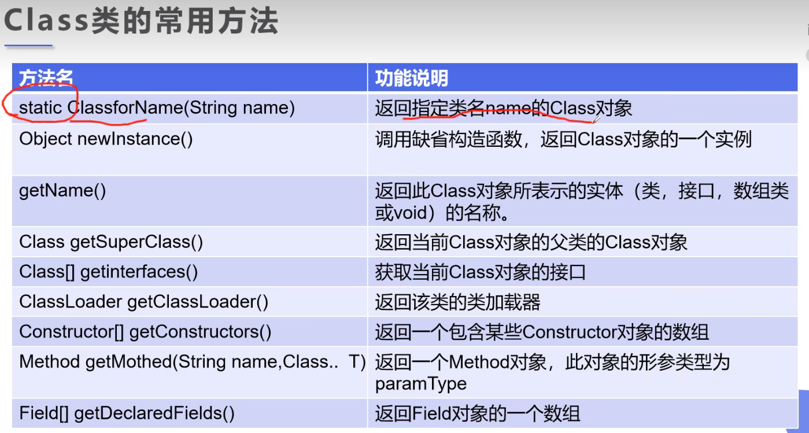
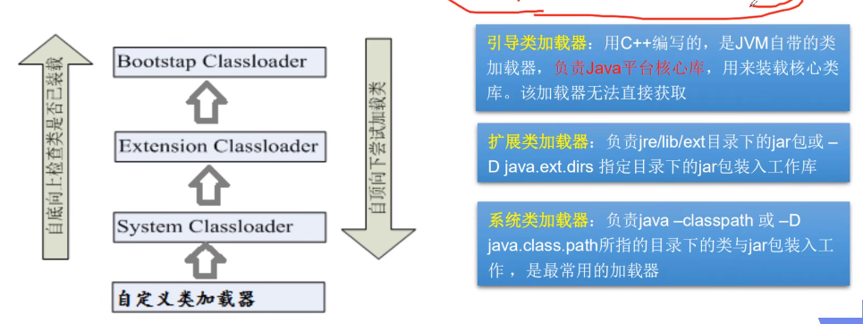

 # 1. 什么是注解

## 1.1 注解初步

- `Annotation`的作用:
  - 不是程序本身，可以对程序做出解释
  - 可以被其他程序(比如:编译器等)读取
- `Annotation`的格式
  - 注解是以"@AnnotationName(value)"的形式在代码中存在的，还可以添加一些参数值
- `Annotation`的作用
  - 可以附加在package,class,method,field等上面，相当于给他们添加了额外的辅助信息，可以通过反射机制编程实现对这些元数据的访问

## 1.2 元注解

- 元注解的作用就是负责注解其他注解，JAVA定义了4个标准的meta-Annotation类型，他们被用来提供对其他Annotation类型作说明
- 这些类型和它们所支持的类在包中可以被找到
- `@Target`:用来描述注解的使用范围
- `@Retention`:表示需要在什么级别保存该注释信息，用来描述注解的生命周期(SOURCE<CLASS<RUNTIME)
- `@Documented`:说明该注解将被包含在javadoc中
- `@Inherited`：说明子类可以继承父类中的该注解

## 1.3 自定义注解

```java
@Target({ElementType.TYPE,ElementType.FIELD})
@Retention(value = RetentionPolicy.RUNTIME)
@interface myAnnotation{
    //注解的参数:参数类型+参数名();
    String name() default "";
    int age() default 0;
}
```

# 2. 反射

## 2.1 反射概述

- 动态语言
  - 是一类在运行时可以改变其结构的语言，例如新的函数、对象、甚至代码可以被引进，已有的函数可以被删除或者是其他结构上的变化，通俗点说就是在运行时代码可以根据某些条件改变自身的结构
- 静态语言
  - 与动态语言相对应的是静态语言，运行时结构不可变，通过反射机制可以使得JAVA具有一定的动态性

- Reflection(反射)是JAVA被视为动态语言的关键，反射机制允许程序在执行期间借助于Reflection API取得任何类的内部信息，并能直接操作任意对象的内部属性及其方法

- 加载完类之后，在堆内存的方法区中就产生了一个Class类型对象(一个类只有一个Class对象)，这个对象就包含了完整的类的结构信息，我们可以通过这个对象看到类的结构，这个对象就像一面镜子，透过这个镜子看到类的结构，我们形象地称之为反射

## 2.2 反射机制研究及其应用

- JAVA反射机制提供的功能
  - 在运行时判断任意一个对象所属的类
  - 在运行时构造任意一个类的对象
  - 在运行时判断任意一个类所具有的成员变量和方法
  - 在运行时获取泛型信息
  - 在运行时调用任意一个对象的成员变量和方法
  - 在运行时处理注解
  - 生成动态代理
- 反射主要API
  - `class`:代表一个类
  - `reflect.Method`:代表类的方法
  - `reflect.Field`:代表类的成员变量
  - `reflect.Constructor`:代表类的构造器

## 2.3 Class类

- 对于每个类而言，JRE都为其保留一个不变的Class类型的对象，一个Class对象包含了特定某个结构的有关信息
- Class本身也是一个类
- Class对象只能由系统建立对象
- 一个加载的类在JVM中只会有一个Class实例
- 一个Class独享对应的是一个接在到JVM中的一个.class文件
- 每个类的实例都会记得自己是由哪个Class实例所生成
- 通过Class可以完整地得到一个类中的所有被加载的结构
- Class类是Reflection的根源，针对任何想动态加载、运行的类、唯有先获得响应的class对象



- 获取class类的实例

```java
        try {
            Class<?> aClass = Class.forName("core.page.FIFO");//泛型不确定
            System.out.println(aClass);
            Class FIFO = core.page.FIFO.class;
            FIFO fifo = new FIFO();
            FIFO = fifo.getClass();
        } catch (ClassNotFoundException e) {
            e.printStackTrace();
        }
//三种方式
```

## 2.4 类加载内存分析

### 2.4.1 类的加载

- JAVA内存
  - 堆
    - 存放的是new的对象和数组
    - 可以被所有的线程所共享，不会存放别的对象引用
  - 栈
    - 存放基本变量类型(会包含这个基本类型的具体数值)
    - 引用对象的变量(会存放这个引用在堆里面的具体地址)
  - 方法区
    - 可以被所有的线程共享
    - 包含了所有的class和static变量
- 类加载的过程
  - 当程序主动使用某个类的时候，如果该类还未被加载到内存中，则系统会通过如下三个步骤来对该类进行初始化
  - 类的加载:将该类的class文件读入内存，并将这些静态数据转换成方法区的运行时数据结构，并为之创建一个java.lang.Class对象。此过程由类加载器完成
  - 类的链接:将该类的二进制数据合并到JRE中
    - 验证：确保加载的类信息符合JVM规范，没有安全方面的问题
    - 准备：正式为类变量(static)分配内存并设置变量默认初始值的阶段，这些内存都将在方法区中进行分配
    - 解析：虚拟机常量池内的符号引用(常量名)替换为直接引用(地址)的过程
  - 类的初始化:JVM负责对类进行初始化
    - 执行类构造器`<clinit>()`方法的过程，类构造器`<clinit>()`方法是由编译器自动收集类中所有类变量的复制动作和静态代码块中的语句合并产生的(类构造器是构造类信息的，不是构造该类对象的构造器)
    - 当初始化一个类的时候，如果发现其父类还没有进行初始化，则需要先触发其父类的初始化
    - 虚拟机会保证一个类的`<clinit>()`方法在多线程环境中被正确加载和同步
- 示例

```java
    @Test
    public void test(){
        /**
         * 1.加载到内存,会产生一个class对象
         * 2.链接,链接结束后 m = 0
         * 3.初始化,执行<clinit>()方法
         * <clinit>{
         *  System.out.println("现在正在执行类的静态初始化");
         *  m = 300;
         *  m = 100;//这两步是会被合并的
         * }
         */
        A a = new A();
        System.out.println(A.m);
    }
class A{
    static {
        System.out.println("现在正在执行类的静态初始化");
        m = 300;
    }

    static int m = 100;
    public A(){
        System.out.println("执行无参构造方法");
    }
}
```

### 2.4.2 类的初始化

- 类的主动引用(一定会发生类的初始化)
  - 当虚拟机启动，先会初始化main方法所在的类
  - new一个类的对象
  - 调用类的静态成员(除了final变量)和静态方法
  - 使用java.lang.reflect包的方法对类进行反射调用
  - 当初始化一个类，如果其父类没有被初始化，则先会初始化它的父类
- 类的被动引用(不会发生类的初始化)
  - 当访问一个静态域时，只有真正声明这个域的类才会被初始化，如果访问的是其父类的静态变量，如果该父类已经被初始化的话，会直接引用父类已经被初始化好的值而不会导致子类被初始化
  - 通过数组定义类引用，不会触发此类的初始化
  - 引用常量不会触发此类的初始化(常量在链接阶段就存入调用类的常量池了)

 ### 2.4.3 类加载器

- 类加载的作用:将class文件字节码内容加载到内存中，并将这些静态数据转换成方法去的运行时数据结构，然后在堆中生成一个代表这个类的java.lang.Class对象，作为方法区中类数据的访问入口
- 类缓存：标准的JavaSE类加载器可以按要求查找类，但一但某个类被加载到类加载器中，它将维持加载（缓存）一段时间。不过JVM垃圾回收机制可以回收这些Class对象



```java
        //获得系统类加载器
        ClassLoader systemClassLoader = ClassLoader.getSystemClassLoader();
        //系统类的父类加载器,也就是扩展加载器
        ClassLoader parent = systemClassLoader.getParent();
        //扩展类加载器的父类加载器-->根加载器(c/c++)
        ClassLoader parent1 = parent.getParent();
        //这里会输出null,无法直接获取 
        ClassLoader classLoader = Class.forName("java.lang.Object").getClassLoader();
        //核心类是由根加载器加载的,因此无法获取
        //如何获得系统类加载器可以加载的路径
        System.out.println(System.getProperty("java.class.path"));
```

### 2.4.4 双亲委派机制


- 这种设计有个好处是，如果有人想替换系统级别的类：String.java。篡改它的实现，在这种机制下这些系统的类已经被Bootstrap classLoader加载过了（为什么？因为当一个类需要加载的时候，最先去尝试加载的就是BootstrapClassLoader），所以其他类加载器并没有机会再去加载，从一定程度上防止了危险代码的植入。

## 2.5 获取类的运行时结构

- 通过反射获取运行时类的完整结构:`Field、Method、Constructor、Superclass、Interface、Annotation`

```java
    @Test
    public void test() throws ClassNotFoundException, NoSuchFieldException, NoSuchMethodException {
        Class<?> c1 = Class.forName("core.page.FIFO");
        System.out.println(c1.getName());       //包名+类名
        System.out.println(c1.getSimpleName()); //类名
        System.out.println(c1.getFields());     //获取所有字段,只能获取到public的属性
        System.out.println(c1.getDeclaredFields());//可以获取全部的字段属性
        System.out.println(c1.getField("int"));//通过字段名获取,只能获取public
        System.out.println(c1.getDeclaredField("int"));//可以获取任意一个字段名
        System.out.println(c1.getMethod("test",null));//同理,以及父类的方法也都会输出,限于public
        System.out.println(c1.getMethods());//同理
        System.out.println(c1.getDeclaredMethod("test"));//只有本类的方法
        System.out.println(c1.getDeclaredMethods());
        c1.getConstructor();//获取构造器
        c1.getDeclaredConstructors();
    }
```

## 2.6 通过反射构造对象

- 创建类的对象:调用Class对象的newInstance()方法
  - 类必须具有一个无参数的构造器
  - 类的构造器的访问权限需要足够
- 构造方法讲解
  - 通过Class类的getDeclaredConstructor(Class,...parameterTypes)取得本类的指定形参类型的构造器
  - 向构造器的形参中传递一个对象数组进去，里面包含了构造器中所需要的各个参数
  - 通过Constructor实例化对象

```java
        //通过构造器来创建实例
        Class<?> c1 = Class.forName("core.page.FIFO");
        Constructor constructor = c1.getDeclaredConstructor();
        FIFO fifo = (FIFO)constructor.newInstance();

        //通过反射调用普通方法
        Method method = c1.getDeclaredMethod("sim", int.class);
        //invoke(激活该方法):(对象,"方法的值")
        method.invoke(fifo,4);

        //通过反射操作属性
        Field num = c1.getDeclaredField("num");
        //(要操作的对象,设置的值),注意如果是private的话默认是不能修改的,可以关闭权限检查
        num.setAccessible(true);
        num.set(fifo,50);
```

```java
Object invoke(Ovject obj,Object... arg)
    Object对应原方法的返回值,若原方法无返回值,此时返回null
    若原方法为静态方法,则obj可以为null
    若原方法形参列表为空,则Object[] args为null
setAccessible()
    Method和Field、Constructor对象都有此方法
    其作用是启动和禁用范文安全检查的开关
    参数值为true则指示反射的对象在使用时应该取消JAVA语言访问检查
    提高反射的效率，如果代码中必须用反射，则该句代码需要被频繁地调用
    使得原本无法访问的私有成员也可以被访问
```

## 2.7 获取泛型信息

- JAVA采用泛型擦除的极值来引入泛型，JAVA中的泛型仅仅是给编译器javac使用的，确保数据的安全性和免去强制类型转换问题，但是，一旦编译完成，所有和泛型有关的类型将全部擦除
- 为了通过反射操作这些类型，JAVA新增了ParameterizedType、GenericArrayType、TypeVariable和WildCardType几种类型来代表不能被归一到Class类中的类型但是又和原始类型齐名的类型

## 2.8 获取注解信息

- 什么是ORM:Obejct relationship Mapping-->对象关系映射
- 类和表结构对应
- 属性和字段对应
- 对象和记录对应

```java
import org.junit.Test;

import java.lang.annotation.*;

public class ORM {
    public static void main(String[] args) throws ClassNotFoundException {
        Class c1 = Class.forName("student");
        Annotation[] annotations = c1.getAnnotations();
        for (int i = 0; i < annotations.length; i++) {
            System.out.println(annotations[i]);
        }
        Table table = (Table)c1.getAnnotation(Table.class);
        System.out.println(table.value());
    }
}

@Table("db_student")
class student{
    @Field(colName = "db_id",type = "int",length = 10)
    private int id;
    @Field(colName = "db_age",type = "int",length = 10)
    private int age;
    @Field(colName = "db_name",type = "int",length = 10)
    private String name;

    public int getId() {
        return id;
    }

    public void setId(int id) {
        this.id = id;
    }

    public int getAge() {
        return age;
    }

    public void setAge(int age) {
        this.age = age;
    }

    public String getName() {
        return name;
    }

    public void setName(String name) {
        this.name = name;
    }
}

//创建一个注解
@Target(ElementType.TYPE)
@Retention(RetentionPolicy.RUNTIME)
@interface Table{
    //给一个表名
    String value();
}

//属性的注解
@Target(ElementType.FIELD )
@Retention(RetentionPolicy.RUNTIME)
@interface Field{
    String colName();
    String type();
    int length();
}

```

