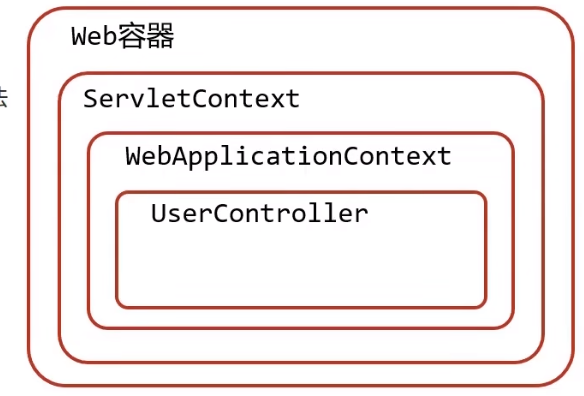
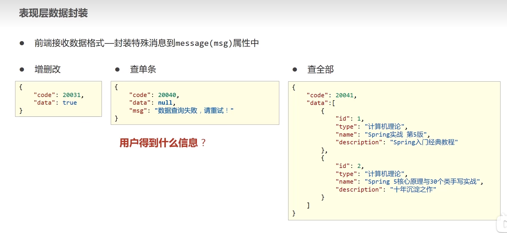

# 1. Spring Framework系统架构

- Spring Framework是Spring生态圈中最基础的项目，是其他项目的根基


# 2. 核心概念

- 在之前编写的java-web代码中，使用过动态代理的思想，但是都是硬编码的，一旦需要修改实现类，就需要重新编译，测试，部署，上线，成本较高
- 解决方案
  - 使用对象时，在程序中不要主动使用new来产生对象，而是转换由外部提供对象

- 对象的创建控制权`由程序转移到外部`，这种思想称为控制反转
- 使用对象时，由主动new产生对象转换为由外部提供对象，此过程中对象创建控制权由程序转移到外部。
- 由内部关联转化为外部关联

- Spring技术对IOC思想进行了实现
  - Spring提供了一个容器，称为IOC容器，用来充当IoC思想中的外部
  - 也就是说，原本我们的对象是要通过new来产生的，现在可以通过IoC来产生
  - 那么产生对象，管理对象这件事情，就交给了IoC容器
  - **IoC容器负责对象的创建、初始化等一系列工作**，被创建或者被管理的对象在IoC容器中被统称为**Bean**
- **DI(Dependency Injection)依赖注入**:在容器中建立bean与bean之间的依赖关系的整个过程就称为依赖注入

- 目标:**充分解耦**

  - 使用**IOC**容器管理**bean**
  - 在IOC容器内将有依赖关系的bean进行关系绑定**DI**

  - 使用对象时不仅可以直接从IoC容器中获取，并且获取到的bean已经绑定了所有的依赖关系

# 3. 入门案例

## 3.1 配置Spring配置文件

```java
<?xml version="1.0" encoding="UTF-8"?>
<beans xmlns="http://www.springframework.org/schema/beans"
       xmlns:xsi="http://www.w3.org/2001/XMLSchema-instance"
       xsi:schemaLocation="http://www.springframework.org/schema/beans http://www.springframework.org/schema/beans/spring-beans.xsd">
    <!--配置beans-->
    <bean  id="bookDaoImpl01" class="dao.impl.BookDaoImpl01"></bean>
    <bean  id="serviceImpl02" class="service.impl.BookServiceImpl02"></bean>
</beans>
```

## 3.2 编写IoC基础代码

```java
    public static void main(String[] args) {
        //1.先拿容器(IoC)
        ApplicationContext ctx = new ClassPathXmlApplicationContext("applicationContext.xml");
        //2.通过容器去拿bean
        BookDaoImpl01 bookDaoImpl01 = (BookDaoImpl01)ctx.getBean("bookDaoImpl01");
        bookDaoImpl01.save();
    }
```

## 3.3 基础Service类

```java
package service.impl;

import dao.BookDao;
import service.BookService;

public class BookServiceImpl02 implements BookService {
    //删除业务层中的使用new的方式创建的dao对象
    private BookDao bookDao;
    @Override
    public void save() {
        System.out.println("service");
    }

    public void setBookDao(BookDao bookDao) {
        this.bookDao = bookDao;
    }
}

```

## 3.4 编写配置

```xml
<?xml version="1.0" encoding="UTF-8"?>
<beans xmlns="http://www.springframework.org/schema/beans"
       xmlns:xsi="http://www.w3.org/2001/XMLSchema-instance"
       xsi:schemaLocation="http://www.springframework.org/schema/beans http://www.springframework.org/schema/beans/spring-beans.xsd">
    <!--配置beans-->
    <bean  id="serviceImpl02" class="service.impl.BookServiceImpl02">
        <!--配置service与dao之间的关系-->
        <!--property:标签表示配置当前bean的属性
            name:表示配置哪一个具体的属性
            ref属性表示参照哪一个bean
        -->
        <property name="bookDao" ref="bookDaoImpl01"></property>
    </bean>
    <bean  id="bookDaoImpl01" class="dao.impl.BookDaoImpl01"></bean>
</beans>
```

# 4. bean配置

## 4.1 bean别名配置

- name
  - 定义bean的别名，可以定义多个，使用逗号(,)分号(;)空格( )分割

## 4.2 bean作用范围配置

- Spring所创建的bean是单例的，如果想要产生非单例的，则需要进行配置
- scope
  - prototype:非单例
  - singleton:单例(默认)

- 适合交给容器进行管理的bean
  - 表现层对象
  - 业务层对象
  - 数据层对象
  - 工具对象
- 不适合交给容器进行管理的bean
  - 封装实体的域对象（记录状态）domain pojo等

# 5. bean实例化

## 5.1 bean的创建过程

- bean本质上就是对象，创建bean使用构造方法完成 

- 使用的是单例模式方法来创建的，底层原理是通过反射机制来完成的，调用的是newInstance()，调用无参构造函数

## 5.2 使用静态工厂实例化bean

- 编写工厂方法

```java
package factory;

import dao.BookDao;
import dao.impl.BookDaoImpl01;

public class BookDaoFactory {
    public static BookDao getBookDao(){
        return new BookDaoImpl01();
    }


}

```

- 编写配置文件

```xml
    <bean id = "bookDao" class="factory.BookDaoFactory" factory-method="getBookDao"></bean>
```

## 5.3 使用实例工厂实例化bean

```java
package factory;

import dao.BookDao;
import dao.impl.BookDaoImpl01;

public class BookDaoFactory {
    public BookDao getBookDao(){
        return new BookDaoImpl01();
    }
}
```

```xml
    <bean id = "bookDaoFactory" class="factory.BookDaoFactory"></bean>
    <bean id = "bookDao" factory-bean="bookDaoFactory" factory-method="getBookDao"></bean>
```

## 5.4 FactoryBean

```java
package factory;

import dao.BookDao;
import dao.impl.BookDaoImpl01;
import org.springframework.beans.factory.FactoryBean;

public class BookDaoFactoryBean implements FactoryBean<BookDao> {
    @Override
    public Class<?> getObjectType() {
        return BookDao.class;
    }
    //代替原始实例工厂中创建对象的方法
    @Override
    public BookDao getObject() throws Exception {
        return new BookDaoImpl01();
    }

    @Override
    public boolean isSingleton() {
        return FactoryBean.super.isSingleton();
    }

}
```

```xml
    <bean id=  "bookDao" class="factory.BookDaoFactoryBean"></bean>
```

```java
        //1.先拿容器(IoC)
        ApplicationContext ctx = new ClassPathXmlApplicationContext("applicationContext.xml");
        //2.通过容器去拿bean
        BookDao bookDao = (BookDao)ctx.getBean("bookDao");
        bookDao.save();
    }
```

## 5.5 bean生命周期控制

```java
    <bean id=  "bookDao" class="factory.BookDaoFactoryBean" init-method="init" destroy-method="destroy"></bean>
```

```java
        //1.先拿容器(IoC)
        ClassPathXmlApplicationContext ctx = new ClassPathXmlApplicationContext("applicationContext.xml");
        //2.通过容器去拿bean
        BookDao bookDao = (BookDao)ctx.getBean("bookDao");
        bookDao.save();
        //3.注册一个函数,在关闭之前
        ctx.registerShutdownHook();
		//而close()方法是实时的,暴力关闭ctx
```

```java
package factory;

import dao.BookDao;
import dao.impl.BookDaoImpl01;
import org.springframework.beans.factory.FactoryBean;

public class BookDaoFactoryBean implements FactoryBean<BookDao> {
    @Override
    public Class<?> getObjectType() {
        return BookDao.class;
    }
    //代替原始实例工厂中创建对象的方法
    @Override
    public BookDao getObject() throws Exception {
        return new BookDaoImpl01();
    }

    @Override
    public boolean isSingleton() {
        return FactoryBean.super.isSingleton();
    }

    //表示bean初始化对应的操作
    public void init(){
        System.out.println("init");
    }
    //bean销毁前的操作
    public void destroy(){
        System.out.println("destroy");
    }

}
```

- 同时可以通过继承InitializingBean, DisposableBean接口来实现

```java
package service.impl;

import dao.BookDao;
import org.springframework.beans.factory.DisposableBean;
import org.springframework.beans.factory.InitializingBean;
import service.BookService;

public class BookServiceImpl02 implements BookService , InitializingBean, DisposableBean {
    //删除业务层中的使用new的方式创建的dao对象
    private BookDao bookDao;
    @Override
    public void save() {
        System.out.println("service");
        bookDao.save();
    }
    //在属性设置之后,才会执行init函数
    public void setBookDao(BookDao bookDao) {
        this.bookDao = bookDao;
    }


    @Override
    public void destroy() throws Exception {
        System.out.println("destroy");
    }

    @Override
    public void afterPropertiesSet() throws Exception {
        System.out.println("init");
    }
}

```

- 初始化容器
  - 创建对象(内存的分配)
  - 执行构造方法
  - 执行属性注入(set操作)
  - 执行bean自身的初始化方法
- 使用bean
  - 执行业务操作
- 关闭/销毁容器
  - 执行bean销毁方法 

# 6. 依赖注入方式

- setter注入
  - 简单类型
  - 引用类型
- 构造器注入
  - 简单类型
  - 引用类型

## 6.1 setter注入

- 在bean中定义引用类型属性并提供可访问的set方法
- 配置中使用property标签ref属性注入引用类型对象

```xml
    <bean id=  "services" class="service.impl.BookServiceImpl02">
        <property name="connectionNum" value="10"></property>
        <property name="dbName" value="mysql"></property>
    </bean>
```

```java
    public void setConnectionNum(int connectionNum) {
        this.connectionNum = connectionNum;
    }

    public void setDbName(String dbName) {
        this.dbName = dbName;
    }
```

 ## 6.2 构造器注入

```xml
    <bean id=  "services" class="service.impl.BookServiceImpl02">
        <constructor-arg name="connectionNum" value="10"></constructor-arg>
        <constructor-arg name="bookDao" ref="bookDao"></constructor-arg>
        <constructor-arg name="dbName" value="mysql"></constructor-arg>
    </bean>
```

```java
    public BookServiceImpl02(BookDao bookDao, int connectionNum, String dbName) {
        this.bookDao = bookDao;
        this.connectionNum = connectionNum;
        this.dbName = dbName;
    }
```

- 强制依赖使用构造器执行，使用setter注入有概率不进行注入导致null对象的出现
- 可选依赖使用setter注入进行，可以灵活配置
- Spring框架倡导使用构造器，第三方框架内部大多数采用构造器注入的形式进行数据初始化，相对比较严谨
- 如果有必要可以两者同时使用，使用构造器注入完成强制依赖的注入，使用setter注入完成可选依赖的注入
- 实际开发过程中还要根据实际情况分析，如果受控对象没有提供setter方法就必须使用构造器注入
- 自己开发的模块推荐使用setter注入

## 6.3 依赖自动装配

- IoC容器根据bean所依赖的资源在容器中自动查找并注入到bean中的过程称为自动装配

- 自动装配方式
  - 按类型(常用)
  - 按名称
  - 按构造方法
  - 不启用自动装配

- 先为类提供setter方法,然后提供auto-wire注解
- 注意在用ByTye装配依赖bean的时候
  - 首先第一个不能够没有注册所依赖的bean
  -  第二个则是如果注册了多个不同id的同一类型bean的时候,也无法使用

```java
    <bean id="service" class="service.impl.BookServiceImpl02" autowire="byType"></bean>
```

- 按名装配的时候(ByName)
  - 对于bean而言,则是id要与set后面接上去的对象名一致 

- 自动装配优先级低于setter注入与构造器注入，同时出现时自动装配配置失效

# 7. Spring读取配置文件

- 开启context命名空间

```xml
<!--定义新的命名空间为context-->
<!--将bean修改为context -->
<beans xmlns="http://www.springframework.org/schema/beans"
       xmlns:xsi="http://www.w3.org/2001/XMLSchema-instance"
       xmlns:context="http://www.springframework.org/schema/context"
       xsi:schemaLocation="http://www.springframework.org/schema/beans
                           http://www.springframework.org/schema/beans/spring-beans.xsd
                           http://www.springframework.org/schema/context
                           http://www.springframework.org/schema/beans/spring-context.xsd
                           ">
```

- 使用context空间加载配置文件

```xml
    <context:property-placeholder location="classpath:*.properties" system-properties-mode="NEVER"></context:property-placeholder>
<!--只读取当前项目的配置文件-->
<!--若要读取jar包下的properties，则需要写为classpath*:*.properties-->
```

- 将配置字符串修改为属性占位符

```java
    <bean id="dataSource" class="com.alibaba.druid.pool.DruidDataSource">
        <!--必须使用setter注入-->
        <property name="driverClassName" value="${jdbc.driver}"></property>
        <property name="url" value="${jdbc.url}"></property>
        <property name="username" value="${jdbc.username}"></property>
        <property name="password" value="${jdbc.password}"></property>
    </bean>   
```

- 一些规范


# 8.容器相关总结

- BeanFactory是IoC容器的顶层接口，初始化BeanFactory对象时，加载的bean延迟加载
- ApplicationContext接口是Spring容器的核心接口，初始化时bean立即加载(饿汉式单例)
- ApplicationContext接口提供基础的bean操作相关方法，通过其他接口扩展功能

# 9. 注解开发

 ## 9.1 使用注解替代bean配置

```java
@Component(value = "bookService")//在实体类头加上此注解,value是bean的id
```

```xml
    <context:component-scan base-package="service.impl"></context:component-scan>
	<!--使得spring感知到该bean的存在-->
```

- Spring提供@Component注解的三个衍生注解
  - @Controller:用于表现层bean的定义
  - @Service:用于业务层定义bean
  - @Repository:用于数据层定义bean

## 9.2 纯注解开发

 ```java
 //用此类来代替xml文件,配置类
 @Configuration
 @@Configuration({"service.impl","dao.impl"})//替代了<context:component-scan base-package="service.impl"></context:component-scan>这一行
 public class SpringConfig {
     
 }
 ```

```java
 //加载配置类
        ApplicationContext context = new AnnotationConfigApplicationContext(SpringConfig.class);
```

- @Configuration注解用于设定当前类为配置类
- @Configuration注解用于设定扫描路径，此注解只能添加一次，多个数据则用数组即可

## 9.3 bean管理

```java
@Scope("prototype")//控制是否单例模式,singleton 
```

```java
    @PreDestroy
    public void destroy(){
        System.out.println("destroy");
    }

    @Override
    public void save() {
        System.out.println("service");
        bookDao.save();
    }
```

## 9.4 依赖注入

```java
@AutoWired//提供自动装配,暴力反射装配
//当存在多个实现类bean的时候
@Qualifier("beanId")//必须配合AutoWired使用
```

- 自动装配是基于反射设计创建对象并暴力反射对应属性为私有属性初始化数据，因此不需要提供setter方法
- 自动装配建议使用无参构造方法创建对象(默认的)，如果不提供对应的构造方法，请提供唯一的构造方法

```java
    @Value("10")//对值类型进行注入
    private int connectionNum;
```

```java
@PropertySource("jdbc.properties")//装载配置文件,不支持通配符
@Value("${name}")//使用$
private int connectionNum;
```

## 9.5 第三方bean管理及其依赖注入

 ```java
     //定义一个方法,获得要管理的对象
     //添加@bean,表示方法的返回值是bean
     @Bean
     public DataSource dataSource(){
         DruidDataSource druidDataSource = new DruidDataSource();
         druidDataSource.setUrl("jdbc:mysql://127.0.0.1:3306/db_1");
         return druidDataSource;
     }
 ```

```java
package config;

import com.alibaba.druid.pool.DruidDataSource;
import org.springframework.context.annotation.Bean;
import org.springframework.context.annotation.Configuration;

import javax.sql.DataSource;

@Configuration
public class jdbcConfig {
    //定义一个方法,获得要管理的对象
    //添加@bean,表示方法的返回值是bean
    @Bean
    public DataSource dataSource(){
        DruidDataSource druidDataSource = new DruidDataSource();
        druidDataSource.setUrl("jdbc:mysql://127.0.0.1:3306/db_1");
        return druidDataSource;
    }
}

```

```java
package config;

import com.alibaba.druid.pool.DruidDataSource;
import org.springframework.context.annotation.*;

import javax.sql.DataSource;

//用此类来代替xml文件,配置类
@Configuration
@Import(jdbcConfig.class)
@ComponentScan("service.impl")//替代了<context:component-scan base-package="service.impl"></context:component-scan>这一行
public class SpringConfig {

    public static void main(String[] args) {
        AnnotationConfigApplicationContext annotationConfigApplicationContext = new AnnotationConfigApplicationContext(SpringConfig.class);
        DataSource dataSource = annotationConfigApplicationContext.getBean(DataSource.class);
    }
}

```


# 10. Spring整合Mybatis

```xml
<!--首先先导包-->
<?xml version="1.0" encoding="UTF-8"?>
<project xmlns="http://maven.apache.org/POM/4.0.0"
         xmlns:xsi="http://www.w3.org/2001/XMLSchema-instance"
         xsi:schemaLocation="http://maven.apache.org/POM/4.0.0 http://maven.apache.org/xsd/maven-4.0.0.xsd">
    <modelVersion>4.0.0</modelVersion>

    <groupId>org.example</groupId>
    <artifactId>Spring-demo</artifactId>
    <version>1.0-SNAPSHOT</version>

    <properties>
        <maven.compiler.source>8</maven.compiler.source>
        <maven.compiler.target>8</maven.compiler.target>
    </properties>

    <dependencies>
        <dependency>
            <groupId>junit</groupId>
            <artifactId>junit</artifactId>
            <version>4.12</version>
            <scope>test</scope>
        </dependency>

        <dependency>
            <groupId>org.springframework</groupId>
            <artifactId>spring-context</artifactId>
            <version>5.2.10.RELEASE</version>
        </dependency>
        <dependency>
            <groupId>com.alibaba</groupId>
            <artifactId>druid</artifactId>
            <version>1.1.16</version>
        </dependency>
        <dependency>
            <groupId>mysql</groupId>
            <artifactId>mysql-connector-java</artifactId>
            <version>8.0.15</version>
        </dependency>

        <dependency>
            <groupId>org.mybatis</groupId>
            <artifactId>mybatis</artifactId>
            <version>3.5.6</version>
        </dependency>

        <dependency>
            <groupId>org.springframework</groupId>
            <artifactId>spring-jdbc</artifactId>
            <version>5.2.10.RELEASE</version>
        </dependency>

        <dependency>
            <groupId>org.mybatis</groupId>
            <artifactId>mybatis-spring</artifactId>
            <version>1.3.0</version>
        </dependency>


    </dependencies>

</project>
```

```java
package config;

import org.mybatis.spring.SqlSessionFactoryBean;
import org.mybatis.spring.mapper.MapperScannerConfigurer;
import org.springframework.context.annotation.Bean;

import javax.sql.DataSource;

//返回sqlFactory对象
public class MybatisConfig {

    @Bean
    public SqlSessionFactoryBean sqlSessionFactory(DataSource dataSource){
         SqlSessionFactoryBean sqlSessionFactoryBean = new SqlSessionFactoryBean();
         sqlSessionFactoryBean.setTypeAliasesPackage("domain");
         sqlSessionFactoryBean.setDataSource(dataSource);
         return sqlSessionFactoryBean;
    }

    @Bean
    public MapperScannerConfigurer mapperScannerConfigurer(){
        MapperScannerConfigurer msc = new MapperScannerConfigurer();
        msc.setBasePackage("domain");
        return msc;
    }
}

```

# 11. Spring整合Junit

```java
@RunWith(SpringJUnit4ClassRunner.class)
@ContextConfiguration(classes = SpringConfig.class)
public class AccountServiceTest {
    @Autowired
    private BookService bookService;
    
    @Test
    public void test(){
        bookService.save();
    }
}
```

# 12. AOP

## 12.1 AOP核心概念

- AOP(Aspect Oriented Programming)面向切面编程，一种编程范式，指导开发者如何组织程序结构
- 作用:在不惊动原始设计的基础上为其进行功能增强
- 理念:无入侵式/无侵入式编程


- 连接点:程序执行过程中的任意位置，粒度为执行方法、抛出异常、设置变量等
  - 在SpringAOP中理解为方法的执行
- 切入点：匹配连接点的式子
  - 在SpringAOP中，一个切入点可以只描述一个具体方法，也可以匹配多个方法
- 通知：在切入点执行的操作，也就是共性功能
- 通知类：定义通知的类
- 切面(Aspect)：描述通知与切入点的对应关系 
- 目标对象(Target):原始功能去掉共性功能对应的类产生的对象，这种对象是无法直接完成最终工作的
- 代理(proxy)：目标对象无法直接完成工作，需要对其进行功能回填，通过原始对象的代理对象实现

## 12.2 AOP快速入门

- 定义dao接口与实现类

```java
package dao;

public interface BookDao {
    void save();
    void update();

}

```

```java
package dao.impl;

import dao.BookDao;
import org.springframework.stereotype.Repository;

@Repository
public class BookDaoImpl01 implements BookDao {

    @Override
    public void save() {
        System.out.println("save...");
    }

    @Override
    public void update() {
        System.out.println("update....");
    }
}
```

-  定义通知类，制作通知

```java
    public void method(){
        System.out.println(System.currentTimeMillis());
    }
```

- 定义切入点

```java
    //定义切入点
    @Pointcut("execution(void dao.BookDao.update())")
    private void pt(){}//切入点依托一个不具有实际意义的方法进行，也就是没有参数，没有返回值，方法体没有实际逻辑

```

- 绑定切入点与通知关系，并指定通知添加到原始连接点的具体执行位置

```java
public class MyAdvice {
    //定义切入点
    @Pointcut("execution(void dao.BookDao.update())")
    private void pt(){}//切入点依托一个不具有实际意义的方法进行，也就是没有参数，没有返回值，方法体没有实际逻辑

    @Before("pt()")//在pt()之前执行
    public void method(){
        System.out.println(System.currentTimeMillis());
    }

}

```

- 定义通知类受Spring容器管理，并定义当前类为切面类

```java
@Component
@Aspect//使得让Spring控制它
public class MyAdvice {
    //定义切入点
    @Pointcut("execution(void dao.BookDao.update())")
    private void pt(){}//切入点依托一个不具有实际意义的方法进行，也就是没有参数，没有返回值，方法体没有实际逻辑

    @Before("pt()")//在pt()之前执行
    public void method(){
        System.out.println(System.currentTimeMillis());
    }

}
```

- 开启Spring对AOP注解驱动支持

```java
package config;

import com.alibaba.druid.pool.DruidDataSource;
import org.springframework.context.annotation.*;

import javax.sql.DataSource;

//用此类来代替xml文件,配置类
@Configuration
@PropertySource("classpath:jdbc.properties")
@ComponentScan("dao.impl")//替代了<context:component-scan base-package="service.impl"></context:component-scan>这一行
@EnableAspectJAutoProxy
public class SpringConfig {

    public static void main(String[] args) {
        AnnotationConfigApplicationContext annotationConfigApplicationContext = new AnnotationConfigApplicationContext(SpringConfig.class);
        DataSource dataSource = annotationConfigApplicationContext.getBean(DataSource.class);
    }

}
```

## 12.3 AOP工作流程

- Spring容器启动

- 读取所有切面配置中的切入点，只读取配置了的切入点

- 初始化bean，判定bean对应的类中方法是否匹配到任意切入点

  - 匹配失败则创建对象
  - 匹配成功则创建原始对象（`目标对象`）的`代理`对象

- 获取bean执行方法

  - 获取bean，调用方法并执行，完成操作

  - 当获取的bean是代理对象的时候，根据代理对象的运行模式运行原始方法与增强的内容，完成操作 

## 12.4 AOP切入点表达式

- 切入点:要进行增强的方法
- 切入点表达式:要进行增强的方法的描述方式

- 描述方式一:执行dao包下的BookDao接口中的无参数update()方法
- 描述方式二:执行dao.impl.BookDao.impl包下的BookDaoImpl类中的无参数update方法

- 切入点表达式标准格式:动作关键字(访问修饰符 返回值 包名.类/接口名.方法名 (参数) 异常名)

- 可以使用通配符描述切入点，快速描述
  - *:单个独立的任意符号，可以独立出现，也可以作为前缀或者后缀的匹配符出现
    - 
  - ..:多个连续的任意符号，可以独立出现，常用来简化包名与参数的书写
  - +:专用于匹配子类型
  - 例如`execution(* *..*Service+.*(..))`
    - 任意返回值 任意包下的 以Service结尾的接口或者子类 的任意方法 任意描述

- 书写技巧
  - 描述切入点通常描述接口，而不描述实现类
  - 访问控制符针对接口开发均采用public描述(可以省略访问控制修饰符描述)
  - 返回值类型对于增删改查使用精准类型加速匹配，对于查询类使用*同配快速描述
  - 包名书写尽量不使用..匹配，效率过低，常用*做单个包描述匹配，或精准匹配
  - 接口名/类名书写名称与模块相关的采用星号匹配，例如getById书写成getBy星号,selectAll书写成selectAll
  - 参数规则比较复杂，根据业务方法灵活调整
  - 通常不使用异常作为匹配规则

## 12.5 AOP通知类型 

- AOP通知描述了抽取的共性功能，根据共性功能抽取的位置不同，最终运行代码时要将其加入到合理的位置

- AOP通知共分为5种类型

  - 前置通知:`@Before`

  - 后置通知:`@After`

  - 环绕通知:`@Around()`

  - ```java
        @Around("pt()")
        public Object around(ProceedingJoinPoint proceedingJoinPoint) throws Throwable {
            System.out.println("before");
            //表示对原始操作的调用,可能会抛出异常
            Object proceed = proceedingJoinPoint.proceed();
            System.out.println("after");
            return proceed;
        }
    ```

    - 环绕通知必须依赖形参ProceedingJoinPoint才能实现对原始方法的调用，进而实现原始方法调用前后同时添加通知,这个形参必须在方法的第一位
    - 对原始方法的调用可以不接收返回值，通知方法设置成void即可，如果接收返回值，必须设定为Object类型
    - 原始方法的返回值如果是void类型，通知方法的返回值类型可以设置成void，也可以设置成Object
    - 由于无法预知原始方法运行后释放会抛出异常，因此环绕通知方法必须抛出Throwable对象

  - 返回后通知:`@AfterReturning("pt()")`

  - 抛出异常后通知:`@AfterThrowing("pt()")`

## 12.6 AOP通知获取数据

- 获取切入点方法的参数
  - JoinPoint:适用于前置、后置、返回后、抛出异常后通知
  - ProceedingJoinPoint：适用于环绕通知
- 获取切入点方法返回值
  - 返回后通知
  - 环绕通知
- 获取切入点方法运行异常信息
  - 抛出异常后通知
  - 环绕通知

```java
Object[] args = proceedingJoinPoint.getArgs();
System.out.println(Arrays.toString(args));
```

# 13. Spring事务

## 13.1 简介

- 事务作用:在数据层保障一系列的数据库操作同步成功同步失败
- Spring事务作用:在数据层或业务层保障一系列的数据库操作同成功同失败

```java
PlatformTransactionManager platformTransactionManager = new DataSourceTransactionManager();
//Spring中提供的最基本的接口和实现类
```

- 快速入门
- 首先定义service接口方法,并且使用注解开启事务

```java
public interface AccountService {
    //要在接口上写
    @Transactional
    public void transfer(String out,String in,double money);
}
```

- 在jdbcConfig中定义平台事务管理器,并且交给Spring管理

```java
    @Bean
    public PlatformTransactionManager transactionManager(DataSource dataSource){
        DataSourceTransactionManager transactionManager = new DataSourceTransactionManager();//定义事务管理器
        transactionManager.setDataSource(dataSource);//定义数据源,jdbc,根据技术进行选择
        return transactionManager;
    }
```

- 开启注解式事务驱动

```java
@EnableTransactionManagement
```

- Spring注解式事务通常添加在业务层接口而不会添加到业务层实现类中，降低耦合
- 注解式事务可以添加到业务方法上表示当前方法开启事务，也可以添加到接口上表示当前接口所有方法开启事务

## 13.2 Spring事务角色


- 事务管理员:发起事务方，在Spring中通常指代业务层开启事务的方法
- 事务协调员:加入事务方，在Spring中通常指代数据层方法，但也可以是业务层的方法
- 也就是原本有多个事务互相独立，但是通过一个业务层方法，这个业务层方法去调用了这多个事务，我们把这多个事务合并到业务层事务中去，从而达到各个事务之间同成功，同失败

## 13.3 Spring事务相关配置

| 属性                   | 作用                       | 示例                                     |
| ---------------------- | -------------------------- | ---------------------------------------- |
| readOnly               | 设置是否为只读事务         | readOnly = true 只读事务                 |
| timeout                | 设置事务超时时间           | timeout=-1(永不超时)                     |
| rollbackFor            | 设置事务回滚异常(class)    | rollbackFor ={NullPointException.class}  |
| rollbackForClassName   | 设置事务回滚异常(String)   | 同上,只是格式为字符串                    |
| noRollbackFor          | 设置事务不回滚异常(class)  | noRollbackFor={NullPointException.class} |
| noRollbackForClassName | 设置事务不回滚异常(String) | 同上,只是格式为字符串                    |
| propagation            | 设置事务传播行为           | ...                                      |

- 回滚的两种异常
  - Error类的异常
  - RuntimeException例如是NullPointerException
  - 其他异常不会回滚


```java
@Transactional(propagation = Propagation.REQUIRES_NEW)
//通过该注解来分离事务,解除事务传播行为
```


# 14. SpringMVC

## 14.1 概述

- SpringMVC技术与Servlet技术功能等同，均属于web层开发技术

- SpringMVC是一种基于Java实现MVC模型的轻量级`web框架`


## 14.2 快速入门

- 编写web代码,使用controller对应的注解

```java
package springmvc.controller;

import org.springframework.stereotype.Controller;
import org.springframework.web.bind.annotation.RequestMapping;
import org.springframework.web.bind.annotation.ResponseBody;

/**
 * 创建SpringMVC控制器类(等同于servlet功能)
 * 开发表现层，需要使用Controller
 */
@Controller
public class UserController {
    @RequestMapping("/save")
    @ResponseBody
    public String save(){
        System.out.println("user save");//直接在此处编写代码
        return "{'info':'springmvc'}";//返回的数据
    }
}
```

- 编写SpringMVC配置类

```java
@Configuration
@ComponentScan("springmvc.controller")//扫描对应的bean
public class SpringMVCConfig {

}
```

- 初始化servlet容器,加载SpringMVC环境，并且设置SpringMVC技术处理的请求

```java
//此类存在的目的是为了使得tomcat容器装载spring的配置
public class ServletContainersInitConfig extends AbstractDispatcherServletInitializer {
    //用来加载SpringMVC容器配置的
    @Override
    protected WebApplicationContext createServletApplicationContext() {
        AnnotationConfigWebApplicationContext ctx = new AnnotationConfigWebApplicationContext();//web应用专用
        ctx.register(SpringMVCConfig.class);//注册配置类文件
        return ctx;
    }

    //设置哪些请求归属SprintMVC处理的
    @Override
    protected String[] getServletMappings() {
        return new String[]{"/"};//所有请求
    }

    //加载Spring容器的配置
    @Override
    protected WebApplicationContext createRootApplicationContext() {
        return null;
    }
}
```

- SpringMVC开发总结
  - 一次性工作
    - 创建工程，设置服务器，加载工程
    - 导入坐标
    - 创建web容器启动类，加载SpringMVC配置，并设置SpringMVC请求拦截路径
    - SpringMVC核心配置类(设置配置类，扫描包,加载bean)
  - 多次工作
    - 定义处理请求的控制器类
    - 定义处理请求的控制方法，并配置映射路径，与返回json数据

## 14.3  工作流程分析

- 启动服务器初始化过程
  - 服务器启动，执行ServletContainersInitConfig类，初始化web容器
  - 执行createServletApplicationContext方法，创建了AnnotationConfigWebApplicationContext对象
  - 加载SpringMVCConfig
  - 执行@ComponentScan("com.example.controller")扫描对应的bean
  - 执行getServletMappings方法，定义所有的请求都通过SpringMVC



- 单次请求发送过程
  - 发送请求localhost/save
  - web容器发现所有请求都经过SpringMVC，将请求交给SpringMVC处理
  - 解析请求路径/save
  - 由/save匹配执行对应的方法save()
  - 执行save()
  - 检查到有返回请求，直接将save()方法的返回值作为响应体返回给请求方  

## 14.4 Controller加载控制与业务bean加载控制

- 对于SpringMVC所需要加载的bean与Spring所需要加载的bean，如何避免两者错误地互相加载呢?

- 加载Spring控制的bean的时候，排除掉那些SpringMVC已经控制的bean

```java
@ComponentScan({"com.example.dao","com.example.service"})//直接精确匹配法
//过滤器排除法,springboot中有用到
@ComponentScan(value = "com.example",
               excludeFilters = @ComponentScan.Filter(
                       type = FilterType.ANNOTATION,//按照注解过滤
                       classes = Controller.class//凡是controller的注解的就都过滤掉
               )
)
```

- 用此方法来解决bean加载细粒度的控制

```java
    //用来加载SpringMVC容器配置的
    @Override
    protected WebApplicationContext createServletApplicationContext() {
        AnnotationConfigWebApplicationContext ctx = new AnnotationConfigWebApplicationContext();//web应用专用
        ctx.register(SpringMVCConfig.class);//注册配置类文件
        return ctx;
    }

    //设置哪些请求归属SprintMVC处理的
    @Override
    protected String[] getServletMappings() {
        return new String[]{"/"};//所有请求
    }

    //加载Spring容器的配置
    @Override
    protected WebApplicationContext createRootApplicationContext() {
        AnnotationConfigApplicationContext context = new AnnotationConfigApplicationContext();
        context.register(SpringConfig.class);
        return (WebApplicationContext) context;
    }
```

```java
//此类存在的目的是为了使得tomcat容器装载spring的配置,是上面的简化,简化了开发
public class ServletContainersInitConfig extends AbstractAnnotationConfigDispatcherServletInitializer {
    @Override
    protected Class<?>[] getRootConfigClasses() {//对应的配置类
        return new Class[]{SpringConfig.class};
    }

    @Override
    protected Class<?>[] getServletConfigClasses() {
        return new Class[]{SpringMVCConfig.class};
    }

    @Override
    protected String[] getServletMappings() {
        return new String[]{"/"};
    }
}
```

# 15. SpringMVC-Web

## 15.1 请求映射路径设置

- 设置模块名为请求路径的前缀
- 例如说是属于user的模块,则在前缀写user/*具体路径即可

```java
@Controller
@RequestMapping("/user")//请求路径前缀,在此定义整体的请求路径即可
public class UserController {

    @RequestMapping("/save")//设置访问路径
    @ResponseBody//将return的"{'module':'springmvc'}"作为响应数据给到外边
    public String save(){
        System.out.println("user save...");
        return "{'module':'user save'}";
    }

    @RequestMapping("/delete")
    @ResponseBody
    public String delete(){
        System.out.println("user delete...");
        return "{'module':'user delete'}";
    }

}

```

## 15.2 GET与POST请求的编写

- 后台其实是不区分GET和POST的

- GET请求URL（单个参数）:`http://localhost:80/user/save?name=lumxi`
- 后台编写

```java
    @RequestMapping("/save")//设置访问路径
    @ResponseBody//将return的"{'module':'springmvc'}"作为响应数据给到外边
    public String save(String name){//在此加入参数即可
        System.out.println("user save...===>"+name);
        return "{'module':'user save'}";
    }
```


```java
    //编写过滤器的方法,此过滤器无法过滤GET的直接传参方法,需要从编码角度进行编程
	@Override
    protected Filter[] getServletFilters() {
        //编写字符过滤器
        CharacterEncodingFilter filter = new CharacterEncodingFilter();
        filter.setEncoding("UTF-8");
        return new Filter[]{filter};//传入过滤器对象(们)
    }
```

- 如果是GET请求的话,只需要修改tomcat插件选项即可

```java
    <build>
        <plugins>
            <plugin>
                <groupId>org.apache.tomcat.maven</groupId>
                <artifactId>tomcat7-maven-plugin</artifactId>
                <version>2.2</version>
                <configuration>
                    <port>80</port>
                    <path>/</path>
                    <uriEncoding>UTF-8</uriEncoding>
                </configuration>
            </plugin>
        </plugins>
    </build>
```

## 15.3 五种类型参数传递

### 15.3.1 普通参数

- 普通参数:URL地址传参，地址参数与形参变量名相同，定义形参即可接收参数，相同名称才能映射进来，否则使用`@RequestPram("ParamName")String name`，通过这个来改写形参和地址参数之间的映射关系

### 15.3.2 POJO类型参数

- 可以在前端的URL中地址参数的属性名与形参(封装好的pojo对象中的属性名)完全一致的话，就可以自动完成封装
- 例如:`http://localhost:80/user/pojoParam?id=1&name=黑马程序员&password=123456`

```java
    //POJO参数
    @RequestMapping("/pojoParam")
    @ResponseBody
    public String pojoParam(User user){
        System.out.println("pojo参数传递 user===>"+user.toString());
        return "{'module':'user pojoParam'}";
    }
```

### 15.3.3 嵌套POJO类型参数

- 例如说现在存在这样一个类

```java
public class User {
    private int id;
    private String name;
    private String password;
    private Address address;
}
public class Address {
    private String address;
}
//存在嵌套关系
```

- 那么首先要保证User该有的基本类型都得有,然后我们通过address.方式来补充属性名，从而构造映射

`http://localhost:80/user/pojoParam?id=1&name=黑马程序员&password=123456&address.address=广东`

### 15.3.4 数组类型参数

- 接收形参是一个数组类型，前端URL使用同一个名称`http://localhost:80/user/arrayParam?likes=1&likes=黑马程序员&likes=123456&likes=广东`

```java
    //数组类型的参数
    @RequestMapping("/arrayParam")
    @ResponseBody
    public String arrayParam(String[] likes){//注意形参对应关系
        System.out.println("arrayParam参数 likes===>"+ Arrays.toString(likes));
        return "{'module':'user arrayParam'}";
    }
```

### 15.3.5 集合类型参数

- `http://localhost:80/user/collectionParam?likes=1&likes=黑马程序员&likes=123456&likes=广东`

```java
    //集合类型的参数
    @RequestMapping("/collectionParam")
    @ResponseBody
    public String collectionParam(@RequestParam List<String> likes){//它的执行逻辑是先造一个你给的对象,然后拿到URL给的值，往里边去填
        System.out.println("arrayParam参数 likes===>"+ likes);
        return "{'module':'user collectionParam'}";
    }
```

## 15.4 处理json数据


- 开启springmvc将JSON数据转化为集合对象的功能:`@EnableWebMvc`，该功能非常强大

```xml
        <!-- https://mvnrepository.com/artifact/com.fasterxml.jackson.core/jackson-databind -->
        <dependency>
            <groupId>com.fasterxml.jackson.core</groupId>
            <artifactId>jackson-databind</artifactId>
            <version>2.13.3</version>
        </dependency>
<!--配置依赖包-->
```

```java
    //json类型
    @RequestMapping("/listParamsForJson")
    @ResponseBody
    public String listParamsForJson(@RequestBody List<String> likes){
        System.out.println("user ===>listParamsForJson,"+likes);
        return "{'module':'user listParamsForJson'}";
    }
```

- pojo类型(包含嵌套)

```json
{
    "id":1,
    "name":"lumxi",
    "password":"123456",
    "address":{
        "address":"广东"
    }
}
```

```java
    //pojo类型
    //json类型
    @RequestMapping("/pojoParamsForJson")
    @ResponseBody
    public String pojoParamsForJson(@RequestBody User user){
        System.out.println("user ===>pojoParamsForJson,"+user.toString());
        return "{'module':'user pojoParamsForJson'}";
    }
```

- pojo包装到集合中

```java
    //集合pojo类型
    //json类型
    @RequestMapping("/pojoCollectionParamsForJson")
    @ResponseBody
    public String pojoCollectionParamsForJson(@RequestBody List<User> list){
        System.out.println("user ===>pojoParamsForJson,"+list);
        return "{'module':'user pojoCollectionParamsForJson'}";
    }
```

```json
    //集合pojo类型
    //json类型
    @RequestMapping("/pojoCollectionParamsForJson")
    @ResponseBody
    public String pojoCollectionParamsForJson(@RequestBody List<User> list){
        System.out.println("user ===>pojoParamsForJson,"+list);
        return "{'module':'user pojoCollectionParamsForJson'}";
    }
```

- 区别
  - @RequestParam用于接收url地址传参，表单传参[x-www-form-urlencoded]
  - @RequestBody用于接收json数据[json]

## 15.5 日期型传参

```java
    @RequestMapping("/dataParam")
    @ResponseBody
    public String dataParam(Date date, @DateTimeFormat(pattern = "yyyy-MM-dd HH:mm:ss")Date date1){
        //通过该注解来限定日期的输入转换公式
        System.out.println(date);
        System.out.println(date1);
        return "{'module':'user dataParam'}";
    }
//如果要修改日期的格式类型，只需要更改-或者:即可
```

- 内部原理

```java
public interface Converter<S,T>{
    @Nullable
    T convert(s var1);
}
//请求参数年龄数据(String->Integer)
//日期格式转换(String->Date)
@EnableWebMvc可以根据类型匹配对应的类型转换器
```

## 15.6 响应页面

```java
    //响应页面,跳转页面
    @RequestMapping("/toJumpPage")
    public String toJumpPage(){
        System.out.println("跳转页面");
        return "page.jsp";//page.jsp是页面文件
    }
```

## 15.7 响应数据

```java
	//响应文本数据
    @RequestMapping("/toText")
    @ResponseBody
    public String toText(){
        System.out.println("返回文本数据");
        return "response text";
    }

    //响应pojo对象,其实对于springmvc来说,其要求的返回对象就是要一个字符串,使用ResponseBody可以自定义我们想要返回的数据对象
    @RequestMapping("/pojoToJson")
    @ResponseBody
    public User pojoToJson(){
        System.out.println("返回json数据对象");
        User user = new User();
        user.setName("Lumxi");
        user.setId(1);
        Address address = new Address();
        address.setAddress("广东");
        user.setAddress(address);
        user.setPassword("123456");
        return user;
    }
```

- @ResponseBody:用来设置当前控制器返回值作为响应体

# 16. REST风格

## 16.1 REST简介

- REST(Representational State Transfer),表示形式状态转换

- 用来描述访问网络资源的格式

- 书写被简化了

- 隐藏了资源的访问行为，无法通过地址得知对资源是何种操作

- 上述行为是约定方式，约定不是规范，可以被打破，所以成为REST风格而非REST规范

- 描述模块的名称通常用负数，也就是要用加s的格式描述，而非单个资源

  根据REST风格对资源进行访问称为RESTful

## 16.2 实际使用

```java
    @RequestMapping(path = "/users",method = RequestMethod.POST)//设定请求行为,POST用来做增加
    @ResponseBody//将return的"{'module':'springmvc'}"作为响应数据给到外边
    public String save(String name,String password){
        System.out.println("user save...===>"+name+",password===>"+password);
        return "{'module':'user save'}";
    }

    @RequestMapping(path = "/users/{id}",method = RequestMethod.DELETE)//表示路径参数,Delete用来做删除数据
    @ResponseBody
    public String delete(@PathVariable Integer id){//设置路径变量,http://localhost:80/users/1
        System.out.println("user delete..."+id);
        return "{'module':'user delete'}";
    }

    @RequestMapping(path = "/users",method = RequestMethod.PUT)//PUT用来做修改数据
    @ResponseBody
    public String update(){
        System.out.println("user update...");
        return "{'module':'user update'}";
    }

    @RequestMapping(path = "/users",method = RequestMethod.GET)//Get是专门用来做查询的
    @ResponseBody
    public String getAll(){
        System.out.println("user getAll...");
        return "{'module':'user getAll'}";
    }
```

- @RequestParam用于接收url地址传参或者表单传参
- @RequestBody用于接收json数据
- @PathVariable用于接收路径参数，使用{参数名称}描述路径参数
- 后期开发中，发送请求参数超过一个时，以json格式为主，@RequsetBody的应用比较广泛
- 如果发送非json数据，选用@RequsetParam接收请求参数
- 采用RESTful进行开发，当参数量较少的时候，例如1个，可以采用@PathVariable接收请求路径变量，通常用于传递id值

## 16.3 Restful快速开发方法

```java
@RequestMapping("/user")//请求路径前缀,在此定义整体的请求路径即可
@RestController//设置当前控制器为RESTful风格,等同于@Controller和@ResponseBody两个注解组合功能
public class UserController {

    @PostMapping//设定请求行为,POST用来做增加
    public String save(String name,String password){
        System.out.println("user save...===>"+name+",password===>"+password);
        return "{'module':'user save'}";
    }

    @DeleteMapping("/{id}")
    public String delete(@PathVariable Integer id){//设置路径变量,http://localhost:80/users/1
        System.out.println("user delete..."+id);
        return "{'module':'user delete'}";
    }

    @PutMapping
    public String update(){
        System.out.println("user update...");
        return "{'module':'user update'}";
    }

    @GetMapping
    public String getAll(){
        System.out.println("user getAll...");
        return "{'module':'user getAll'}";
    }
}
```

## 16.4 案例开发

```java
package com.example.controller;

import com.example.domain.Book;
import org.springframework.stereotype.Controller;
import org.springframework.web.bind.annotation.*;

import java.util.ArrayList;
import java.util.List;

@RestController
@RequestMapping("/books")
public class BookController {

    @PostMapping
    public String save(@RequestBody Book book){
        System.out.println("book====>"+book);
        return "'module:':'book save success'";
    }

    @GetMapping
    public List<Book> getAll(){
        List list = new ArrayList<>();
        Book book1 = new Book();

        book1.setId(1);
        book1.setName("计算机");
        book1.setType("好书");
        book1.setDescription("好书");

        Book book2 = new Book();
        book2.setId(2);
        book2.setName("计算机");
        book2.setType("好书");
        book2.setDescription("好书");

        Book book3 = new Book();
        book3.setId(3);
        book3.setName("计算机");
        book3.setType("好书");
        book3.setDescription("好书");

        list.add(book1);
        list.add(book2);
        list.add(book3);
        System.out.println("bookList====>"+list);
        return list;
    }

}
```

```java
    @Override
    protected void addResourceHandlers(ResourceHandlerRegistry registry) {//添加资源过滤,放行非springmvc的请求
        //当访问/pages/???不要走mvc,走/pages/目录下的内容
        registry.addResourceHandler("/pages/**").addResourceLocations("/pages/");//前面一个用于限制资源内容 访问这个路径下的东西
        registry.addResourceHandler("/css/**").addResourceLocations("/css/");
        registry.addResourceHandler("/plugins/**").addResourceLocations("/plugins/");
        registry.addResourceHandler("/js/**").addResourceLocations("/js/");
    }
```

```java
@Configuration
@ComponentScan({"com.example.controller","com.example.config"})//扫描该包下的bean
@EnableWebMvc
public class SpringMVCConfig {

}
```

```javascript
                //添加
                saveBook () {
                    axios.post("/books",this.formData).then((res)=>{
                        
                    });
                },

                //主页列表查询
                getAll() {
                    axios.get("/books").then((res)=>{
                        this.dataList = res.data;
                    })
                },
```

# 17. SSM整合

## 17.1 SSM整合流程

- SSM整合
  - Spring
    - SpringConfig
  - Mybatis
    - MyBatisConfig
    - JdbcConfig
    - jdbc.properties
  - SpringMVC
    - ServletConfig
    - SpringMvcConfig
- 功能模块
  - 表与实体类
  - dao(接口+自动代理)
  - servive(接口+实现类)
    - 业务层接口测试(整合Junit)
  - controller
    - 表现层接口测试

## 17.2 前后端交互协议



```java
public class Result {
    private Object data;
    private Integer code;
    private String msg;

    public Result( Integer code, Object data,String msg) {
        this.data = data;
        this.code = code;
        this.msg = msg;
    }

    public Result(Integer code,Object data) {
        this.data = data;
        this.code = code;
    }

    public Result(){

    }

    public Object getData() {
        return data;
    }

    public void setData(Object data) {
        this.data = data;
    }

    public Integer getCode() {
        return code;
    }

    public void setCode(Integer code) {
        this.code = code;
    }

    public String getMsg() {
        return msg;
    }

    public void setMsg(String msg) {
        this.msg = msg;
    }
}

```

```java
public class Code {
    public static final Integer SAVE_OK = 20011;
    public static final Integer DELETE_OK = 20021;
    public static final Integer UPDATE_OK = 20031;
    public static final Integer GET_OK = 20041;

    public static final Integer SAVE_ERR = 20010;
    public static final Integer DELETE_ERR = 20020;
    public static final Integer UPDATE_ERR = 20030;
    public static final Integer GET_ERR = 20040;
}

```

```java
@RestController
@RequestMapping("/books")
public class BookController {
    /**
     * 提供所有方法
     */

    //要使用DAO,要先注入
    @Autowired
    private BookService bookService;
    /**
     *
     * 保存
     * @param book
     * @return
     */
    @PostMapping()
    public Result save(@RequestBody Book book) {
        boolean flag =  bookService.save(book);
        return new Result(flag?Code.SAVE_OK:Code.SAVE_ERR,flag);
    }

    /**
     * 按id删除
     * @param id
     * @return
     */
    @DeleteMapping("/{id}")
    public Result delete(@PathVariable Integer id) {
        boolean flag = bookService.delete(id);
        return new Result(flag?Code.DELETE_OK:Code.DELETE_ERR,flag);
    }

    /**
     * 更新
     * @param book
     * @return
     */
    @PutMapping
    public Result update(@RequestBody Book book) {
        boolean flag = bookService.update(book);
        return new Result(flag?Code.UPDATE_OK:Code.UPDATE_ERR,flag);
    }

    /**
     * 按id查询
     * @param id
     * @return
     */
    @GetMapping("/{id}")
    public Result getById(@PathVariable Integer id) {
        Book book = bookService.getById(id);
        System.out.println(book);
        Integer code = book!=null ? Code.GET_OK:Code.GET_ERR;
        String msg = book!=null ?"":"数据查询失败,请重试";
        return new Result(code,book,msg);
    }

    /**
     * 查询全部
     * @return
     */
    @GetMapping
    public Result getAll() {
        List<Book> bookList = bookService.getAll();
        System.out.println(bookList);
        Integer code = bookList!=null ? Code.GET_OK:Code.GET_ERR;
        String msg = bookList!=null ?"":"数据查询失败,请重试";
        return new Result(code,bookList,msg);
    }
}

```

## 17.3 项目异常处理

```java
@RestControllerAdvice
public class ProjectExceptionAdvice {
    @ExceptionHandler(Exception.class)//编写拦截异常的处理器
    public Result doException(Exception exception){
        exception.printStackTrace();//具体处理方法
        return new Result(666,null,"后台发生了异常");
    }
}
```

- 业务异常
  - 发送对应消息传递给用户，提醒其规范操作
- 系统异常
  - 发送固定消息传递给用户，安抚用户
  - 发送特定消息给运维人员，提醒其维护
  - 记录日志
- 其他异常
  - 发送固定消息传递给用户，安抚用户
  - 发送特定消息给编程人员，提醒维护
  - 记录日志

```java
@RestControllerAdvice
public class ProjectExceptionAdvice {
    @ExceptionHandler(SystemException.class)
    public Result doSystemException(SystemException ex) {
        return new Result(ex.getCode(),null,ex.getMessage());
    }

    @ExceptionHandler(BusinessException.class)
    public Result doBusinessException(BusinessException ex) {
        return new Result(ex.getCode(),null,ex.getMessage());//规范后端返回数据
    }

    @ExceptionHandler(Exception.class)
    public Result doBusinessException(Exception ex) {
        return new Result(Code.SYSTEM_UNKOWN_ERR,null,ex.getMessage());
    }

}
```

```java
package exception;
/*自定义异常*/
public class BusinessException extends RuntimeException{
    private Integer code;

    public Integer getCode() {
        return code;
    }

    public void setCode(Integer code) {
        this.code = code;
    }

    public BusinessException(Integer code, String message) {
        super(message);
        this.code = code;
    }

    public BusinessException(Integer code,String message, Throwable cause) {
        super(message, cause);
        this.code = code;
    }
}
```

# 18.拦截器

## 18.1 基本概念


- 拦截器是一种动态拦截方法的调用的机制，在SpringMVC中动态拦截控制器方法的执行
- 作用
  - 在执行到的方法调用前后执行预先设定的代码
  - 阻止原始方法的执行
- 拦截器与过滤器的区别
  - 归属的不同:Filter属于Servlet技术，拦截器属于SpringMVC技术
  - 拦截内容不同:Filter对所有的访问进行增强，而拦截器仅针对SpringMVC的访问进行增强

## 18.2 基本使用

```java
//定义拦截器
@Component
public class ProjectInterceptor implements HandlerInterceptor {
    @Override
    public boolean preHandle(HttpServletRequest request, HttpServletResponse response, Object handler) throws Exception {//表示在原始被执行的函数之前执行的代码
        System.out.println("preHandle");
        return true;
        //如果这是true的之后,那么原始被执行的函数将不被执行,终止其操作
    }

    @Override
    public void postHandle(HttpServletRequest request, HttpServletResponse response, Object handler, ModelAndView modelAndView) throws Exception {//表示在原始被执行的函数之后执行的代码
        System.out.println("postHandle");
    }

    @Override
    public void afterCompletion(HttpServletRequest request, HttpServletResponse response, Object handler, Exception ex) throws Exception {//在post之后执行的代码
        System.out.println("afterCompletion");
    }
}

```

```java
    @Override
    protected void addInterceptors(InterceptorRegistry registry) {
        registry.addInterceptor(projectInterceptor).addPathPatterns("/books","/books/*");//拦截所有路径前缀是这个的url
        //当我调用books这个请求的时候进行拦截
    }
//添加拦截器与拦截路径
```

```java
preHandle
[INFO] {dataSource-1} inited
[Book{id=3, name='计算机', type='计算机', description='计算机'}, Book{id=4, name='计算机', type='计算机', description='计算机'}, Book{id=5, name='计算机', type='计算机', description='计算机'}, Book{id=6, name='计算机', type='计算机', description='计算机'}, Book{id=7, name='ss', type='ss', description='ss'}, Book{id=8, name='44', type='33', description='55'}]
postHandle
afterCompletion
```


# 19. Maven进阶

## 19.1 依赖传递

- 依赖具有传递性
- 直接依赖:在当前项目中通过依赖配置建立的依赖关系
- 间接依赖:被资源的资源如果依赖其他资源，则当前项目间接依赖其他资源
- 如果同一个项目配置了一个依赖多次，则以最后配置(指的是在pom.xml)中的位置为准
- 依赖传递冲突的问题
  - 路径优先:当依赖中出现相同的资源的时候，层次越深，优先级越低，层级越浅，优先级越高
  - 声明优先:当资源在相同层次被依赖时，配置顺序靠前的覆盖配置顺序靠后的
  - 特殊优先:当同级配置了相同资源的不同版本，后配置的覆盖先配置的

## 19.2 可选依赖

```xml
<optional>true</optional>
<!--可选依赖是隐藏当前工程所依赖的资源,隐藏后对应资源不具有依赖传递性-->
```

## 19.3 排除依赖

```xml
    <dependency>
      <groupId>org.example</groupId>
      <artifactId>Mave_03_pojo</artifactId>
      <version>1.0-SNAPSHOT</version>
        <!--排除依赖是隐藏当前资源对应的依赖关系-->
      <exclusions>
        <exclusion>
          <groupId>junit</groupId>
          <artifactId>junit</artifactId>
        </exclusion>
      </exclusions>
    </dependency>
```

## 19.4 聚合

- 聚合:将多个模块组织成一个整体，同时进行项目构建的过程称为聚合
- 聚合工程:通常是一个不具有业务功能的"空"工程(有且只有一个pom文件)
- 作用:使用聚合工程可以将多个工程编组，通过对聚合工程进行构建，实现对所包含的模块进行同步构建
  - 当工程中某个模块发生更新（变更）时，必须保障工程中与已更新模块关联的模块同步更新，此时可以使用聚合工程来解决批量模块同步构建的问题


```xml
<packaging>pom</packaging>
<!--打包方式为pom-->

<!--设置管理的模块名称-->
<modules>
    <!--要注意路径,是从pom.xml文件开始的,因此要找到其他模块需要从../开始-->
    <module>../maven_02</module>
    <module>../maven_03</module>
    <module>../maven_04</module>
</modules>
```

## 19.5 继承

- 继承描述的是两个工程间的关系，与JAVA中的继承相似，子工程可以继承父工程中的配置信息，常见于依赖关系的继承
  - 简化配置
  - 减少版本冲突
- 子工程

```xml
<!--配置当前工程继承自parent-->
<parent>
    <groupId>org.example</groupId>
    <artifactId>Mave_03_pojo</artifactId>
    <version>1.0-SNAPSHOT</version>
    <relativePath>../maven01_parent/pom.xml</relativePath>
</parent>
```

- 子工程中使用父工程中的可选依赖的时候，仅需要提供群组id和项目id，无需提供版本，版本由父工程统一提供，避免版本冲突
- 子工程中还可以定义父工程中没有定义的依赖关系

## 19.6 属性

```xml
  <!--定义属性-->
  <properties>
    <spring.version>5.2.10.RELEASE</spring.version>
    <!--使用的时候${spring.version}即可-->
  </properties>

```

- 通过加载配置文件，将属性加载到pom.xml中

```xml
    <resources>
      <resource>
        <directory>${project.basedir}/src/main/resources/</directory>
        <filtering>true</filtering><!--能够识别${}的这种符号,-->
      </resource>
    </resources>
```

## 19.7 版本管理

- SNAPSHOT(快照版本)
  - 项目开发过程中临时输出的版本,称为块照版本
- RELEASE(发布版本)
- alpha版本(alpha测试)

- beta版本(beta测试)

## 19.8 多环境配置与应用

```xml
  <!--配置多环境-->
  <profiles>
    <profile>
      <id>env_dep</id>
      <properties>
        <jdbc.url>...</jdbc.url>
      </properties>
      <activation>
        <activeByDefault>true</activeByDefault> <!--设定是否为默认启动的环境,可以通过这个来切换具体的环境变量-->
      </activation>
    </profile>

    <profile>
      <id>env_pro</id>
      <properties>
        <jdbc.url>...</jdbc.url>
      </properties>
    </profile>

    <profile>
      <id>env_test</id>
      <properties>
        <jdbc.url>...</jdbc.url>
      </properties>
    </profile>
  </profiles>
```

```shell
mvn install-p env_dep #通过该指令来部署对应的环境
```

## 19.9 跳过测试(便于快速打包与上线测试)

```xml
      <plugin>
        <groupId>org.apache.maven.plugins</groupId>
        <artifactId>maven-surefire-plugin</artifactId>
        <version>2.12.4</version>
        <configuration>
          <skipTests>false</skipTests><!--true的话直接跳过所有测试-->
          <excludes>
            <exclude>**/BookServiceTest.java</exclude>
          </excludes>
          <includes></includes><!--同理-->
        </configuration>
      </plugin>
```

```shell
mvc 指令 -D skitTests 
```

## 19.10 私服

私服原理与GIT比较类似，可以融汇贯通


```xml
<server>
    <!--配置私服-->
    <id>私服中的服务器id名称</id>
    <username>admin</username>
    <password>admin</password>
</server>
<mirror>
    <id>mirrorId</id>
    <mirrorOf>*</mirrorOf><!--限制访问的资源,*代表所有资源都可以被访问-->
    <url>...</url>
</mirror>
```

```xml
<!--配置当前工程保存在私服中的具体位置-->  
<distributionManagement>
    <repository>
      <id>...</id>
      <url>...</url>
    </repository>
    <snapshotRepository>
      <id>...</id>
      <url>...</url>
    </snapshotRepository>
</distributionManagement>
```

```shell
mvn deploy #根据pom.xml的内容开始发布内容到私服
#要注意,管理工程与被管理工程应该要设定一个继承关系,否则会build失败
#同时会关注到你的version版本,如果是快照的,就会发布到快照仓库(-RELEASE)、(-SNAPSHOT)
```

