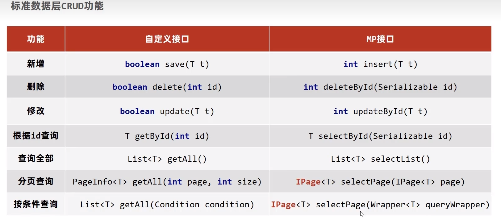

# 1. SpringBoot用例程序

```java
@RestController
@RequestMapping("/books")
public class BookController {

    @GetMapping("/{id}")
    public String getById(@PathVariable Integer id){
        System.out.println(id);
        return "hello springboot";
    }
}

        SpringApplication.run(SpringBootDemoApplication.class, args);//直接启动springboot项目应用
```

```xml
    <!--继承-->
    <parent>
        <groupId>org.springframework.boot</groupId>
        <artifactId>spring-boot-starter-parent</artifactId>
        <version>2.7.2</version>
        <relativePath/> <!-- lookup parent from repository -->
    </parent>
```

# 2. SpringBoot基础配置

## 2.1 配置文件格式

找到application.properties文件

```java
server.port=80
//修改端口为80
```

新建application.yml,修改文件

```yaml
server:
  port: 80
  #有一个空格,一定要注意
```

新建application.yaml,修改文件

```xml
server:
  port: 80
```

- application.properties:主启动文件
- application.yml :第二启动文件

- application.yaml:第三启动文件

## 2.2 yaml语法规则

- 大小写敏感
- 属性层级关系使用多行描述，每行结尾使用冒号结束，如:

```yaml
logging:
  level:
    root: info
```

- 使用缩进表示层级关系，同层级左侧对齐，只允许使用空格而不允许使用Tab键
- `属性值前面添加空格(属性名与属性值之间使用冒号+空格作为分割)`
- #表示注释
- 数组数据

```yaml
#subject是一个数组
subject:
	- java
	- 前端
	- 大数据
```

```java
    @Value("${lesson}")
    private String lesson;
    @Value("${subject[0]}")
    private String subject0;
	//自动注入
```

## 2.3 yaml数据读取的方式

```java
    @Value("${lesson}")
    private String lesson;
    @Value("${subject[0]}")
    private String subject0;
    //自动装配
    @Autowired
    private Environment environment;//可以用来加载所有的环境信息
	System.out.println(environment.getProperty("lesson"));
	System.out.println(environment.getProperty("subject[1]"));
```

```java
//定义实体类并且配置注解
@Component
@ConfigurationProperties(prefix = "enterprise")//与yaml中的数据要对应
public class Enterprise {
    private String name;
    private Integer age;
    private String tel;
    private String[] subjects;

    @Override
    public String toString() {
        return "domain{" +
                "name='" + name + '\'' +
                ", age=" + age +
                ", tel='" + tel + '\'' +
                ", subjects=" + Arrays.toString(subjects) +
                '}';
    }

    public String getName() {
        return name;
    }

    public void setName(String name) {
        this.name = name;
    }

    public Integer getAge() {
        return age;
    }

    public void setAge(Integer age) {
        this.age = age;
    }

    public String getTel() {
        return tel;
    }

    public void setTel(String tel) {
        this.tel = tel;
    }

    public String[] getSubjects() {
        return subjects;
    }

    public void setSubjects(String[] subjects) {
        this.subjects = subjects;
    }
}

```

```yaml
enterprise:
  name: itcast
  age: 16
  tel: 123456
  subject:
    - java
    - 前端
    - 大数据
```

```java
    @Autowired
    private Enterprise enterprise;//成bean后自动装配
```

## 2.4 多环境开发配置

```yaml
#设置启用的环境,在active后加环境名称
spring:
  profiles:
    active: test
    
---
#多环境开发配置,使用---来分割环境
spring:
  profiles: dev
    server:
      port: 80
---
spring:
  profiles: pro
    server:
      port: 81
---
spring:
  profiles: test
    server:
      port: 82

```

## 2.5 多环境命令格式

```sh
#修改环境
java -jar spring-boot-demo-0.0.1-SNAPSHOT.jar --spring.profiles.active=test
#修改端口号,通过--就可以同时修改多个配置
java -jar spring-boot-demo-0.0.1-SNAPSHOT.jar --spring.profiles.server.port=88 --spring.profiles.active=test
```

## 2.6 多环境开发控制

- 如果项目中同时用到了Maven和Spring，由于项目打包的主导者是Maven，因此最终的开发环境的主导权给到了Maven，以Maven中的profile为主，听从Maven控制，Spring充当一个控制类，让Maven`控制`版本号，再让Spring来`加载`这些版本

## 2.7 多级配置文件

- SpringBoot中4级配置文件中优先级设定
  - 1级：file:config/application.yml`[最高]`
  - 2级：file:application.yml
  - 3级：classpath:config/application.yml
  - 4级：classpath:application.yml`[最低]`
- 如果要当场修改配置文件,那么只需要在jar包所在目录创建新的配置文件即可,还可以创建config文件夹来做这个,注意config下必须有一个子目录(空的也行，格式的要求)

# 3. SprintBoot整合案例

## 3.1 整合JUit

```java
//Spring整合JUnit
@RunWith(SpringJUnit4ClassRunner.class)//设置运行器
@ContextConfiguration(classes = SpringConfig.class)//加载环境
/**
  * 测试代码
 /*
```

```java
@SpringBootTest(classes = SpringBootDemoApplication.class)//可以指定其启动类
class SpringBootDemoApplicationTests {
    //如果测试类是在SpringBoot启动类的包或者子包中,可以省略启动类的设置,也就是省略classes的指定
    @Autowired
    private BookService bookService;

    @Test
    void contextLoads() {
        bookService.save(new Book());
    }
    
}
```

## 3.2 整合Mybatis

```java
@Mapper//为接口添加Mapper注解
public interface BookDao {
    @Select("select * from book where id =#{id} ")
    Book getById(Integer id);

}
```

```properties
spring:
  datasource:
    driver-class-name: com.mysql.jdbc.Driver
    url: jdbc:mysql://127.0.0.1:3306/db1?serverTimezone=GMT&useSSL=false&allowPublicKeyRetrieval=true
    username: root
    password: 123456
    type: com.alibaba.druid.pool.DruidDataSource
#配置数据源
```

# 4. Mybatis-plus

## 4.1 MP特性

- 无侵入:只做增强而不做改变,不会对现有的工程产生影响
- 强大的CRUD操作:内置通用的Mapper,只需要通过少量配置即可实现单表CRUD操作
- 支持Lambda:编写查询条件无需担心字段写错
- 支持主键自动的生成
- 内置分页插件

## 4.2 标准开发



- 分页查询

```java
@Configuration
public class MPConfig {
    @Bean
    public MybatisPlusInterceptor mybatisPlusInterceptor(){
        //1.定义mp拦截器
        MybatisPlusInterceptor mybatisPlusInterceptor = new MybatisPlusInterceptor();
        //2.添加具体的拦截器
        mybatisPlusInterceptor.addInnerInterceptor(new PaginationInnerInterceptor());
        return mybatisPlusInterceptor;
    }
}
```

```java
    void testGetAll() {
        IPage page = new Page(1,2);//查第几页,后边是页的尺寸
        bookDao.selectPage(page,null);
        System.out.println(page.getCurrent());//表示当前是第几页
        System.out.println(page.getTotal());//一共多少条数据
        System.out.println(page.getPages());//表示总共有多少页
        System.out.println(page.getSize());//每页显示数
        System.out.println(page.getRecords());//真正的数据
    }
```

## 4.3 条件查询方法

```java
    void testGetAll() {
        QueryWrapper wrapper = new QueryWrapper();
        wrapper.eq("type","计算机");//equals
        wrapper.lt("id",5);//less than
        wrapper.gt("id",5);//greater than
        List list = bookDao.selectList(wrapper);
        System.out.println(list);
    }
```

```java
    void testGetAll() {
        //使用lambda
        QueryWrapper<Book> queryWrapper = new QueryWrapper();//需要先执行泛型才能使用
        queryWrapper.lambda().lt(Book::getType,"计算机");
        queryWrapper.lambda().lt(Book::getId,"5");
        queryWrapper.lambda().gt(Book::getId,"5");
    }
```

```java
        LambdaQueryWrapper<Book> lambdaQueryWrapper = new LambdaQueryWrapper();
        lambdaQueryWrapper.lt(Book::getId,"5");//同理
```

## 4.4 查询投影

- 查询投影:设置查询出来的结果的形式，查询字段控制

```java
lambdaQueryWrapper.select(Book::getType,Book::getDescription);//限定了查询的字段
```

```java
QueryWrapper<Book> queryWrapper = new QueryWrapper<>();
queryWrapper.select("count(*) as count,type");
queryWrapper.groupBy("type");
List<Map<String, Object>> maps = bookDao.selectMaps(queryWrapper);
System.out.println(maps);
```

## 4.5 id生成策略

```java
@TableId(type = IdType.AUTO)
private Long id;
//AUTO:数据库方默认的生成策略
//INPUT:与自增策略矛盾,ID由自己指定,不指定则会报错(id为null)
//ASSIGN_ID:使用雪花算法生成id(可以兼容数值型与字符串类型,64位2进制)
//ASSIGN_UUID:以UUID生成算法作为id生成策略
```


## 4.6 逻辑删除

- 删除操作的业务问题:业务数据从数据库中丢弃
- 逻辑删除:为数据设置是否可用的字段，删除时设置状态字段为不可用状态，数据保留在数据库中，因此逻辑删除实际上是`做标记`

```java
@TableLogic(value="0",delval="1")//没有删除是0,删除了是1
private int delete;
```

