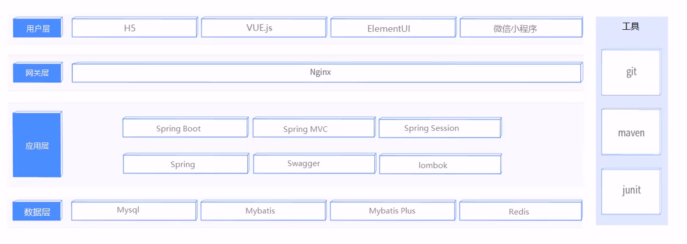
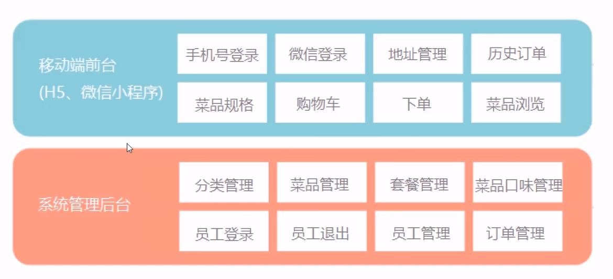
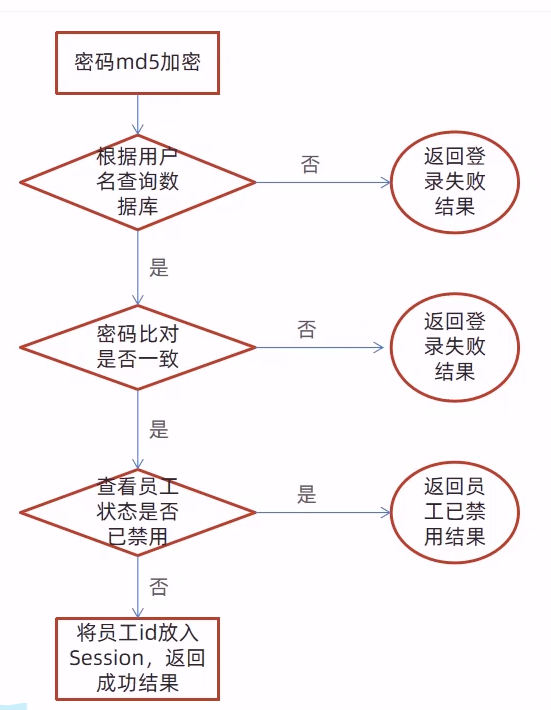
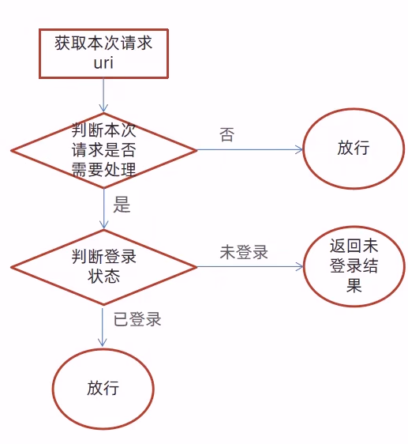

# 1. 项目介绍

## 1.1 概述

- 本项目是专门为餐饮企业定制的一款软件产品，包括`系统管理后台`和`移动端应用`两部分，其中系统管理后台主要提供给餐饮企业内部员工使用，可以对餐厅的菜品、套餐、订单等进行管理和维护。移动端应用主要提供给消费者使用，可以在线浏览菜品、添加购物车、下单等。

## 1.2 技术选型



## 1.3 功能架构



## 1.4 角色设置

- 后台系统管理员:登录后台管理系统,拥有后台系统中的所有操作权限
- 后台系统普通员工:登录后台管理系统，对菜品、套餐、订单等进行管理
- C端用户：登录移动端的用户，可以在线浏览菜品、添加购物车、下单等。

# 2. 开发环境搭建

## 2.1 数据库环境搭建

| 序号 | 表名          | 说明             |
| ---- | ------------- | ---------------- |
| 1    | employee      | 员工表           |
| 2    | category      | 菜品和套餐分类表 |
| 3    | dish          | 菜品表           |
| 4    | setmeal       | 套餐表           |
| 5    | setmeal_dish  | 套餐菜品关系表   |
| 6    | dish_flavor   | 菜品口味关系表   |
| 7    | user          | 用户表(C段)      |
| 8    | address_book  | 地址薄表         |
| 9    | shopping_cart | 购物车表         |
| 10   | orders        | 订单表           |
| 11   | order_detail  | 订单明细表       |

## 2.2 Maven项目搭建

- 配置依赖项

```xml
<?xml version="1.0" encoding="UTF-8"?>
<project xmlns="http://maven.apache.org/POM/4.0.0"
         xmlns:xsi="http://www.w3.org/2001/XMLSchema-instance"
         xsi:schemaLocation="http://maven.apache.org/POM/4.0.0 http://maven.apache.org/xsd/maven-4.0.0.xsd">
    <modelVersion>4.0.0</modelVersion>
    <!--继承springboot-->
    <parent>
        <groupId>org.springframework.boot</groupId>
        <artifactId>spring-boot-starter-parent</artifactId>
        <version>2.4.5</version>
        <relativePath/> <!-- lookup parent from repository -->
    </parent>
    <groupId>com.example</groupId>
    <artifactId>reggie</artifactId>
    <version>1.0-SNAPSHOT</version>
    <properties>
        <java.version>1.8</java.version>
    </properties>
    <dependencies>
        <!--boot启动项-->
        <dependency>
            <groupId>org.springframework.boot</groupId>
            <artifactId>spring-boot-starter</artifactId>
        </dependency>

        <dependency>
            <groupId>org.springframework.boot</groupId>
            <artifactId>spring-boot-starter-test</artifactId>
            <scope>test</scope>
        </dependency>
        <!--spring-web框架-->
        <dependency>
            <groupId>org.springframework.boot</groupId>
            <artifactId>spring-boot-starter-web</artifactId>
            <scope>compile</scope>
        </dependency>
        <!--mp-->
        <dependency>
            <groupId>com.baomidou</groupId>
            <artifactId>mybatis-plus-boot-starter</artifactId>
            <version>3.4.2</version>
        </dependency>
        <!--lombok-->
        <dependency>
            <groupId>org.projectlombok</groupId>
            <artifactId>lombok</artifactId>
            <version>1.18.20</version>
        </dependency>
        <!--用于解析前台传给过来的json数据-->
        <dependency>
            <groupId>com.alibaba</groupId>
            <artifactId>fastjson</artifactId>
            <version>1.2.76</version>
        </dependency>

        <dependency>
            <groupId>commons-lang</groupId>
            <artifactId>commons-lang</artifactId>
            <version>2.6</version>
        </dependency>

        <dependency>
            <groupId>mysql</groupId>
            <artifactId>mysql-connector-java</artifactId>
            <scope>runtime</scope>
        </dependency>

        <dependency>
            <groupId>com.alibaba</groupId>
            <artifactId>druid-spring-boot-starter</artifactId>
            <version>1.1.23</version>
        </dependency>

    </dependencies>

    <build>
        <plugins>
            <plugin>
                <groupId>org.springframework.boot</groupId>
                <artifactId>spring-boot-maven-plugin</artifactId>
                <version>2.4.5</version>
            </plugin>
        </plugins>
    </build>

</project>
```

- SpringBoot基础设置 

```yaml
server:
  #tomcat访问端口
  port: 8080
spring:
  application:
    #非必须项,可以手动指定
    name: reggie
  datasource:
    #数据库连接池
    druid:
      driver-class-name: com.mysql.cj.jdbc.Driver
      url: jdbc:mysql://localhost:3306/reggie?serverTimezone=Asia/Shanghai&useUnicode=true&characterEncoding=utf-8&zeroDateTimeBehavior=convertToNull&useSSL=false&allowPublicKeyRetrieval=true
      username: root
      password: 123456
mybatis-plus:
  configuration:
    #在映射实体或者属性时，将数据库中表名和字段名中的下划线去掉，按照驼峰命名法映射
    #这是因为表字段名是用下划线做分割的,而实体类使用驼峰类命名法的
    #address_book->AddressBook
    map-underscore-to-camel-case: true
    log-impl: org.apache.ibatis.logging.stdout.StdOutImpl
  global-config:
    db-config:
      #雪花算法
      id-type: ASSIGN_ID
```

- 编写启动类

```java
//lombok提供的日志工具
@Slf4j
@SpringBootApplication
public class ReggieApplication {
    public static void main(String[] args) {
        SpringApplication.run(ReggieApplication.class,args);//运行此类
        log.info("项目构建完成");//使用log在控制台中输出日志
    }
}
```

- 引入前端资源
  - 要注意的是,由于页面等资源是静态资源，如果直接放在resources下的话访问是会被拦截的，为了避免这样的情况，需要:
    - 将静态资源放在static/模板包下
    - 编写配置类，对于静态资源的访问进行放行

```java
    /**
     * 设置静态资源映射,放行请求
     * @param registry
     * 要注意,因为存在classpath这样的东西,所以一定要确保你的启动类是位于最外层的,否则读取会失败
     */
    @Override
    protected void addResourceHandlers(ResourceHandlerRegistry registry) {
        log.info("静态资源映射到了");
        registry.addResourceHandler("./backend/**").addResourceLocations("classpath:/backend/");//设置要映射哪些访问路径
        registry.addResourceHandler("./front/**").addResourceLocations("classpath:/front/");
    }
```

# 3. 后台登录功能开发

## 3.1 需求分析

- 用户输入账号密码,前端进行非空校验,校验成功后发送请求到后端，后端校验数据库中的数据与前端输入的数据是否一致
  - 一致:则将code设置为1
  - 不一致:设置为非1，供前端使用，并且设置msg
- 将页面提交的密码password进行md5加密处理
- 根据页面提交的用户名username查询数据库
- 如果没有查询到则返回登录失败的结果
- 密码比对，如果不一致则返回登录失败的结果
- 查看员工状态，如果已经是禁用的状态，则返回员工已经禁用的这个结果
- 登录成功，将员工id存入Session并返回登录成功结果



## 3.2 代码开发

- 创建实体类Employee，与数据库中的employee表进行映射

```java
@Data
public class Employee implements Serializable {
    private static final long serialVersionUID = 1L;

    private Long id;

    private String username;

    private String name;

    private String password;

    private String phone;

    private String sex;

    private String idNumber;//身份证号码,注意命名,已经在SpringBoot配置中配置好了,对应的是id_number,映射没有问题

    private Integer status;

    private LocalDateTime createTime;

    private LocalDateTime updateTime;
    @TableField(fill = FieldFill.INSERT)
    private Long createUser;

    @TableField(fill = FieldFill.INSERT_UPDATE)
    private Long updateUser;
}
```

- 创建dao(mapper)-service链路

```java
@Mapper
public interface EmployeeMapper extends BaseMapper<Employee> {}
```

```java
public interface EmployeeService extends IService<Employee> {}
```

```java
@Service
public class EmployeeImpl extends ServiceImpl<EmployeeMapper, Employee> implements EmployeeService {}
//这个写法是mp所特有的,第一个泛型参数代表实现的mapper接口类型,第二个是所接收的实体类型
//最终再实现service接口即可
```

- 创建Result类

```java
@Data
public class Result <T>{
    private Integer code;//编码:1成功,0和其他数字为失败

    private String msg;//错误信息

    private T data;//回传数据,不定泛型

    private Map map = new HashMap();//动态数据

    public static <T> Result<T> success(T object){//通用响应结果方法
        Result<T> result = new Result<T>();
        result.data = object;
        result.code = 1;
        return result;
    }

    public static <T> Result<T> error(T object){//通用响应结果方法
        Result<T> result = new Result<T>();
        result.data = object;
        result.code = 0;
        return result;
    }

    public Result<T> add(String key,Object value){//操作动态对象
        this.map.put(key,value);
        return this;
    }

}
```

- 创建controller

```java
    @PostMapping("/login")//post请求,参数藏在请求体中,使用此注解取出数据
    public Result login(HttpServletRequest httpServletRequest, @RequestBody Employee employee){
        //1.将页面提交的密码进行md5加密
        String passwordMd5 = DigestUtils.md5DigestAsHex(employee.getPassword().getBytes());
        System.out.println(passwordMd5);
        System.out.println(employee.getUsername());
        //2.根据页面提交的用户名的username查询数据库,注意添加泛型
        LambdaQueryWrapper<Employee> lambdaQueryWrapper = new LambdaQueryWrapper();
        lambdaQueryWrapper.eq(Employee::getUsername,employee.getUsername());
        //调用service的getOne方法即可,这里数据库的设置是因为用户名是唯一的(UNIQUE)
        Employee user = employeeService.getOne(lambdaQueryWrapper);
        //3.如果没有查询到则返回登录失败的结果
        if(null == user){
            System.out.println("登录失败");
            return Result.error("登录失败");
        }

        //4.查到了接口,进行密码的校验
        if(!user.getPassword().equals(passwordMd5)){
            System.out.println("密码错误!登录失败");
            return Result.error("密码错误!登录失败");
        }

        //5.密码也比对成功,查看员工状态,注意Integer的缓存问题
        if(user.getStatus() == 0){//禁用
            System.out.println("账号已经禁用");
            return Result.error("账号已经禁用");
        }
        //6.登录成功
        httpServletRequest.getSession().setAttribute("employee",user.getId());
        System.out.println("登录成功!");
        return Result.success("登录成功!");
    }
```

## 3.3 问题完善

- 上述登录的开发存在一定问题，因为就算用户没有通过登录页面验证通过，也可以通过访问html静态资源的方式来侵入访问页面，毫无安全性，因此需要增加`拦截器或者过滤器`对用户的登录状态进行验证
- 创建自定义过滤器
- 在启动类上加上注解@ServletComponentScan
- 完善过滤器的处理逻辑
  - 获取本次请求的URI
  - 判断本次请求是否需要处理
  - 如果不需要处理则直接放行
  - 判断登录状态，如果已经登录，则直接放行
  - 如果未登录则返回未登录的结果




- 在Spring核心配置中添加注解

```java
@ServletComponentScan//此注解用于激活spring去扫描拦截器
```

- 编写过滤器

```java
@WebFilter(filterName = "loginCheckFilter",urlPatterns = "/*")
@Slf4j
//此注解有两个参数,第一个参数是该过滤器的名称,第二个是过滤器所需要拦截的路径,我们设置为所有请求路径都拦截判断一下
public class LoginCheckFilter implements Filter {//要实现一个过滤器,需要实现一个过滤器的接口
    public static final AntPathMatcher PATH_MATCHER = new AntPathMatcher();//路径匹配器,支持通配符
    @Override
    public void doFilter(ServletRequest servletRequest, ServletResponse servletResponse, FilterChain filterChain) throws IOException, ServletException {
        //1.获取本次请求的URI(请求路径)
        //URL是同一资源定位符,是网络上资源的地址,可以定义为引用地址的字符串,用于指示资源的位置以及用于访问它的协议
        //包括访问资源的协议 服务器的位置(IP或者是域名) 服务器上的端口号 在服务器目录结构中的位置 片段标识符
        //URI是表示逻辑或者物理资源的字符序列,与URL类似,也是一串字符,通过使用位置,名称或两者来表示
        //URL主要用来连接网页,网页组件或网页上的程序,借助访问方法
        //URI用于定义项目的标识
        HttpServletRequest httpServletRequest = (HttpServletRequest) servletRequest;
        HttpServletResponse httpServletResponse =(HttpServletResponse) servletResponse;
        log.info("拦截到请求:{}",((HttpServletRequest) servletRequest).getRequestURI());

        //2.判断本次请求是否需要处理,不需要处理则直接放行
        String requestURI = httpServletRequest.getRequestURI();
        //设置一个字符串集,表示不需要处理的路径
        String[] urls = new String[]{
                "/employee/login",//1.如果人家请求的路径就是来登录的,直接放行
                "/employee/logout",//2.退出则直接放行
                "/backend/**",  //关于页面的显示可以交给前端工程师来做,我们要做的是当用户未登录时,屏蔽请求数据的接口
                "/front/**"
        };

        if(check(urls,requestURI)){//不需要处理,直接放行
            log.info("不需要处理,直接放行");
            filterChain.doFilter(httpServletRequest,httpServletResponse);
            return;
        }

        //4.判断登录状态,如果已经登录,则直接放行
        if(httpServletRequest.getSession().getAttribute("employee") != null){//之前已经登录过的,直接放行
            log.info("用户已经登录");
            filterChain.doFilter(httpServletRequest,httpServletResponse);
            return;
        }

        //5.未登录则返回未登录结果,由于前端拦截的是我们的response对象,所以我们往response对象里面写result对象即可
        //res.data.code === 0 && res.data.msg === 'NOTLOGIN',这是前端的逻辑
        log.info("用户未登录");
        httpServletResponse.getWriter().write(JSON.toJSONString(Result.error("NOTLOGIN")));
    }
```

# 4. 退出功能开发

## 4.1 需求分析

- 用户点击页面中的退出按钮，发送请求，请求地址为`/employee/logout`,请求方式为POST，我们只需要在Controller中创建对应的处理方法即可，逻辑
  - 清理Session中的用户id
  - 返回结果

## 4.2 代码开发

 ```java
     @PostMapping("/logout")
     public Result<String> logout(HttpServletRequest httpServletRequest){
         //1.清理session中保存的当前员工的id
         httpServletRequest.getSession().removeAttribute("employee");
         //2.返回结果
         return Result.success("退出成功!");
     }
 ```

 # 5. 新增员工功能开发

## 5.1 需求分析

- 新增员工,其实就是将我们新增页面录入的员工数据插入到employee表,需要注意,employee表中对username字段加入了`唯一约束`，因为username是员工的登录账号，必须是唯一的
- 当新增员工时输入的账号已经存在，由于employee表中对该字段加入了唯一约束，此时程序会抛异常
- 此时需要我们的程序对异常进行捕获，通常有两种处理方式
  - 在controller加入try、catch进行异常捕获
  - 使用异常处理器进行全局异常捕获
- 使用的是AOP代理，代理这些controller的行为
- 正常流程如下:

- 页面发送ajax请求，将新增员工页面中输入的数据以json的形式提交到服务端
- 服务端controller接收页面提交的数据并调用service将数据进行保存
- service调用mapper操作数据库，保存数据

## 5.2 代码开发

- 设置异常处理器

```java
/**
 * 全局异常处理器
 */
@ControllerAdvice(annotations = {RestController.class, Controller.class})//设置要拦截哪些controller
@ResponseBody//当异常处理完毕后,响应到前端
@Slf4j
public class GlobalExceptionHandler {
    /**
     * 异常处理方法
     * @return
     */
    @ExceptionHandler(SQLIntegrityConstraintViolationException.class)//设置处理什么异常
    public Result<String> exceptionHandler(SQLIntegrityConstraintViolationException ex){
        log.error(ex.getMessage());//得到异常信息
        if(ex.getMessage().contains("Duplicate entry")){//是否包含特征值,做异常处理分发
            String[] split = ex.getMessage().split(" ");
            String msg = split[2]+"已存在";
            return Result.error(msg);
        }
        return Result.error("未知错误");
    }
}
```

- 新增员工

```java
    /**
     * 新增员工
     * @param employee
     * @return
     */
    @PostMapping
    public Result<String> save(HttpServletRequest request,@RequestBody Employee employee){
        log.info("新增员工,前台发过来的员工信息:{}",employee.toString());
        //新增员工时添加初始密码,注意要md5加密
        employee.setPassword(DigestUtils.md5DigestAsHex("123456".getBytes(StandardCharsets.UTF_8)));
        //设置创建时间
        employee.setCreateTime(LocalDateTime.now());
        //设置更新时间
        employee.setUpdateTime(LocalDateTime.now());
        //设置创建人,拿到当前登录用户的session从而得到id
        employee.setCreateUser((Long)request.getSession().getAttribute("employee"));
        //设置更新,拿到当前登录用户的session
        employee.setUpdateUser((Long)request.getSession().getAttribute("employee"));
        employeeService.save(employee);//MP简洁方法
        return Result.success("新增员工成功");
    }
```

# 6. 员工信息分页查询

## 6.1 需求分析

- 系统中的员工很多的时候，如果在一个页面中全部展示出来会显得比较乱，不便于查看，所以一般的系统中都会以分页的方式来展示列表数据
- 流程如下:页面发送ajax请求，将分页查询参数(page,pageSize,name)提交到服务器
- 服务端controller 接收页面提交的数据并调用service查询数据
- service调用mapper操作数据库,查询分页数据
- controller将查询到的分页数据响应给页面
- 渲染数据到页面

## 6.2 代码开发

- 首先配置mybatis-plus分页插件

```java
@Configuration
public class MybatisPlusConfig {
    @Bean
    public MybatisPlusInterceptor mybatisPlusInterceptor(){
        MybatisPlusInterceptor mybatisPlusInterceptor = new MybatisPlusInterceptor();
        mybatisPlusInterceptor.addInnerInterceptor(new PaginationInnerInterceptor());
        return mybatisPlusInterceptor;
    }
}
```

```java
    @GetMapping("/page")
    public Result<Page> page(int page,int pageSize,String name){
        log.info("page={},pageSize={},name={}",page,pageSize,name);
        //使用Mp的分页插件,如果有name的话就构造条件构造器
        //1.分页构造器
        Page pageInfo = new Page(page,pageSize);//查第page页,查pageSize条件
        //2.条件构造器,添加过滤条件
        LambdaQueryWrapper<Employee> lambdaQueryWrapper = new LambdaQueryWrapper();//注意指定泛型
        lambdaQueryWrapper.like(!StringUtils.isBlank(name),Employee::getName,name);//where name = ,注意当name为空的时候不搞这个sql
        //3.保证查询数据的一致性,设置排序规则
        lambdaQueryWrapper.orderByDesc(Employee::getUpdateTime);
        //4.执行查询(分页构造器,条件构造器)
        Page data = employeeService.page(pageInfo, lambdaQueryWrapper);
        return Result.success(data);
    }
```

# 7. 启用/禁用员工账号

## 7.1 需求分析

- 在员工管理列表页面，可以对某个员工账号进行启用或者禁用操作。账号禁用的员工不能登录系统，启用后的员工可以正常登录
- 需要注意，只有管理员(admin用户)可以对其他普通用户进行启用、禁用操作，所以普通用户登录系统后启用、禁用按钮不显示

- 流程
- 页面发送ajax请求，将参数(id、status)提交到服务端
- 服务端controller接收页面提交的数据并调用Service更新数据
- Service调用Mapper操作数据库
- 由于启用/禁用员工账号的这个操作是更新字段信息，那么我们是否可以抽取这个方法，将这个方法作为一个通用的更新方法来使用?

## 7.2 代码开发

- 存在一个精度丢失的问题:SQL执行的结果是更新的数据行数为0，仔细观察id的值，和数据库中对应记录的id值并不相同，这是因为前端js对数据进行处理的时候，我们后台的实际数据是19位的，但是前台的js代码只能够保证前16位是一致的，后边的几位发生了舍入
- 解决方法：可以在服务端给页面响应json数据时进行处理，将Long类型数据同一转为String字符串，这样的话就不会产生数字精度的问题

- 提供对象转换器JacksonObjectMapper,基于Jackson进行JAVA对象到json数据的转换(或者使用fastJson)
- 在WebMvcConfig配置类中扩展Spring mvc的消息转换器，在此消息转换器中使用提供的对象转换器进行Java对象到json数据的转换

- 消息转换器：将controller的返回结果转成相应的json

```java
/**
 * 对象映射器:基于jackson将Java对象转为json，或者将json转为Java对象
 * 将JSON解析为Java对象的过程称为 [从JSON反序列化Java对象]
 * 从Java对象生成JSON的过程称为 [序列化Java对象到JSON]
 */
public class JacksonObjectMapper extends ObjectMapper {//通过继承该类,就可以将java对象转换为json数据对象

    public static final String DEFAULT_DATE_FORMAT = "yyyy-MM-dd";
    public static final String DEFAULT_DATE_TIME_FORMAT = "yyyy-MM-dd HH:mm:ss";
    public static final String DEFAULT_TIME_FORMAT = "HH:mm:ss";

    public JacksonObjectMapper() {
        super();
        //收到未知属性时不报异常
        this.configure(FAIL_ON_UNKNOWN_PROPERTIES, false);

        //反序列化时，属性不存在的兼容处理
        this.getDeserializationConfig().withoutFeatures(DeserializationFeature.FAIL_ON_UNKNOWN_PROPERTIES);


        SimpleModule simpleModule = new SimpleModule()
                .addDeserializer(LocalDateTime.class, new LocalDateTimeDeserializer(DateTimeFormatter.ofPattern(DEFAULT_DATE_TIME_FORMAT)))
                .addDeserializer(LocalDate.class, new LocalDateDeserializer(DateTimeFormatter.ofPattern(DEFAULT_DATE_FORMAT)))
                .addDeserializer(LocalTime.class, new LocalTimeDeserializer(DateTimeFormatter.ofPattern(DEFAULT_TIME_FORMAT)))
            /*以上是添加反序列化的*/
                .addSerializer(BigInteger.class, ToStringSerializer.instance)
                .addSerializer(Long.class, ToStringSerializer.instance)
                .addSerializer(LocalDateTime.class, new LocalDateTimeSerializer(DateTimeFormatter.ofPattern(DEFAULT_DATE_TIME_FORMAT)))
                .addSerializer(LocalDate.class, new LocalDateSerializer(DateTimeFormatter.ofPattern(DEFAULT_DATE_FORMAT)))
                .addSerializer(LocalTime.class, new LocalTimeSerializer(DateTimeFormatter.ofPattern(DEFAULT_TIME_FORMAT)));

        //注册功能模块 例如，可以添加自定义序列化器和反序列化器
        this.registerModule(simpleModule);
    }
}

```

```java
    /**
     * 扩展MVC框架的消息转换器
     * @param converters
     */
    @Override
    protected void extendMessageConverters(List<HttpMessageConverter<?>> converters) {
        //创建消息转换器
        MappingJackson2HttpMessageConverter mappingJackson2HttpMessageConverter = new MappingJackson2HttpMessageConverter();
        //设置对象转换器
        mappingJackson2HttpMessageConverter.setObjectMapper(new JacksonObjectMapper());
        //将上述的消息转换器对象追加到mvc框架的转换器容器中
        converters.add(0,mappingJackson2HttpMessageConverter);
        //将此转换器置顶,提高其优先级
    }
```

```java
    /**
     * 根据id修改员工 信息,修改信息需要使用put
     * @param employee
     * @return
     */
    @PutMapping
    public Result<String> update(HttpServletRequest request,@RequestBody Employee employee){
        log.info("收到前台给的员工信息:{}",employee.toString());

        //收到信息后就开始update
        employee.setUpdateUser((Long) request.getSession().getAttribute("employee"));
        employee.setUpdateTime(LocalDateTime.now());

        employeeService.updateById(employee);
        return Result.success("修改成功");
    }
```

# 8. 编辑员工信息

## 8.1 需求分析

- 在员工管理列表页面点击编辑按钮，跳转到编辑页面，在编辑页面回显员工信息并且进行修改，最后点击保存按钮完成编辑操作

- 点击编辑按钮时，页面跳转到add.html,并在url中携带参数`[员工id]`
- 获取url的参数
- 发送ajax请求，请求服务端，同时提交员工id参数
- 服务端接收请求，根据员工id查询员工信息，将员工信息以json形式响应给页面
- 页面接收json数据，通过VUE的数据绑定进行员工信息的回显
- 点击保存按钮，发送ajax请求，将页面中的员工信息以json方式提交给服务端
- 服务端接收员工信息，并进行处理，完成后给页面进行响应
- 页面接收到服务端响应信息后进行响应的处理

## 8.2 代码开发

```java
    @GetMapping("/{id}")
    public Result<Employee> getById(@PathVariable Long id){
        Employee employee = employeeService.getById(id);
        log.info("根据id查询员工信息{}",employee.toString());
        if(employee!=null){
            return Result.success(employee);
        }
        return Result.error("没有查询到对应的员工信息");
    }
```

由于已经编写了通用的更新接口方法，因此不需要在额外编写了

# 9. 公共字段自动填充

## 9.1 问题分析

在新增员工时需要设置`创建时间`、`创建人`、`修改时间`、`修改人`等字段，在编辑员工时需要设置修改时间和修改人等字段，这些字段属于公共字段，也就是很多表中都具有此字段，需要做的是对这些公共字段在某个地方进行同一处理，来简化开发

## 9.2 代码实现

- 对于这样一个统一的操作来说，我们很容易想到编写通知类，创建AOP来进行处理，但是考虑到AOP的实现底层是暴力反射，对于后端业务的性能会有较大影响，因此不采用这种方法。
- MP公共字段自动填充，也就是在插入或者更新的时候为指定的字段赋予指定的值，使用它的好处就是可以同一对这些字段进行处理，避免了重复代码
- 实现步骤
  - 在实体类的属性上加入@TableField注解，指定自动填充的策略
  - 按照框架要求编写元数据对象处理器，在此类中统一为公共字段赋值，此类需要实现`MetaObjectHandler`接口
  - 问题：当我们需要设置createUser和updateUser为固定值，后面我们需要进行改造，改为动态获取当前登录用户的id
  - 解决方法:首先我们容易想到我们将用户的id存入了HttpSession中，我们只需要能够获得HttpSession就可以解决这个问题，可以通过使用`ThreadLocal`来解决这个问题
  - 客户端发送的每次http请求，对应的服务端都会分配一个新的线程来处理，在处理过程中设计到下面类中的方法都属于相同的一个线程，只要请求的处理链是同一条，那么这些方法的调用者都是同一个线程
    - LoginCheckFilter的doFilter方法
    - EmployeeController的update方法
    - MyMetaObjectHandler的updateFill方法
  - ThreadLocal并不是一个线程，而是线程的`局部变量`，当使用ThreadLocal维护变量时，ThreadLocal为每个使用该变量的线程提供独立的变量副本，所以每一个线程都可以独立地改变自己的脚本而不会影响其它线程所对应的副本。ThreadLocal为每个线程提供单独一份存储空间，具有`线程隔离`的效果，只有在线程内才能获取到对应的值，线程外则不能访问
  - ThreadLocal是Thread以Map键的值执行Local 是弱引用 值存储数据 如果是弱引用的话JVM将会自动回收 但是值会一直存在,最好进行remove()
  - public void set(T value):`设置当前线程的线程局部变量的值`
  - public T get():`返回当前线程所对应的线程局部变量的值`
  - 解决本问题的思路:可以在LoginCheckFilter的doFilter方法中获取当前登录用户的id，并且调用ThreadLocal的set方法来设置当前线程的线程局部变量的值(用户id)，然后再MyMetaObjectHandler的UpdateFill方法中调用ThreadLocal的get方法来获取当前线程所对应的线程局部变量的值(用户id)
  - 实现步骤
  - 编写BaseContext工具类,基于ThreadLocal封装工具类
  - 在LoginCheckFilter的doFilter方法中调用BaseContext来设置当前登录用户的id
  - 在MyMetaObjectHandler的方法中调用BaseContext获取登录用户的id

```java
@TableField(fill = FieldFill.INSERT)//在插入时填充字段
private LocalDateTime createTime;

@TableField(fill = FieldFill.INSERT_UPDATE)//在插入和更新时填充该字段
private LocalDateTime updateTime;

@TableField(fill = FieldFill.INSERT)
private Long createUser;

@TableField(fill = FieldFill.INSERT_UPDATE)
private Long updateUser;
```

```java
//4.判断登录状态,如果已经登录,则直接放行
if(httpServletRequest.getSession().getAttribute("employee") != null){//之前已经登录过的,直接放行
    log.info("用户已经登录");
    //取出id
    BaseContext.setCurrentUserId((Long)httpServletRequest.getSession().getAttribute("employee"));
    filterChain.doFilter(httpServletRequest,httpServletResponse);
    return;
}
```

```java
/**
 * 基于ThreadLocal的工具类:用于保存和获取当前登录用户的id
 */
public class BaseContext {
    private static ThreadLocal<Long> threadLocal = new ThreadLocal<>();

    /**
     * 设置值
     * @param id
     */
    public static void setCurrentUserId(Long id){
        threadLocal.set(id);
    }

    /**
     * 获取值
     * @return
     */
    public static Long getCurrentUserId(){
        return threadLocal.get();
    }

    public static void removeUserId(){
        threadLocal.remove();
    }

}
```

```java
/**
 * 元数据对象处理器
 */
@Slf4j
@Component
public class MyMetaObjectHandler implements MetaObjectHandler {
    /**
     * 插入操作时自动填充
     * @param metaObject
     */
    @Override
    public void insertFill(MetaObject metaObject) {//在插入时执行
        log.info("公共字段自动填充[insert],原始对象:{}",metaObject.toString());
        metaObject.setValue("createTime", LocalDateTime.now());//写属性名=>值
        metaObject.setValue("updateTime", LocalDateTime.now());
        //此处需要获取到request=>session=>Attribute中的id属性,暂时获得不了
        metaObject.setValue("createUser",BaseContext.getCurrentUserId());
        metaObject.setValue("updateUser",BaseContext.getCurrentUserId());
    }

    /**
     * 更新操作时自动填充
     * @param metaObject
     */
    @Override
    public void updateFill(MetaObject metaObject) {//在更新时执行
        log.info("公共字段自动填充[update],原始对象:{}",metaObject.toString());
        metaObject.setValue("updateTime", LocalDateTime.now());
        metaObject.setValue("updateUser",BaseContext.getCurrentUserId());
    }
}
```

# 10. 新增分类

## 10.1 需求分析

- 后台系统中可以管理分类信息，分类包括两种类型，分别是菜品分类和套餐分类，当我们在后台系统中添加菜品时需要选择一个菜品分类，当我们在后台系统中添加一个套餐时需要选择一个套餐分类，在移动时也会按照菜品分类和套餐分类来展示对应的菜品和套餐。
- 页面发送ajax请求，将新增分类窗口输入的数据以json形式提交到服务端
- 服务端controller接收页面提交的数据并调用service将数据进行保存
- Service调用Mapper操作数据库，保存数据
- 由于新增菜品分配和套餐分配的请求的地址和json数据结构相同，因此只需要提供一个方法接口即可

## 10.2 代码开发

```java
    @PostMapping
    public Result<String> save(@RequestBody Category category){
        categoryService.save(category);
        return Result.success("添加成功");
    }
```

# 11. 分页展示分类

## 11.1 需求分析

- 与员工的分页展示是比较类似的，但是少了一个按照名字过滤的需求，其他完全一致

## 11.2 代码开发

```java
    @GetMapping("/page")
    public Result<Page> page(int page,int pageSize){
        log.info("page={},pageSize={}",page,pageSize);
        //使用Mp的分页插件,如果有name的话就构造条件构造器
        //1.分页构造器
        Page pageInfo = new Page(page,pageSize);//查第page页,查pageSize条件
        //2.条件构造器,添加过滤条件
        LambdaQueryWrapper<Category> lambdaQueryWrapper = new LambdaQueryWrapper();//注意指定泛型
        //3.保证查询数据的一致性,设置排序规则
        lambdaQueryWrapper.orderByDesc(Category::getSort);
        //4.执行查询(分页构造器,条件构造器)
        Page data = categoryService.page(pageInfo, lambdaQueryWrapper);
        return Result.success(data);
    }
```

# 12. 删除分类

## 12.1 需求分析

- 删除一般是要采用软删除的方式来进行
- 在分类管理列表页面，可以对某个分类进行删除，需要注意的是当分类关联了菜品或者套餐时，此分类不允许删除

- 因此要开发分类之前，先得把菜品的删除给开发出来

## 12.2 代码开发

- 编写菜品和套餐dao=>service链路

- 利用菜品和套餐的查询链路对关联信息进行判断，并且用软删除删除信息，如果无法删除则抛出异常，交给全局异常处理器

```java
    @DeleteMapping
    public Result<String> deleteById(Long ids){
        log.info("删除分类");
        //在分类管理列表页面，可以对某个分类进行删除，需要注意的是当分类关联了菜品或者套餐时，此分类不允许删除
        //一般不使用外键,外键影响性能
        categoryService.remove(ids);
        return Result.success("删除成功!");
    }
```

```java
    /**
     * 异常处理方法
     * @return
     */
    @ExceptionHandler(CustomException.class)//设置处理什么异常
    public Result<String> exceptionHandler(CustomException ex){
        log.error(ex.getMessage());//得到异常信息
        return Result.error(ex.getMessage());
    }
```

```java
    @Autowired
    private DishService dishService;
    @Autowired
    private SetmealService setmealService;

    /**
     * 根据id进行删除分类,删除之前需要进行判断
     * @param id
     */
    @Override
    public void remove(Long id) {
        //查询当前分类是否关联了菜品,如果已经关联,则抛出一个业务异常
        LambdaQueryWrapper<Dish> dishWrapper = new LambdaQueryWrapper<>();
        //添加查询条件
        dishWrapper.eq(Dish::getCategoryId,id);
        if(dishService.count(dishWrapper)>0){
            //已经关联菜品,需要抛出业务异常
            throw new CustomException("当前分类下关联了菜品,不能删除");
        }
        //查询当前分类是否关联了套餐,如果已经关联,则抛出一个业务异常
        LambdaQueryWrapper<Setmeal> setmealWrapper = new LambdaQueryWrapper<>();
        //添加查询条件
        setmealWrapper.eq(Setmeal::getCategoryId,id);
        if(setmealService.count(setmealWrapper)>0){
            //已经关联菜品,需要抛出业务异常
            throw new CustomException("当前分类下关联了套餐,不能删除");
        }
        //正常删除分类LambdaQueryWrapper
        LambdaUpdateWrapper<Category> categoryWrapper = new LambdaUpdateWrapper();
        categoryWrapper.set(Category::getIsDeleted,1);
        categoryWrapper.eq(Category::getId,id);
        //第一个参数要设置为null,这样就只会更新你set的字段
        super.update(null,categoryWrapper);
    }
```

# 13. 修改分类

## 13.1 需求分析

- 回显信息
- 修改后保存信息并且发送到服务端

## 13.2 代码开发

首先拿到请求的URL:`http://localhost:8080/category`(PUT)，直接开发接口

```java
    /**
     * 根据id修改分类信息
     * @param category
     * @return
     */
    @PutMapping
    public Result<String> update(@RequestBody Category category){
        log.info("修改分类,得到的参数是{}",category.toString());
        categoryService.updateById(category);
        return Result.success("修改成功!");
    }
```

# 14. 文件的上传和下载

## 14.1 简介

- 文件上传，也称为upload,是指将本地图片、视频、音频等文件上传到服务器上，可以供其他用户浏览或者下载的过程，文件上传在项目中引用非常广泛
- 文件上传时，对页面的form表单有如下要求
  - method="post"
  - enctype="multipart/form-data" 采用此格式上传文件
  - type="file" 使用input的file控件上传
- 服务端要接收客户端页面所上传的文件，通常都会使用两个组件
  - commons-fileupload
  - commons-io
- Spring 框架在Spring-web包中对文件的上传进行了封装，大大简化了服务端代码，只需要在Controller的方法中声明一个MultipartFile类型的参数即可接收上传的文件

- 通过浏览器进行文件下载
  - 以附件的形式下载，弹出保存对话框，将文件保存到指定的磁盘目录
  - 直接在浏览器中打开
- 通过浏览器进行文件下载，本质上就是服务单将文件以流的形式写回浏览器的过程

## 14.2 代码实现

首先获取得到抓包得到的请求地址`http://localhost:8080/common/upload`

```java
@RestController
@RequestMapping("/common")
@Slf4j
public class CommentController {
    @Value("${reggie.path}")//类似el表达式
    private String basePath;
    @PostMapping("/upload")
    public Result<String> upload(MultipartFile file){//必须和前端规定的名字保持一致
        //file是一个临时文件,在这里需要设置保存到指定位置,否则请求结束后临时文件就会被删除
        log.info(file.toString());
        String suffix = file.getOriginalFilename().substring(file.getOriginalFilename().lastIndexOf("."));
        File dir = new File(basePath);
        if(!dir.exists()){
            dir.mkdirs();
        }
        try {
            //将临时文件转存到指定文件
            //使用UUID生成唯一的文件名
            file.transferTo(new File(basePath+ UUID.randomUUID()+suffix));
        } catch (IOException e) {
            e.printStackTrace();
        }
        return null;
    }
}
```

```yaml
reggie:
  path: H:/download/
  #一定要注意,因为我们后边使用的有get请求,因此涉及到url的合法性,所以斜杠和反斜杠一定要注意好
```

```java
    /**
     * 文件下载功能
     * @param name
     * @param response
     */
    @GetMapping("/download")
    public void download(String name, HttpServletResponse response){
        //下载指定文件
        //通过输入流来读取文件内容
        try {
            FileInputStream fileInputStream = new FileInputStream(new File(basePath+name));
            byte[] bytes = new byte[1024];
            int len = 0;
            response.setContentType("image/jpeg");
            //这个逻辑简单讲一下,就是首先read(bytes)会从输入流中得到数据，然后将数据写入bytes数组中,
            //并且返回本次读入/写回的长度,只有当读完的时候,len才会等于-1
            //然后读完之后,将得到的byte通过write,将byte里面的内容通过len的限制写回输出流
            //循环往复
            while((len = fileInputStream.rea d(bytes))!= -1){
                response.getOutputStream().write(bytes,0,len);
                response.getOutputStream().flush();
            }
            response.getOutputStream().close();
            fileInputStream.close();
        } catch (Exception e) {
            e.printStackTrace();
        }
        //通过输出流来写回浏览器,在浏览器中展示图片
    }

```

# 15. 新增菜品

## 15.1 需求分析

- 后台系统中可以管理菜品的信息，通过新增功能来添加一个新的菜品，在添加菜品时需要选择当前菜品所属的菜品分类，并且需要上传菜品信息，在移动端会按照菜品分类来展示对应的菜品信息

- 新增菜品，其实就是将新增页面录入的菜品信息插入到dish表，如果添加了口味做法，还需要向dish_flavour表插入数据，所以在新增菜品时，涉及到两个表
  - dish:菜品表
  - dish_flagvor:菜品口味表

- 页面发送ajax请求，请求服务端获取菜品分类数据并展示到下拉框中
  - `http://localhost:8080/category/list?type=?`
- 页面发送请求进行图片上传，请求服务端将图片保存到服务器
- 页面发送请求进行图片下载，将上传的图片进行回显
- 点击保存按钮，发送ajax请求，将菜品相关数据以json形式提交到服务端

## 15.2 代码开发

- 首先编写获取菜品分类列表的接口

```java
    /**
     * 获取菜品分配列表
     * @param type
     * @return
     */
    @GetMapping("/list")
    public Result<List<Category>> list(Integer type){
        LambdaQueryWrapper<Category> lambdaQueryWrapper = new LambdaQueryWrapper<>();
        lambdaQueryWrapper.eq(type!=null,Category::getType,type);
        lambdaQueryWrapper.orderByDesc(Category::getSort);
        lambdaQueryWrapper.orderByDesc(Category::getUpdateTime);
        
        List<Category> list = categoryService.list(lambdaQueryWrapper);//.list方法可以将查询到的结果封装到List去
       
        return Result.success(list);
    }
```

- 根据页面提交数据格式导入DTO
- **DTO**:全称为Data Transfer Object,即数据传输对象，一般用于展示层与服务层之间的数据传输

```java
@Data
public class DishDto extends Dish {
    private List<DishFlavor> flavors = new ArrayList<>();//注意名称要一致,否则传过来的json数据无法解析

    private String categoryName;

    private Integer copies;
}
```

- 根据需求,需要同时操作两张表，因此需要在service层中编写方法，同时操作口味表和菜品表,值得注意的是，由于操作的是两张表，一旦发生错误或者抛出异常，可能导致数据不一致的问题，因此需要开启事务

```java
@EnableTransactionManagement//激活事务,在启动类上配置
```

```java
    @Autowired
    private DishFlavorService dishFlavorService;
    /**
     * 新增菜品,同时插入菜品对应的口味数据,需要同时操作两张表:dish、dish_flavor
     * @param dishDto
     */
    @Override
    @Transactional//由于涉及到多张表的操作,因此这里需要开启事务控制,这是为了保证数据库表的一致性
    public void saveWithFlavor(DishDto dishDto){
        //保存菜品的基本信息到菜品表dish
        this.save(dishDto);
        //保存菜品口味数据到菜品口味表dish_flavor
        Long dishId = dishDto.getId();
        //获取id
        List<DishFlavor> flavors = dishDto.getFlavors();
        //获取口味列表
        List<DishFlavor> collect = flavors.stream().map((item) -> {
            item.setDishId(dishId);
            return item;
        }).collect(Collectors.toList());
        //流式计算存取数据
        dishFlavorService.saveBatch(collect);

    }
```

# 16. 菜品信息分页查询

## 16.1 需求分析

- 与前面的分页功能有所的不同的是，这里的前端还需要渲染出图片，因此我们后台还需要借助于前面编写的下载/上传的逻辑，对图片进行展示 
- 页面发送ajax请求，将分页查询参数(page,pageSize,name)提交到服务端，获取分页数据
- 页面发送请求，请求服务端进行图片下载，用于页面图片的展示

## 16.2 代码开发

- 具体的逻辑与注释见代码

```java
    /**
     *
     * @param page
     * @param pageSize
     * @param name
     * @return
     */
    @GetMapping("/page")
    public Result<Page> page(int page, int pageSize,String name){
        //要注意的是,由于渲染数据还需要的菜品分类,但是我们Dish中只有菜品分类的id,而前端是无法获知我们菜品分类的id的
        //因此我们需要在拿到Dish之后,拿着这个菜品分类的id,去菜品分类表中去查你这个菜品分类的名称,拿到之后,再包装成DTO发送到前端即可
        //这里可以提一嘴,就是前端渲染数据的时候,拿到我们后端给它的json,会挨个地查询有没有一个属性名字叫做categoryName的,如果没有的话它就渲染不上
        //同样的,我们后端接收数据的话也就这样,它会去扫描前端给的json数据,挨个地查询有没有我们参数表里面的字段名,假如说有字段名的话,那么就会把数据填进去
        /**先拿到Dish**/
        log.info("page={},pageSize={}",page,pageSize);
        //使用Mp的分页插件,如果有name的话就构造条件构造器
        //1.分页构造器
        Page<Dish> pageInfo = new Page(page,pageSize);//查第page页,查pageSize条件
        Page<DishDto> pageDtoInfo = new Page<>();

        //2.条件构造器,添加过滤条件
        LambdaQueryWrapper<Dish> lambdaQueryWrapper = new LambdaQueryWrapper();//注意指定泛型
        lambdaQueryWrapper.like(!StringUtils.isBlank(name), Dish::getName,name);//where name = ,注意当name为空的时候不搞这个sql
        //3.保证查询数据的一致性,设置排序规则
        lambdaQueryWrapper.orderByDesc(Dish::getUpdateTime);
        //4.执行查询(分页构造器,条件构造器)
        dishService.page(pageInfo, lambdaQueryWrapper);

        //对象拷贝
        BeanUtils.copyProperties(pageInfo,pageDtoInfo,"records");//records是正常的列表数据,不需要修改,我们的目的是修改categoryName
        List<Dish> records = pageInfo.getRecords();//然后咱根据records里面的数据id去获取名字
        List<DishDto> list = records.stream().map((item) -> {
            DishDto dishDto = new DishDto();
            BeanUtils.copyProperties(item, dishDto);//设置普通属性值(Dish的值全部赋值进去)
            dishDto.setCategoryName(categoryService.getById(item.getCategoryId()).getName());//设置categoryName
            return dishDto;//完成后将该对象返回
        }).collect(Collectors.toList());

        pageDtoInfo.setRecords(list);
        return Result.success(pageDtoInfo);
    }
```

# 17. 修改菜品

## 17.1 需求分析

- 在菜品管理列表页面点击修改按钮，跳转到修改菜品页面，在修改页面回显菜品相关信息并进行修改，最后点击确定按钮完成修改操作
- 由于菜品的展示涉及到口味，因此依然需要多表联查
- 页面发送ajax请求,请求服务端获取分类数据，用于菜品分类下拉框中数据展示
- 页面发送ajax请求,请求服务端,根据id查询当前菜品信息,用于菜品信息回显
- 页面发送请求,请求服务端进行图片下载,用于页面图片的回显
- 点击保存按钮,页面发送ajax请求,将修改后的菜品相关数据以json形式提交到服务端

## 17.2 代码开发

```java
    @Override
    @Transactional
    public void updateWithFlavor(DishDto dishDto) {
        //更新dish表
        log.info("正在执行dish表的操作");
        this.updateById(dishDto);

        //更新口味表
        //1.清理当前菜品对应口味数据,重置
        //delete from dish_flavor where dish_id = ???
        log.info("正在执行dish_flavor表的操作");
        LambdaQueryWrapper<DishFlavor> wrapper = new LambdaQueryWrapper();
        wrapper.eq(DishFlavor::getDishId,dishDto.getId());
        //正常删除分类LambdaQueryWrapper
        LambdaUpdateWrapper<DishFlavor> dishFlavorWrapper = new LambdaUpdateWrapper();
        dishFlavorWrapper.set(DishFlavor::getIsDeleted,1);
        dishFlavorWrapper.eq(DishFlavor::getDishId,dishDto.getId());
        //第一个参数要设置为null,这样就只会更新你set的字段
        dishFlavorService.update(null,dishFlavorWrapper);
        //2.再来针对当前提交过来的口味数据,执行插入操作
        List<DishFlavor> flavors = dishDto.getFlavors();
        dishFlavorService.saveBatch(putIdIn(flavors,dishDto.getId()));

    }

    public List<DishFlavor> putIdIn(List<DishFlavor> flavors,Long dishId){
        return flavors.stream().map((item) -> {
            item.setId(CustomIdentifierGenerator.getAssignID());
            item.setDishId(dishId);
            return item;
        }).collect(Collectors.toList());
    }
```

```java
    public static Long getAssignID(){
        return new DefaultIdentifierGenerator().nextId(null);
    }
```

# 18. 删除&批量删除菜品

## 18.1 需求分析

- 首先我们分析页面上的请求,发现批量删除和单个删除的请求其实可以合并为一个请求，也就是前端传过来的ids被我们解析为数组的个数不同而已
- 删除的时候，还需要将菜品口味表中的有对应的getDishId给删除掉

## 18.2 代码开发

```java
    @Override
    @Transactional
    public void deleteByIds(String ids){
        Long[] dstIds = MyStringHandler.getAllIds(ids);
        //删除菜品信息和口味信息表的心思
        for (Long dstId : dstIds) {
            log.info("目前正在删除的是:{}",dstId);
            LambdaUpdateWrapper<Dish> dishWrapper = new LambdaUpdateWrapper();
            LambdaUpdateWrapper<DishFlavor> dishFlavorWrapper = new LambdaUpdateWrapper();
            //删除菜品信息
            dishWrapper.eq(Dish::getId,dstId);
            dishWrapper.set(Dish::getIsDeleted,1);
            this.update(dishWrapper);

            //删除口味信息
            dishFlavorWrapper.eq(DishFlavor::getDishId,dstId);
            dishFlavorWrapper.set(DishFlavor::getIsDeleted,1);
            dishFlavorService.update(dishFlavorWrapper);
        }
    }
```

# 19. 启售&批量启售菜品

## 19.1 需求分析

- 主要是要实现起售和禁售之间的状态切换，观察前端已经为我们封装好了status的值,只需要拿过来直接给status用上即可

## 19.2 代码开发

```java
    @Override
    @Transactional
    public void changeStatusByIds(int status,String ids) {
        //scope.row.status == '0' ? '启售' : '停售'
        Long[] dstIds = MyStringHandler.getAllIds(ids);
        for (Long dstId : dstIds) {
            LambdaUpdateWrapper<Dish> dishWrapper = new LambdaUpdateWrapper();
            //删除菜品信息
            dishWrapper.eq(Dish::getId,dstId);
            dishWrapper.set(Dish::getStatus,status);
            this.update(null,dishWrapper);
        }
    }
```

```java
    /**
     *
     * @param status
     * @param ids
     * @return
     */
    @PostMapping ("/status/{status}")
    public Result<String> changeStatus(@PathVariable int status,String ids){
        log.info("得到的状态是:{},得到的ids是:{}",status,ids);
        dishService.changeStatusByIds(status,ids);
        return Result.success("修改状态成功!");
    }
```

# 20. 新增套餐

## 20.1 需求分析

- 新增套餐，其实就是将新增页面录入的套餐信息插入到setmeal表，还需要向setmeal_dish表中插入套餐和菜品关联数据，所以在新增套餐的时候，涉及到两个表
- setmeal套餐表
- setmeal_dish套餐菜品关系表 

- 页面发送请求,请求服务端获取套餐分类数据并展示到下拉框中
- 页面发送请求，请求服务端获取菜品分类并展示到添加菜品的窗口中
- 页面发送请求，请求服务端，根据菜品分类查询对应的菜品数据并展示到添加菜品窗口中
- 页面发送请求进行图片上传
- 页面发送请求进行图片下载
- 点击保存按钮，发送ajax请求，将套餐相关数据以json数据提交到服务端

## 20.2 代码开发

```java
    @SneakyThrows
    @Override
    public void saveWithDishes(SetmealDto setmealDto) {
        //在做这个之前,先查询表中is_deleted的集合中,有没有和他重名的,如果有则抛出异常
        LambdaQueryWrapper<Setmeal> wrapper = new LambdaQueryWrapper();
        wrapper.eq(Setmeal::getName,setmealDto.getName());
        Setmeal setmeal = super.getOne(wrapper);
        if(null != setmeal){
            throw new SQLIntegrityConstraintViolationException("Duplicate entry "+setmealDto.getName());
        }
        //首先保存套餐信息
        super.save(setmealDto);
        Long setmealId = setmealDto.getId();
        //然后为每一个套餐里面的餐品绑定一个套餐的id
        List<SetmealDish> collect = setmealDto.getSetmealDishes().stream().map((item) -> {
            item.setSetmealId(setmealId);
            return item;
        }).collect(Collectors.toList());
        setmealDishService.saveBatch(collect);
    }
```

```java
    @PostMapping
    @Transactional
    public Result<String> save(@RequestBody SetmealDto setmealDto){
        log.info("所添加的套餐信息:{}",setmealDto);
        setmealService.saveWithDishes(setmealDto);
        return Result.success("添加成功!");
    }
```

# 21. 套餐分页功能

## 21.1 需求分析

- 分页的话与之前是完全类似的，要注意套餐类型也要一起封装过来

## 21.2 代码开发

```java
    @Transactional
    @Override
    public Page pageByPageInfo(int page, int pageSize, String name) {
        //使用Mp的分页插件,如果有name的话就构造条件构造器
        //1.分页构造器
        Page pageInfo = new Page(page,pageSize);//查第page页,查pageSize条件
        //2.条件构造器,添加过滤条件
        LambdaQueryWrapper<Setmeal> lambdaQueryWrapper = new LambdaQueryWrapper();//注意指定泛型
        lambdaQueryWrapper.like(!StringUtils.isBlank(name), Setmeal::getName,name);//where name = ,注意当name为空的时候不搞这个sql
        //3.保证查询数据的一致性,设置排序规则
        lambdaQueryWrapper.orderByDesc(Setmeal::getUpdateTime);
        //4.执行查询(分页构造器,条件构造器)
        Page data = super.page(pageInfo, lambdaQueryWrapper);
        //然后将套餐分类注入进去
        List<Setmeal> records = data.getRecords();
        List<SetmealDto> list = records.stream().map((item) -> {
            SetmealDto setmealDto = new SetmealDto();
            LambdaQueryWrapper<Category> wrapper = new LambdaQueryWrapper<>();
            wrapper.eq(Category::getId, item.getCategoryId());
            Category category = categoryService.getOne(wrapper);
            BeanUtils.copyProperties(item, setmealDto);
            setmealDto.setCategoryName(category.getName());
            return setmealDto;
        }).collect(Collectors.toList());
        data.setRecords(list);
        return data;
    }
```

# 22. 修改功能的开发

## 22.1 需求分析

- 修改功能，首先需要将数据回显到页面上，然后再将用户提交的数据提交到数据库中去

## 22.2 代码开发

```java
    @Override
    public SetmealDto getWithDishesById(Long id) {
        SetmealDto setmealDto = new SetmealDto();
        //首先先得到这个setmeal
        Setmeal setmeal = super.getById(id);
        BeanUtils.copyProperties(setmeal,setmealDto);
        //然后拿着这个id去去找所有的菜品,记得是使用list()方法
        LambdaQueryWrapper<SetmealDish> wrapper = new LambdaQueryWrapper();
        wrapper.eq(SetmealDish::getSetmealId,id);
        List<SetmealDish> list = setmealDishService.list(wrapper);
        setmealDto.setSetmealDishes(list);
        return setmealDto;
    }
```

```java
    @Override
    public void updateWithDishes(SetmealDto setmealDto) {
        //1.首先对套餐的菜品表进行更新,对数据进行删除,拿到dto的id,先去查表
        Long setmealId = setmealDto.getId();
        //对每个套餐内的菜品id进行修改,防止重复id
        List<SetmealDish> list = setmealDto.getSetmealDishes().stream().map((item) -> {
            item.setId(CustomIdentifierGenerator.getAssignID());
            item.setSetmealId(setmealId);
            return item;
        }).collect(Collectors.toList());
        setmealDto.setSetmealDishes(list);
        //设置is_deleted这个属性,进行软删除
        LambdaUpdateWrapper<SetmealDish> wrapper = new LambdaUpdateWrapper();
        wrapper.set(SetmealDish::getIsDeleted,1);//设置为1表示删除
        wrapper.eq(SetmealDish::getSetmealId,setmealId);
        //前一个为null的时候,就会只更新你设置字段
        setmealDishService.update(null,wrapper);
        //然后我们得到了新的菜品表之后,再重新执行插入的操作
        setmealDishService.saveBatch(setmealDto.getSetmealDishes());
        //套餐内菜品更新完毕后,更新菜品表
        LambdaUpdateWrapper<Setmeal> setmealLambdaUpdateWrapper = new LambdaUpdateWrapper();
        setmealLambdaUpdateWrapper.eq(Setmeal::getId,setmealId);
        super.update(setmealDto,setmealLambdaUpdateWrapper);
    }
```

# 23. 批量:启售&&删除套餐

## 23.1 需求分析

- 由于这个功能与之前菜品的功能是完全类似的，所以复制粘贴就能够解决问题，这里直接贴代码

## 23.2 代码开发

```java
    @Override
    @Transactional
    public void deleteByIds(String ids){
        Long[] dstIds = MyStringHandler.getAllIds(ids);
        for (Long dstId : dstIds) {
            log.info("目前正在删除的是:{}",dstId);
            LambdaUpdateWrapper<Setmeal> setmealWrapper = new LambdaUpdateWrapper();
            LambdaUpdateWrapper<SetmealDish> setmealDishWrapper = new LambdaUpdateWrapper();
            setmealWrapper.eq(Setmeal::getId,dstId);
            setmealWrapper.set(Setmeal::getIsDeleted,1);
            super.update(null,setmealWrapper);

            setmealDishWrapper.eq(SetmealDish::getDishId,dstId);
            setmealDishWrapper.set(SetmealDish::getIsDeleted,1);
            setmealDishService.update(null,setmealDishWrapper);
        }
    }

    @Override
    @Transactional
    public void changeStatusByIds(int status,String ids) {
        //scope.row.status == '0' ? '启售' : '停售'
        Long[] dstIds = MyStringHandler.getAllIds(ids);
        for (Long dstId : dstIds) {
            LambdaUpdateWrapper<Setmeal> dishWrapper = new LambdaUpdateWrapper();
            //删除菜品信息
            dishWrapper.eq(Setmeal::getId,dstId);
            dishWrapper.set(Setmeal::getStatus,status);
            this.update(null,dishWrapper);
        }
    }

```

# 24. 手机验证码登录

## 24.1 需求分析

- 首先需要明确的是本次项目所开发的手机验证码登录是基于阿里云提供的SDK实现的，具体的使用流程可以查资料，由于涉及到隐私就不在这里记录了
- 在登录页面输入手机号，点击`[获取验证码按钮]`，页面发送ajax请求，在服务端调用系统短信服务API给指定手机号发送验证码短信
- 在登录页面输入验证码，点击登录按钮，发送ajax请求，在服务端处理登录请求

## 24.2 代码开发

- 生成随机验证码的工具类

```java
/**
 * 随机生成验证码工具类
 */
public class ValidateCodeUtils {
    /**
     * 随机生成验证码
     * @param length 长度为4位或者6位
     * @return
     */
    public static Integer generateValidateCode(int length){
        Integer code =null;
        if(length == 4){
            code = new Random().nextInt(9999);//生成随机数，最大为9999
            if(code < 1000){
                code = code + 1000;//保证随机数为4位数字
            }
        }else if(length == 6){
            code = new Random().nextInt(999999);//生成随机数，最大为999999
            if(code < 100000){
                code = code + 100000;//保证随机数为6位数字
            }
        }else{
            throw new RuntimeException("只能生成4位或6位数字验证码");
        }
        return code;
    }

    /**
     * 随机生成指定长度字符串验证码
     * @param length 长度
     * @return
     */
    public static String generateValidateCode4String(int length){
        Random rdm = new Random();
        String hash1 = Integer.toHexString(rdm.nextInt());
        String capstr = hash1.substring(0, length);
        return capstr;
    }
}

```

- 修改过滤器的访问路径

```java
        //设置一个字符串集,表示不需要处理的路径
        String[] urls = new String[]{
                "/employee/login",//1.如果人家请求的路径就是来登录的,直接放行
                "/employee/logout",//2.退出则直接放行
                "/backend/**",  //关于页面的显示可以交给前端工程师来做,我们要做的是当用户未登录时,屏蔽请求数据的接口
                "/front/**",
                "/common/**",
                "/user/sendMsg",//移动端发送短信
                "/user/login"//移动端登录
        };
```

- 增加用户登录状态的判定

```java
        //4-2.判断登录状态,如果已经登录,则直接放行(用户)
        if(httpServletRequest.getSession().getAttribute("user") != null){//之前已经登录过的,直接放行
            log.info("用户已经登录");
            //取出id
            BaseContext.setCurrentUserId(Long.valueOf(httpServletRequest.getSession().getAttribute("user").toString()));
            filterChain.doFilter(httpServletRequest,httpServletResponse);
            return;
        }
```

- 增加随机生成用户名的功能代码

```java
     //自动生成名字（中文）
     public static String getRandomJianHan(int len) {
     String ret = "";
     for (int i = 0; i < len; i++) {
            String str = null;
            int hightPos, lowPos; // 定义高低位
            Random random = new Random();
            hightPos = (176 + Math.abs(random.nextInt(39))); // 获取高位值
            lowPos = (161 + Math.abs(random.nextInt(93))); // 获取低位值
             byte[] b = new byte[2];
             b[0] = (new Integer(hightPos).byteValue());
             b[1] = (new Integer(lowPos).byteValue());
             try {
                 str = new String(b, "GBK"); // 转成中文
             } catch (UnsupportedEncodingException ex) {
                 ex.printStackTrace();
             }
             ret += str;
         }
      return ret;
 }

 //生成随机用户名，数字和字母组成,
 public static String getStringRandom(int length) {

     String val = "";
     Random random = new Random();

     //参数length，表示生成几位随机数
     for(int i = 0; i < length; i++) {

             String charOrNum = random.nextInt(2) % 2 == 0 ? "char" : "num";
             //输出字母还是数字
             if( "char".equalsIgnoreCase(charOrNum) ) {
                 //输出是大写字母还是小写字母
                 int temp = random.nextInt(2) % 2 == 0 ? 65 : 97;
                 val += (char)(random.nextInt(26) + temp);
             } else if( "num".equalsIgnoreCase(charOrNum) ) {
                 val += String.valueOf(random.nextInt(10));
             }
         }
         return val;
     }
```

- 短信验证码的开发

```java
    /**
     * 发送手机短信验证码
     * @param user
     * @return
     */
    @PostMapping("/sendMsg")
    public Result<String> login(@RequestBody User user, HttpSession session){
        //获取手机号
        String phone = user.getPhone();
        if(!StringUtils.isBlank(phone)){
            //生成随机的4位验证码
            String code = ValidateCodeUtils.generateValidateCode(4).toString();
            log.info("生成的验证码是:{}",code);
            //调用阿里云提供的短信服务API完成发送短信
            SMSUtils.sendMessage("阿里云短信测试","SMS_154950909",phone,code);
            //将验证码保存到session中
            session.setAttribute(phone,code);
            return Result.success("短信发送成功");
        }
        return Result.error("短信发送失败");
    }
```

- 登录接口

```java
    /**
     * 这里可以用map的原因是,封装成的json数据本身就是一条条的key-val,因此用map可以存储
     * @param user
     * @param session
     * @return
     */
    @PostMapping("/login")
    public Result<User> login(@RequestBody Map user,HttpSession session){
        log.info("获取到的用户信息是:{}",user);
        String codeInSession = (String)session.getAttribute((String) user.get("phone"));
        String code = (String) user.get("code");
        String phone = (String) user.get("phone");
        if( codeInSession!= null && code.equals(codeInSession)){
            //判断当前手机号的用户是否是新用户,如果是新用户就自动完成注册
            LambdaQueryWrapper<User> wrapper = new LambdaQueryWrapper();
            wrapper.eq(User::getPhone,phone);
            User oneUser = userService.getOne(wrapper);
            if(oneUser == null){
                oneUser= new User();
                oneUser.setPhone(phone);
                oneUser.setStatus(1);
                userService.save(oneUser);
            }
            session.setAttribute("user",phone);
            return Result.success(oneUser);
        }
        return Result.error("登录失败");
    }
```

# 25.导入用户地址簿

## 25.1 需求分析

- 地址簿:指的是移动端消费者用户的地址信息，用户登录成功后可以维护自己的地址信息。同一个用户可以有多个地址信息，但是只能有一个默认地址 

## 25.2 代码开发

```java
/**
 * 地址簿管理
 */
@Slf4j
@RestController
@RequestMapping("/addressBook")
public class AddressBookController {

    @Autowired
    private AddressBookService addressBookService;

    /**
     * 新增
     */
    @PostMapping
    public Result<AddressBook> save(@RequestBody AddressBook addressBook) {
        addressBook.setUserId(BaseContext.getCurrentUserId());
        log.info("addressBook:{}", addressBook);
        addressBookService.save(addressBook);
        return Result.success(addressBook);
    }

    /**
     * 设置默认地址
     */
    @PutMapping("default")
    public Result<AddressBook> setDefault(@RequestBody AddressBook addressBook) {
        log.info("addressBook:{}", addressBook);
        LambdaUpdateWrapper<AddressBook> wrapper = new LambdaUpdateWrapper<>();
        wrapper.eq(AddressBook::getUserId, BaseContext.getCurrentUserId());
        wrapper.set(AddressBook::getIsDefault, 0);
        //SQL:update address_book set is_default = 0 where user_id = ?
        addressBookService.update(wrapper);

        addressBook.setIsDefault(1);
        //SQL:update address_book set is_default = 1 where id = ?
        addressBookService.updateById(addressBook);
        return Result.success(addressBook);
    }

    /**
     * 根据id查询地址
     */
    @GetMapping("/{id}")
    public Result get(@PathVariable Long id) {
        AddressBook addressBook = addressBookService.getById(id);
        if (addressBook != null) {
            return Result.success(addressBook);
        } else {
            return Result.error("没有找到该对象");
        }
    }

    /**
     * 查询默认地址
     */
    @GetMapping("default")
    public Result<AddressBook> getDefault() {
        LambdaQueryWrapper<AddressBook> queryWrapper = new LambdaQueryWrapper<>();
        queryWrapper.eq(AddressBook::getUserId, BaseContext.getCurrentUserId());
        queryWrapper.eq(AddressBook::getIsDefault, 1);

        //SQL:select * from address_book where user_id = ? and is_default = 1
        AddressBook addressBook = addressBookService.getOne(queryWrapper);

        if (null == addressBook) {
            return Result.error("没有找到该对象");
        } else {
            return Result.success(addressBook);
        }
    }

    /**
     * 查询指定用户的全部地址
     */
    @GetMapping("/list")
    public Result<List<AddressBook>> list(AddressBook addressBook) {
        addressBook.setUserId(BaseContext.getCurrentUserId());
        log.info("addressBook:{}", addressBook);

        //条件构造器
        LambdaQueryWrapper<AddressBook> queryWrapper = new LambdaQueryWrapper<>();
        queryWrapper.eq(null != addressBook.getUserId(), AddressBook::getUserId, addressBook.getUserId());
        queryWrapper.orderByDesc(AddressBook::getUpdateTime);

        //SQL:select * from address_book where user_id = ? order by update_time desc
        return Result.success(addressBookService.list(queryWrapper));
    }

}
```

# 26. 菜品展示

## 26.1 需求分析

- 用户登录成功后跳转到系统首页，在首页需要根据分类来说展示菜品和套餐，如果菜品设置了口味信息，需要展示`[选择规格]`的按钮，否则显示`[+]`
- 页面发送ajax请求，获取分类数据(菜品分类和套餐分类)
- 页面发送ajax请求，获取第一个分类下的菜品或者套餐

## 26.2 代码开发

```java
    @Override
    public List<Setmeal> getByCategoryId(Long categoryId,int status) {
        LambdaQueryWrapper<Setmeal> wrapper = new LambdaQueryWrapper<>();
        wrapper.eq(Setmeal::getCategoryId,categoryId);
        wrapper.eq(Setmeal::getStatus,status);
        wrapper.orderByDesc(Setmeal::getUpdateTime);
        List<Setmeal> list = super.list(wrapper);
        return list;
    }
```

```java
    @Override
    public List<DishDto> getDishDtoListByCategory(Dish dish) {
        LambdaQueryWrapper<Dish> lambdaQueryWrapper = new LambdaQueryWrapper<>();
        lambdaQueryWrapper.eq(dish!=null,Dish::getCategoryId,dish.getCategoryId());
        lambdaQueryWrapper.eq(dish!=null,Dish::getStatus,1);//只查起售的
        lambdaQueryWrapper.orderByDesc(Dish::getSort);
        lambdaQueryWrapper.orderByDesc(Dish::getUpdateTime);
        List<Dish> list = super.list(lambdaQueryWrapper);

        List<DishDto> dishDtoes = list.stream().map((item) -> {
            //1.复制基本属性
            DishDto dishDto = new DishDto();
            BeanUtils.copyProperties(item, dishDto);
            //2.拿着dishId去查口味表
            LambdaQueryWrapper<DishFlavor> dishFlavorWrapper = new LambdaQueryWrapper<>();
            dishFlavorWrapper.eq(DishFlavor::getDishId, item.getId());
            dishDto.setFlavors(dishFlavorService.list(dishFlavorWrapper));
            return dishDto;
        }).collect(Collectors.toList());
        return dishDtoes;
    }
```

# 27. 购物车功能开发

## 27.1 需求分析

- 移动端用户可以将菜品或者套餐添加到购物车，对于菜品来说，如果设置了口味信息，则需要选择规格后才能加入购物车，对于套餐来说，可以直接点击`[+]`将当前套餐加入购物车，在购物车中可以修改菜品和套餐的数量，也可以清空购物车
- 在数据存储模型上，购物车表存储的是购物车中的信息，也就是用户所添加的菜品/套餐信息对应购物车表的一条记录
- 业务流程
  - 点击`[加入购物车]`或者`[+]`按钮，页面发送ajax请求，请求服务端，将菜品或者套餐添加到购物车
  - 点击`[购物车图标]`，页面发送ajax请求，请求服务端查询购物车中的菜品和套餐
  - 点击清空购物车按钮，页面发送ajax请求，请求服务端执行清空购物车的操作 

## 27.1 代码开发

- 添加购物车功能开发 

```java
    /**
     * 添加购物车
     * @param shoppingCart
     * @return
     */
    @PostMapping("/add")
    public Result<ShoppingCart> add(@RequestBody ShoppingCart shoppingCart){
        log.info("得到的购物车数据是:{}",shoppingCart);
        //1.设置当前购物车数据是属于哪个用户的[设置用户id]
        shoppingCart.setUserId(BaseContext.getCurrentUserId());//获取当前用户的id
        //2.添加菜品到购物车
        //如果同一个菜品要了多份,只需要修改菜品的份数即可,而不需要插入多条数据
        //如果在购物车中了,那么就直接将数量+1
        //否则不在购物车中,那么就新建记录
        //2.1 首先判断是菜品还是套餐
        //如果获取到的套餐id不是空,那么认为它就是套餐
        LambdaQueryWrapper<ShoppingCart> wrapper = new LambdaQueryWrapper();
        wrapper.eq(ShoppingCart::getUserId,BaseContext.getCurrentUserId());
        if(shoppingCart.getSetmealId()!=null){
            wrapper.eq(ShoppingCart::getSetmealId,shoppingCart.getSetmealId());
        }else{//否则就是菜品
            wrapper.eq(ShoppingCart::getDishId,shoppingCart.getDishId());
        }
        //然后进行查询,如果发现有这条数据了,那么就直接++
        ShoppingCart one = shoppingCartService.getOne(wrapper);
        if(one != null){
            one.setNumber(one.getNumber()+1);
            shoppingCartService.updateById(one);
        }else{//否则的话就是发现没有这条数据,那么就直接将数据保存到数据库即可
            shoppingCart.setNumber(1);
            shoppingCartService.save(shoppingCart);
            one =shoppingCart;
        }
        one.setCreateTime(LocalDateTime.now());
        return Result.success(one);
    }
```

- 清空购物车

```java
    @DeleteMapping("/clean")
    public Result<String> clean(){
        LambdaQueryWrapper<ShoppingCart> wrapper = new LambdaQueryWrapper();
        wrapper.eq(ShoppingCart::getUserId,BaseContext.getCurrentUserId());
        shoppingCartService.remove(wrapper);
        return Result.success("清空购物车成功");
    }
```

- 修改购物车中菜品信息

```java
    @PostMapping("/sub")
    public Result<String> sub(@RequestBody ShoppingCart shoppingCart){
        //分类
        LambdaQueryWrapper<ShoppingCart> wrapper = new LambdaQueryWrapper<>();
        wrapper.eq(ShoppingCart::getUserId,BaseContext.getCurrentUserId());
        if(shoppingCart.getDishId() != null){
            wrapper.eq(ShoppingCart::getDishId,shoppingCart.getDishId());
        }else if(shoppingCart.getSetmealId() != null){
            wrapper.eq(ShoppingCart::getSetmealId,shoppingCart.getSetmealId());
        }
        ShoppingCart cartServiceOne = shoppingCartService.getOne(wrapper);
        if(cartServiceOne.getNumber() >1 ){
            cartServiceOne.setNumber(cartServiceOne.getNumber()-1);
            //然后更新数据
            shoppingCartService.updateById(cartServiceOne);
        }else if(cartServiceOne.getNumber() == 1){
            //直接删除该条数据即可
            shoppingCartService.remove(wrapper);
        }
        return Result.success("操作成功");
    }
```

- 查看购物车

```java
    /**
     * 获取购物车内的菜品集合,拿着用户id来查
     * @return
     */
    @GetMapping("/list")
    public Result<List<ShoppingCart>> list(){
        log.info("查看购物车");
        LambdaQueryWrapper<ShoppingCart> wrapper = new LambdaQueryWrapper();
        wrapper.eq(ShoppingCart::getUserId,BaseContext.getCurrentUserId());
        wrapper.orderByAsc(ShoppingCart::getCreateTime);
        return Result.success(shoppingCartService.list(wrapper));
    } 
```

# 28. 用户下单

## 28.1 需求分析

- 移动端用户将菜品或者套餐加入购物车之后，可以点击购物车中的`[去结算]`按钮，页面跳转到订单确认按钮，点击`[去支付]`按钮则完成下单操作
- 在购物车中点击`[去结算]`按钮，页面跳转到订单确认页面
- 在订单确认页面中，发送ajax请求，请求服务端获取当前登录用户的默认地址
- 在订单确认页面中，发送ajax请求，请求服务端获取当前登录用户的购物车数据
- 在订单确认页面点击`[去支付]`按钮，发送ajax请求，请求服务端完成下单操作

## 28.1 代码开发

```java
    /**
     *
     * @param orders
     * @return
     */
    @Override
    @Transactional
    public void submit(Orders orders) {
        //1.首先拿到当前用户的id
        Long currentUserId = BaseContext.getCurrentUserId();
        //2.获取当前用户的购物车数据
        LambdaQueryWrapper<ShoppingCart> shoppingCartLambdaQueryWrapper = new LambdaQueryWrapper<>();
        shoppingCartLambdaQueryWrapper.eq(ShoppingCart::getUserId,currentUserId);
        List<ShoppingCart> shoppingCartList = shoppingCartService.list(shoppingCartLambdaQueryWrapper);
        AtomicInteger amount = new AtomicInteger(0);//对于金额这种敏感的数据,需要使用线程安全类
        long orderId = IdWorker.getId();//生成订单号,这个不同于数据库的主键
        //重要数据的后端校验
        if(shoppingCartList == null){
            throw new CustomException("购物车为空,不能下单");
        }
        if(shoppingCartList.size() == 0){
            throw new CustomException("购物车为空,不能下单");
        }
        //计算总金额,批量保存订单明细,把订单明细数据封装出来
        List<OrderDetail> orderDetails = shoppingCartList.stream().map((item) -> {
            OrderDetail orderDetail = new OrderDetail();
            orderDetail.setOrderId(orderId);
            orderDetail.setNumber(item.getNumber());
            orderDetail.setDishFlavor(item.getDishFlavor());
            orderDetail.setDishId(item.getDishId());
            orderDetail.setSetmealId(item.getSetmealId());
            orderDetail.setName(item.getName());
            orderDetail.setImage(item.getImage());
            orderDetail.setAmount(item.getAmount());

            amount.addAndGet(item.getAmount().multiply(new BigDecimal(item.getNumber())).intValue());//计算金额的式子
            return orderDetail;
        }).collect(Collectors.toList());

        //查询用户数据,查询地址数据
        User user = userService.getById(currentUserId);

        //查询地址数据
        Long addressBookId = orders.getAddressBookId();
        AddressBook addressBook = addressBookService.getById(addressBookId);
        if(addressBook == null){
            throw new CustomException("地址信息有误,不能下单");
        }

        //根据以上信息,封装属性
        //3.向订单表插入数据,一次下单对应一条数据
        orders.setId(orderId);
        orders.setOrderTime(LocalDateTime.now());
        orders.setCheckoutTime(LocalDateTime.now());
        orders.setStatus(2);
        orders.setAmount(new BigDecimal(amount.get()));//订单总的金额,后端需要重新校验计算一次,防止前端篡改
        orders.setUserId(currentUserId);
        orders.setNumber(String.valueOf(orderId));
        orders.setUserName(user.getName());
        orders.setConsignee(addressBook.getConsignee());
        orders.setPhone(addressBook.getPhone());
        orders.setAddress((addressBook.getProvinceName() == null ? "" : addressBook.getProvinceName())
                + (addressBook.getCityName() == null ? "" : addressBook.getCityName())
                + (addressBook.getDistrictName() == null ? "" : addressBook.getDistrictName())
                + (addressBook.getDetail() == null ? "" : addressBook.getDetail()));
        //向订单表插入数据，一条数据
        this.save(orders);
        //4.向订单明细表插入数据,有可能有多条数据
        orderDetailService.saveBatch(orderDetails);
        //提交完成之后,将购物车的数据全部删除
        LambdaQueryWrapper<ShoppingCart> shoppingCartWrapper = new LambdaQueryWrapper();
        shoppingCartWrapper.eq(ShoppingCart::getUserId,BaseContext.getCurrentUserId());
        shoppingCartService.remove(shoppingCartWrapper);
    }
```

# 29. 订单管理功能

## 29.1 需求分析

- 用户通过查询功能，查询目前自身的每一笔订单，订单应该包括其详尽信息，包括订单的用户地址簿，订单的具体菜品等

## 29.2 代码开发

```java
    @Override
    public Page userPage(int page,int pageSize) {
        //使用Mp的分页插件,如果有name的话就构造条件构造器
        //1.分页构造器
        Page pageInfo = new Page(page,pageSize);//查第page页,查pageSize条件
        //2.条件构造器,添加过滤条件
        LambdaQueryWrapper<Orders> lambdaQueryWrapper = new LambdaQueryWrapper();//注意指定泛型
        //查询当前用户的所有订单信息
        lambdaQueryWrapper.eq(Orders::getUserId,BaseContext.getCurrentUserId());
        //3.保证查询数据的一致性,设置排序规则
        lambdaQueryWrapper.orderByDesc(Orders::getOrderTime);
        //4.执行查询(分页构造器,条件构造器)
        Page data = super.page(pageInfo, lambdaQueryWrapper);
        //然后将菜品信息注入进去
        List<Orders> records = data.getRecords();
        List<OrdersDto> list = records.stream().map((item) -> {
            OrdersDto ordersDto = new OrdersDto();
            LambdaQueryWrapper<OrderDetail> wrapper = new LambdaQueryWrapper<>();
            wrapper.eq(OrderDetail::getOrderId, item.getId());
            List<OrderDetail> orderDetailList = orderDetailService.list(wrapper);
            BeanUtils.copyProperties(item, ordersDto);
            ordersDto.setOrderDetails(orderDetailList);
            return ordersDto;
        }).collect(Collectors.toList());
        data.setRecords(list);
        return data;
    }
```

# 30. 管理端订单明细功能

## 30.1 需求分析

- 管理端的订单明细包含以下四个功能点
  - 根据订单号 || 订单时间查询
  - 分页查询
  - 删除订单

## 30.2 代码开发

- 时间工具类

```java
    public static final String DEFAULT_DATE_TIME_FORMAT = "yyyy-MM-dd HH:mm:ss";
    public static boolean isInRange(LocalDateTime beginTime, LocalDateTime testTime, LocalDateTime endTime){
        //要求是在开始时间之前在结束时间之后
        if(testTime.compareTo(beginTime)>=0 && testTime.compareTo(endTime)<=0 ){
            return true;
        }
        return false;
    }

    public static LocalDateTime parseStringToTime(String time){
        return LocalDateTime.parse(time,DateTimeFormatter.ofPattern(DEFAULT_DATE_TIME_FORMAT));
    }
```

- 展示列表

```java
    @Override
    public Page page(int page, int pageSize, String number, String beginTime, String endTime) {
        //page和size这两个参数是一定有的,所以我们先处理这个
        //使用Mp的分页插件,如果有name的话就构造条件构造器
        //1.分页构造器
        log.info("前端传过来的数据是:page:{},pageSize:{},number:{},beginTime:{},endTime:{}",page,pageSize,number,beginTime,endTime);
        Page pageInfo = new Page(page,pageSize);//查第page页,查pageSize条件
        //2.条件构造器,添加过滤条件
        LambdaQueryWrapper<Orders> lambdaQueryWrapper = new LambdaQueryWrapper();//注意指定泛型
        //当传来订单号时,查询相关信息
        lambdaQueryWrapper.eq(!StringUtils.isBlank(number),Orders::getNumber,number);
        //3.保证查询数据的一致性,设置排序规则
        lambdaQueryWrapper.orderByDesc(Orders::getOrderTime);
        //4.执行查询(分页构造器,条件构造器)
        Page<OrdersDto> data = super.page(pageInfo, lambdaQueryWrapper);
        //假设说传来了结束时间,就需要拿到这些信息,来进行查询,进行过滤操作,这里使用流式计算来过滤
        //过滤之后,再往数据里面填用户名
        if(beginTime!= null && endTime!=null){
            LocalDateTime beginTimeLocal = TimeUtils.parseStringToTime(beginTime);
            LocalDateTime endTimeLocal = TimeUtils.parseStringToTime(endTime);
            List<OrdersDto> collect = data.getRecords().stream().
                    filter(item -> TimeUtils.isInRange(beginTimeLocal, item.getOrderTime(), endTimeLocal))
                    .collect(Collectors.toList());
            data.setRecords(collect);
        }
        return data;
    }
```

- 更改配送状态

```java
    @PutMapping
    public Result<String> changeStatus(@RequestBody Orders orders){
        ordersService.updateById(orders);
        return Result.success("更改派送状态成功!");
    }
```

# 31. 用户端:退出登录功能

## 31.1 需求分析

- 用户点击退出登录后，删除服务器缓存中的信息，可以让下个用户登录 

## 31.1 代码开发

```java
    @PostMapping("/logout")
    public Result<String> logout(HttpServletRequest httpServletRequest){
        httpServletRequest.getSession().removeAttribute("user");
        return Result.success("退出成功!");
    }
```

