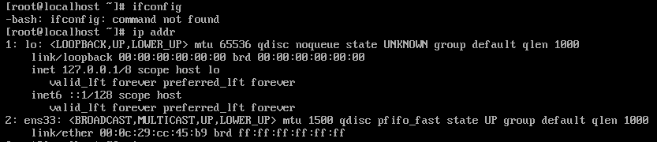
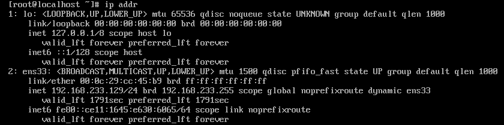
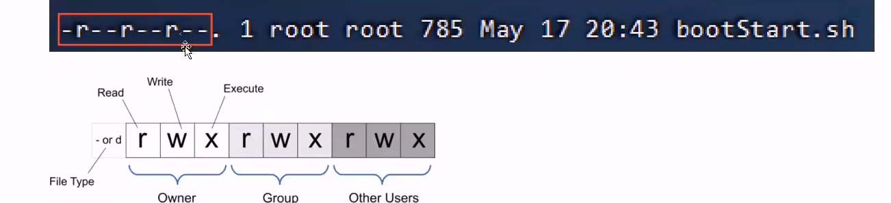
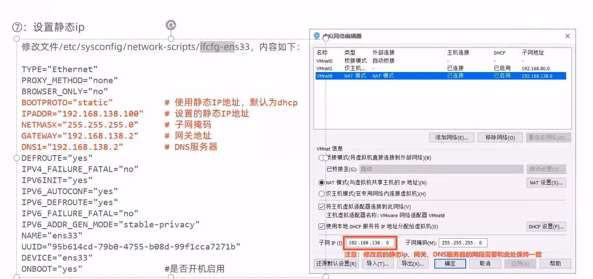

# 1. Linux安装与设置

## 1.1 安装

- 笔者这里安装使用的是Centos7系统，无桌面版本的，教程在网上有很多，这里就不赘述了

## 1.2 网卡设置

- 由于启动服务器时没有加载网卡，导致ip地址初始化是失败的

```shell
ip addr
#此命令用来查看当前的ip设置
```



- 如果网卡配置好的话那么ens33:后边应该是初始化好的ip地址，可以看出需要进行网卡设置

- 修改网络初始化配置，设定网卡在系统启动时初始化

```shell
cd /etc/sysconfig/network-scripts #进入系统设置/网络配置目录下
vi ifcfg-ens33 #使用vim编辑该文件
```

```sh
#vim的一些基本操作
i # 进入编辑状态
光标 # 移动光标
<ESC> -> :wq-><ENTER> # 保存并退出
```

- 将`ONBOOT=no` 修改为`ONBOOT=yes`即可



- 当显示出ip地址的时候，网卡设置完成

## 1.3 安装SSH连接工具

- SSH(Secure Shell):建立在应用层基础上的安全协议
- 通过SSH连接工具就可以实现从本地连接到远程的Linux服务器
- 笔者在本项目开发的话使用的是`[finalShell]`这个工具，只需要简单配置ip和端口即可使用

# 2. Linux常用指令

- 在执行Linux命令，提示信息如果显示为乱码，这是由于编码问题导致，只需要修改Linux的编码即可

```shell
echo 'LANG="en_US.UTF-8"' >> /etc/profile #增加这一行属性
source /etc/profile #刷新环境变量
```

## 2.1 文件目录操作命令

- ls指令

```shell
ls [-al] [dir]
# -a 显示所有文件以及目录(.开头的隐藏文件也会列出)
# -l 除了文件名意外，同时将文件形态(d表示目录,-表示文件)、权限、拥有者、文件带下等信息详细列出
# 由于我们使用ls命令经常需要加入ls选项,所以Linux为ls -l命令提供了一种简写形式，也就是ll
```

- cd指令
  - ~表示用户的home目录，也就是你用不同的用户来登录，可能就进到了不同的目录了
  - .表示目前所在的目录
  - ..表示当前目录位置的上级目录
- cat命令:用来显示文件内容,`cat [-n] fileName`
  - -n表示由开始对所有输出的行数编号
- more命令:以分页的形式来显示文件内容,`more fileName`
  - 回车键:向下滚动一行
  - 空格键:向下滚动一瓶
  - b:返回上一屏
  - q或者Ctrl+C:退出more
- tail命令:查看文件末尾的内容,`tail [-f] fileName`,注意f可以是数字,也就是说显示末尾倒数第几条信息
  - -f:动态读取文件末尾内容并且显示,通常用于日志文件的内容输出
- mkdir:创建目录,mkdir [-p] dirName
  - -p:确保目录名称存在，不存在的话就创建一个，通过此选项可以实现多层目录同时创建，以/分割
- rmdir:删除空目录,`rmdir [-p] dirName`
  - -p:当子目录被删除后使得父目录为空的时候，则一并删除
  - rmdir test*,删除以test开头的所有的空目录
- rm:删除文件或者目录,`rm [-rf] name`
  - -r:将目录以及目录中的所有文件(目录)逐一删除,也就是递归删除
  - -f:不需要确认,直接删除

## 2.2 拷贝移动命令

- cp:用于复制文件和目录,`cp [-r] src dst`
  - -r:如果复制的目录需要使用此选项,此时将复制该目录下的所有子目录和文件
- mv:为文件或者目录改名，或者将文件或目录移动到其他文件,`mv src dst`
  - 重名名实例:`mv hello.txt hi.txt`
  - 简单地说，如果src是文件，dst也是文件，那么就具有改名的作用
  - 如果src是目录，dst是目录，这两个原文件原本的目录是互相不同的，那么就是移动
  - 如果参数满足以上两者，那么就是同时具有上述的功能,也就是可以同时移动文件而且同时改名字的这种操作

## 2.3 打包压缩命令

- tar:对文件进行打包、解包、压缩、解压,`tar [-zcxvf] fileName [files]`
  - fileName是指定的包名,files是可选的(比如说我想对文件进行打包,此处可以输入想要打包的文件)
  - 包文件后缀为.tar表示只是完成了打包，而没有压缩
  - 包文件后缀为.tar.gz表示打包的同时还进行了压缩
  - -z:z表示的是gzip,通过gzip命令处理文件,gzip可以对文件压缩或者解压
  - -c:c代表的是create,即创建新的包文件
  - -x:x代表的是extract,实现从包文件中还原文件
  - -v:v代表的是verbose,显示命令的执行过程
  - -f:f代表的是file,用于指定包文件的名称
  - zcvf(具有压缩功能)、cvf:对包进行压缩的常用组合
  - zxvf:对包进行解包的过程

## 2.4 文本编辑命令

- vi:是Linux系统提供的一个文本编辑工具，可以对文件内容进行编辑，`vi fileName`，`vim fileName`
- 要使用vim,则需要进行下载,`yum install vim`
- 在使用vim命令编辑文件的时候，如果指定的文件存在则会直接打开此文件，如果指定的文件不存在则会新建文件
- vim在进行文本编辑时共分为三种模式，分别是命令模式，插入模式和底行模式，这三种模式之间可以相互切换。
- 命令模式
  - 命令模式下可以查看文件内容，移动光标(上下左右箭头,gg(快速将光标移动到文本的开头),G(快速移动到文本的末尾))
  - 通过vim命令打开文件后,默认进入命令模式
  - 另外两种模式需要首先进入命令模式后才能进入
- 插入模式
  - 插入模式下可以对文件内容进行编辑
  - 在命令模式下按`[i,a,o]`任意一个，可以进入插入模式
  - 在插入模式下按下`[ESC]`即可回到命令模式
- 底行模式
  - 底行模式下可以通过命令对文件内容进行查找、显示行号、退出等操作
  - 在命令模式下按下`[:,/]`任意一个后，即可进入底行模式
  - 通过/方式进入底行模式后,可以对文件内容进行查找
  - 通过:方式进入底行模式后,可以输入wq(保存并退出)、qi(不保存退出)、set nu(显示行号)

## 2.5 查找命令

- find:在指定目录下查找文件,`find dirName -option fileName`
  - option一定用来指定name
  - find . -name "*.java" 在当前目录及其子目录下查找.java结尾文件
  - find /root -name "*.java"

# 3. 基础软件安装

## 3.1 软件安装方式

- 二进制发布包安装:软件已经针对具体平台编译打包，只要解压，修改配置即可
- rpm安装:软件已经安装redhat的包管理规范进行打包，使用rpm命令进行安装，不能自行解决库依赖的问题
- yum安装:一种在线软件安装方式，本质上还是rpm安装，自动下载安装包并且安装，安装过程中自动解决库依赖的问题
- 源码编译安装:软件以源码工程的形式发布，需要自己打包

## 3.2 安装jdk

- 使用FinalShell自带的上传工具将jdk的二进制发布包上传到Linux
- 解压安装包到具体目录
- 配置环境变量，使用vim命令修改/etc/profile文件,在文件末尾加入JAVA_Home等配置
- 刷新环境变量
- 校验java环境,`java -version`

## 3.3 安装tomcat

- 解压安装包
- 进入bin目录启动服务,` sh startup.sh `
- 验证tomcat的启动是否成功：
  - 查看启动日志:`more /usr/local/apache-tomcat-7.0.57/logs/catalina.out`
  - 查看进程:`ps -ef|grep tomcat`
- ps命令是Linux下非常强大的进程查看命令，通过`ps -ef`可以查看当前运行的所有进程详细信息
- |在Linux中称为管道符，可以将前一个命令的结果输出给后一个命令作为输入
- 使用ps命令查看进程的时候，经常配合管道符合查找命令greo一起使用，来查看特定进程
- 需要关闭防火墙或者开放端口后才能进行访问

```shell
firewall-cmd --zone=public --add-port=8080/tcp --permanent
#开放8080端口
firewall-cmd --reload
#生效重启
```

- 结束tomcat服务

```shell
./shutdown.sh
kill -9 pid
#pid指的是进程id 根据你查的进程号来
```

## 3.4 安装MySQL

- 检测当前系统中是否安装了MySQL数据库,CentOS7自动mariada,与MySQL数据库冲突的,将安装失败

```sh
rpm -e --nodeps mariadb-libs-5.5.60-1.el7_5.x86_64
#删除指令
```

- 解压由官网得到的mysql安装包

- 按照顺序安装rpm软件包

```shell
rpm -ivh mysql-community-common-5.7.25-1.el7.x86_64.rpm
rpm -ivh mysql-community-libs-5.7.25-1.el7.x86_64.rpm 
rpm -ivh mysql-community-devel-5.7.25-1.el7.x86_64.rpm
rpm -ivh mysql-community-libs-compat-5.7.25-1.el7.x86_64.rpm
rpm -ivh mysql-community-client-5.7.25-1.el7.x86_64.rpm
yum install net-tools
rpm -ivh mysql-community-server-5.7.25-1.el7.x86_64.rpm
```

- 启动MySql

`systemctl status mysqld`:查看mysql服务状态

`systemctl start mysqld`:启动mysql服务

`systemctl enable mysqld`:开机自动启动mysql

`netstat -tunlp`:查看已经启动的服务

`netstat -tunlp | grep mysql`:查看mysql相关的服务

`ps -ef |grep mysql`:查看mysql相关进程

- 连接MySql
  - 登录MySql数据库,查阅临时密码:`cat /var/log/mysqld.log`
  - 可以通过grep过滤得到我们想要的信息:`cat /var/log/mysqld.log | grep password`
- 登录mysql

`mysql -uroot -p`:登录后输入初始密码

G,HR6%aippfM

- 修改密码

```sh
set global validate_password_length=4;
set global validate_password_policy=LOW;
set password=password('password');
grant all on *.* to 'root'@'%' identified by 'password';
flush privileges;
```

## 3.5 安装lrzsz

- yum(yellow dog updater,modified):是一个前端软件包管理器，基于rpm包管理，能够从指定的服务器自动下载RPM包并且安装，可以自动处理依赖关系，并且一次安装所有依赖的安装包，无需繁琐地一次次下载、安装

- 搜索lrzsz安装包，命令为`yum list lrzsz`
- 使用yum命令在线安装，命令为`yum install lrzsz.x86_64`

# 4. 项目部署

## 4.1 手工部署项目

- 首先将JAVA项目使用Maven打包，打包成jar
- 接着通过`rz`命令,将jar包上传到服务器上，然后手动启动jar包开启服务器
- 改为后台运行的Springboot程序，并将日志输出到日志文件
  - `nohup(no hang up)`:用于不挂断地运行指定命令，退出中断不会影响程序的运行
  - `nohup Command [Arg...] [&]`
  - Command:要执行的命令
  - Arg:一些参数，可以指定输出的文件
  - &:让命令在后台执行
  - nohup java -kar boot工程.jar &> hello.log & (在后台运行java -jar 命令)，并将日志输出到hello.log文件
- 停止进程则是通过直接`kill -9`的方式来终止项目，通过`ps -ef`来查看目前所有的进程号,然后通过`grep`来过滤

## 4.2 编写shell脚本自动部署项目

- 在Linux中安装GIT
  - `yum list git`,`yum install git `

- 使用Git克隆代码
  - git clone xxx.com

- 在Linux中安装Maven
  - `tar -zxvf apache-maven-3.5.4-bin.tar.gz -C /usr/local`
  - `vim /etc/profile`
  - 追加两行
  - `export MAVEN_HOME=/usr/local/apache-maven-3.5.4`
    `export PATH=$JAVA_HOME/bin:$MAVEN_HOME/bin:$PATH`
  - 刷新环境变量后,校验maven:`mvn -version`
  - 配置settings.xml文件:`<localRepository>/usr/local/repo</localRepository>`

- 编写Shell脚本(拉取代码、编译、打包、启动)
  - Shell脚本是一种Linux系统中的脚本程序

```shell
#!/bin/sh
echo =================================
echo  自动化部署服务器脚本启动
echo =================================

echo 停止原来运行中的工程
APP_NAME=helloworld

tpid=`ps -ef|grep $APP_NAME|grep -v grep|grep -v kill|awk '{print $2}'`
if [ ${tpid} ]; then
    echo 'Stop Process...'
    kill -15 $tpid
fi
sleep 2
tpid=`ps -ef|grep $APP_NAME|grep -v grep|grep -v kill|awk '{print $2}'`
if [ ${tpid} ]; then
    echo 'Kill Process!'
    kill -9 $tpid
else
    echo 'Stop Success!'
fi

echo 准备从git仓库中拉取最新代码
cd /usr/local/helloworld

echo 开始从git仓库中拉取最新代码
git pull
echo 代码拉取完成

echo 开始打包项目
output=`mvn clean package -Dmaven.test.skip=true`

cd target

echo 启动项目
nohup java -jar helloworld-1.0-SNAPSHOT.jar &> helloworld.log &
echo 部署完毕
```

- 为用户授予执行Shell脚本的权限
  - Linux中的权限分为:读(r)写(w)执行(x)
  - Linux的文件调用权限分为三级:文件所有者(Owner)、用户组(Group)、其他用户(Other users)
  - 只有文件的所有者和超级用户可以修改文件或者目录的权限
  - 要执行Shell脚本需要有对此脚本文件的执行权限，如果没有则不能执行



- 执行Shell脚本

- 设置静态ip



- 重启网络服务:`systemctl restart network`

